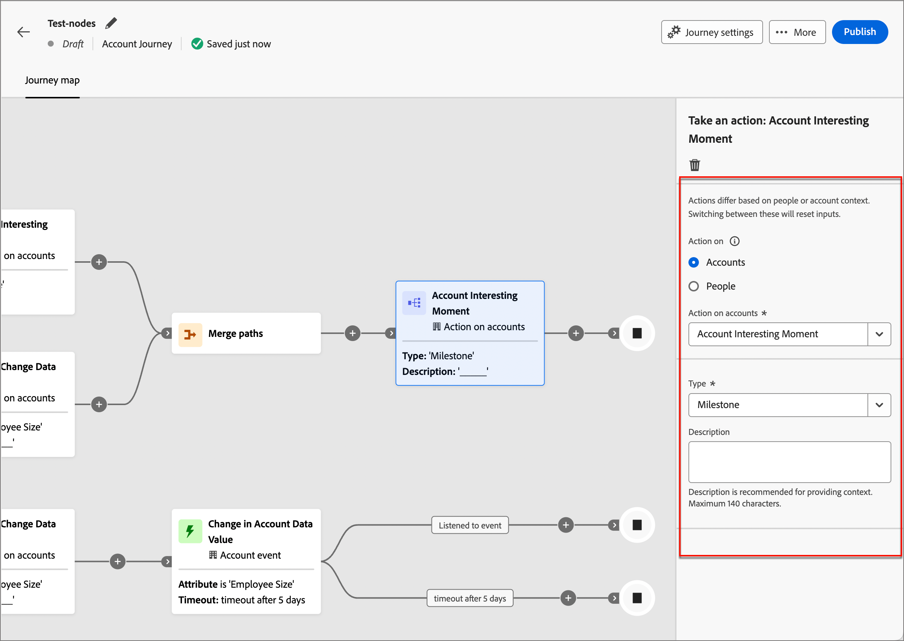
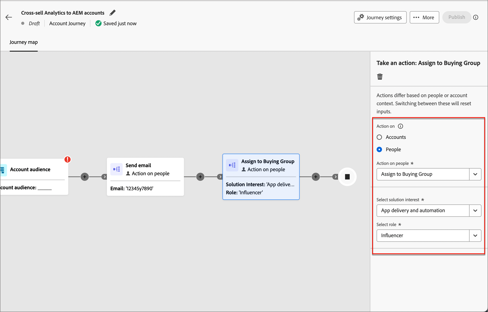
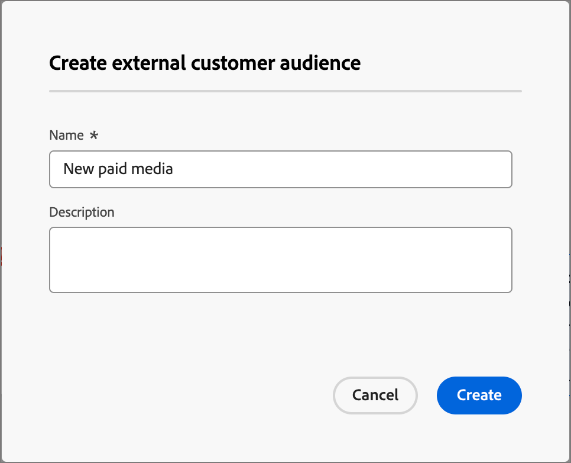

# アクションの実行

ジャーニーで「_[!UICONTROL アクションを実行]_」ノードを追加して、メールの送信、スコアの変更、購入グループへの割り当てなどのアクションを実行できます。 アクションは、通常、イベントや以前のアクションなど、何らかのトリガーの結果として発生させるもので、

{width="30"} [概要ビデオを視聴](#overview-video)

## アカウントのアクション

アカウントジャーニーでは、ノードパスのアカウントに属するすべてのユーザーに変更を適用する場合に、アカウントのアクションを使用します。

### アクションと制約 {#account-action-constraints}

| アクション | 制約 |
| ------ | ----------- |
| [!UICONTROL &#x200B; アカウント興味深い瞬間 &#x200B;] | タイプ （メール、マイルストーン、web）   説明（オプション） |
| [!UICONTROL &#x200B; 宛先に対してアクティブ化 &#x200B;] | 宛先を選択 |
| [!UICONTROL &#x200B; （その他）ジャーニーにアカウントを追加 &#x200B;] | ライブアカウントジャーニーを選択 |
| [!UICONTROL &#x200B; アカウントリストに追加 &#x200B;] | ライブの静的アカウントリストを選択 |
| [!UICONTROL ジャーニーからアカウントを削除 &#x200B;] | ライブアカウントジャーニーを選択 |
| [!UICONTROL &#x200B; アカウントリストから削除 &#x200B;] | ライブ静的アカウントリストの選択 |
| [!UICONTROL &#x200B; 販売アラートの送信 &#x200B;] | ソリューションの関心   メールの送信先を選択 |
| [!UICONTROL &#x200B; アカウントプロファイルを更新 &#x200B;] | 属性   新しい値を選択 |
| [!UICONTROL &#x200B; 購買グループの更新ステージ &#x200B;] | ソリューションの興味   購入グループのステージを選択 |
| [!UICONTROL &#x200B; 購買グループ・ステータスの更新 &#x200B;] | ソリューションの関心   ステータスを選択（必須、最大 50 文字） |

>[!NOTE]
>
>2025.10 リリースでは、_[!UICONTROL アカウント変更データ値]_ アクションは非推奨（廃止予定）になりました。 _[!UICONTROL アカウントプロファイルを更新]_ は、このアクションを [&#x200B; シンプルなアーキテクチャ &#x200B;](../simplified-architecture.md) に置き換えます。 
>
>管理者は、_[!UICONTROL XDM クラス]_/_[!UICONTROL 標準クラス]_ のフィールドを更新することで、XDM ビジネスアカウントで使用可能な属性を設定できます。 詳しくは、[&#x200B; 標準クラス &#x200B;](../admin/xdm-field-management.md#standard-classes) を参照してください。

### アカウントベースのアクションの追加

1. ジャーニーマップに移動します。

1. パスのプラス（**+**）アイコンをクリックし、「**[!UICONTROL アクションを実行]**」を選択します。

   {width="400"}

1. 右側のノードプロパティで、アクションとして **[!UICONTROL アカウント]** を選択します。

1. リストからアクションを選択し、アクションの値を設定します。

   {width="700" zoomable="yes"}

>[!BEGINSHADEBOX]

### LinkedIn 宛先に対してアクティブ化

アカウントの _宛先に対してアクティブ化_ アクションを使用して、ジャーニーから直接Experience Platformの宛先に対してアカウントをアクティブ化します。 このアクションを使用すると、サポートされている宛先で、一致したオーディエンスに（購入グループフィルター、エンゲージメントスコア、その他の条件に基づいて）選定されたアカウントをプッシュできます。 0.43188884

2025.10 リリース以降、**_LinkedIn_** が最初にサポートされる宛先タイプです。 LinkedIn 宛先のアクションを使用すると、複数システムのハンドオフを排除し、待ち時間を短縮して、キャンペーンの実行を効率化できます。 例えば、マーケターは、主要な購入の役割が見つからない場合のリターゲティング用に LinkedIn に対してハイインテントのアカウントを自動的にアクティブ化したり、非アクティブなフィルターに基づいて休眠中のアカウントを再エンゲージしたりできます。

LinkedIn 宛先に対してアカウントに一致したオーディエンスを使用する方法について詳しくは、[LinkedIn アカウントに一致したオーディエンス &#x200B;](../data/linkedin-account-matched-audiences.md) を参照してください。

+++ LinkedIn の宛先に対するアカウントのアクティベーションの設定

1. ジャーニーキャンバスで _アクションの実行_ ノードを選択した状態で、**[!UICONTROL アカウントに対するアクション]** を **[!UICONTROL 宛先に対してアクティブ化]** に設定します。

1. **[!UICONTROL 宛先を選択]** をクリックします。

   {width="600" zoomable="yes"}

1. ダイアログで、設定済みの LinkedIn の宛先を選択し、「**[!UICONTROL 保存]**」をクリックします。

{width="700" zoomable="yes"}

1. 宛先でアクティブ化されたオーディエンスを識別するために使用される **[!UICONTROL オーディエンス名]** を入力します。

   {width="550" zoomable="yes"}

+++

>[!ENDSHADEBOX]

## 顧客のアクション

アカウントまたはユーザーのジャーニーでは、ノードパス上のすべてのユーザーに変更を適用する場合、ユーザーに対してアクションを使用します。 アカウントジャーニーの場合、このノードタイプは、_人物による分割パス_ または _アカウントによる分割パス_ 内で使用できます。

### アクションと制約 {#people-action-constraints}

| コンテキスト | ジャーニーの種類 | アクション | 制約 |
| ------- | ------------ | ------ | ----------- |
| [Journey Optimizer B2B](#journey-optimizer-b2b-actions) | <li>アカウントジャーニー <li>人物ジャーニー | [!UICONTROL &#x200B; 外部顧客オーディエンスに追加 &#x200B;] | <li>外部の顧客オーディエンスを選択 |
| | <li>アカウントジャーニー | [!UICONTROL &#x200B; 購買グループへの割当て &#x200B;] | <li>ソリューションに対する関心を選択 <li>役割を選択 |
| | <li>アカウントジャーニー | [!UICONTROL &#x200B; スコアを変更 &#x200B;] | スコア名 <li>スコアの変化 |
| | <li>アカウントジャーニー <li>人物ジャーニー | [!UICONTROL &#x200B; 人物の興味深い瞬間 &#x200B;] | <li>タイプ <li>説明 |
| | <li>アカウントジャーニー | [!UICONTROL web エクスペリエンスのパーソナライズ &#x200B;] （Beta） | <li>Web エクスペリエンスの作成/編集 |
| | <li>アカウントジャーニー | [!UICONTROL &#x200B; 購入グループから削除 &#x200B;] | <li>ソリューションに対する関心を選択 |
| | <li>アカウントジャーニー <li>人物ジャーニー | [!UICONTROL &#x200B; メールを送信 &#x200B;] | <li>メールを作成 |
| | <li>アカウントジャーニー | [!UICONTROL SMS を送信 &#x200B;] | <li>SMS を作成 |
| | <li>アカウントジャーニー <li>人物ジャーニー | [!UICONTROL &#x200B; ユーザープロファイルを更新 &#x200B;] | <li>人物属性を選択 <li>新しい値を設定 |
| [Marketo Engage](#marketo-engage-actions) | <li>アカウントジャーニー <li>人物ジャーニー | [!UICONTROL Marketo Engage リクエストキャンペーンに追加 &#x200B;] | <li>Marketo Engage ワークスペースを選択 <li>「リクエストキャンペーン」を選択します |
| | [!UICONTROL Marketo リストに追加 &#x200B;] | <li>アカウントジャーニー <li>人物ジャーニー | <li>外部Marketo接続名 <li>リスト名 |
| | [!UICONTROL Marketoリストから削除 &#x200B;] | アカウントジャーニー <li>人物ジャーニー | <li>外部Marketo接続名 <li>リスト名 |

>[!NOTE]
>
>2025.10 リリースでは _[!UICONTROL Marketo Engageの人物パーティションを変更]_ アクションは非推奨となり、Journey Optimizer B2B editionの [&#x200B; シンプルなアーキテクチャ &#x200B;](../simplified-architecture.md) では使用できません。 
>
>_[!UICONTROL データ値を変更]_ アクションは 2025.10 リリースで非推奨（廃止予定）になりました。 簡略化されたアーキテクチャでは、_[!UICONTROL 人物プロファイルを更新]_ に置き換えられています。

### ユーザーベースのアクションを追加

1. ジャーニーマップに移動します。

1. パスのプラス（**+**）アイコンをクリックし、「**[!UICONTROL アクションを実行]**」を選択します。

1. 右側のノードのプロパティで、アクションとして **[!UICONTROL People]** を選択します。

1. リストからアクションを選択し、アクションの値を設定します。

{width="700" zoomable="yes"}

### Journey Optimizer B2B アクション

Journey Optimizer B2B の人物ベースのアクションは、設定されたチャネルを通じてのコミュニケーションを管理し、購入グループおよびアカウント内の人物の分類を管理するように設計されています。 ジャーニーは、ユーザープロファイルを持つ資格のあるアカウントがノードに到達すると、アクションを適用します。

+++[!UICONTROL &#x200B; 外部顧客オーディエンスに追加 &#x200B;]

このアクションを使用して、外部オーディエンスにユーザーをプッシュします。このオーディエンスは、有料メディアチャネルでアクティブ化でき、購入グループのメンバーをさらにターゲットにすることができます。 このアクションは、Real-Time CDP B2B editionを通じて実行されます。

>[!NOTE]
>
>個人プロファイルを含む資格のあるアカウントが公開済みのジャーニーの _外部顧客オーディエンスに追加_ ノードに達した場合、これらのプロファイルが外部オーディエンスに入力されるまで最大 48 時間かかる場合があります。

{width="300"}

この人物ベースのアクションを選択すると、新しい外部オーディエンスを作成したり、既存の外部オーディエンスのリストから選択したりできます。

* 既存のオーディエンスの場合は、[!DNL Journey Optimizer B2B Edition] でのみ作成された外部の顧客オーディエンスから選択できます。
* オーディエンスを作成し、このジャーニーアクションに使用する場合は、必ず宛先に接続してください。 詳しくは、[&#x200B; ドキュメントの &#x200B;](https://experienceleague.adobe.com/ja/docs/experience-platform/destinations/ui/connect-destination){target="_blank"} 新しい宛先接続の作成 [&#x200B; および &#x200B;](https://experienceleague.adobe.com/ja/docs/experience-platform/destinations/ui/activate/activation-overview#activate-audiences-from-the-destinations-catalog){target="_blank"} アクティベーションの概要 [!DNL Experience Platform] を参照してください。

{width="30"}[&#x200B; 有料メディアオーケストレーションの概要に関するビデオをご覧ください &#x200B;](../data/linkedin-account-matched-audiences.md#orchestrate-paid-media-engagement)

2025.10 リリース以降、[!DNL Experience Platform] で作成された外部オーディエンス（[!DNL Adobe Target] の宛先など）を使用してオーケストレーションを行うこともできます。 このオーディエンス統合について詳しくは、[Adobe Target外部オーディエンス &#x200B;](../audiences/target-external-audience.md) を参照してください。

外部オーディエンスを作成するには（_T） :_

1. 「**[!UICONTROL 新規作成]**」を選択します。

1. **[!UICONTROL 外部顧客オーディエンスを作成]** をクリックします。

1. 新しい外部オーディエンスの **[!UICONTROL 名前]** （必須）と **[!UICONTROL 説明]** （オプション）を入力します。

   {width="300"}

1. 「**[!UICONTROL 作成]**」をクリックします。

   新しいオーディエンスが作成され、確認メッセージが表示されます。 その後、ノードアクションの既存のオーディエンスとして使用に進むことができます。

   >[!NOTE]
   >
   >Journey Optimizer B2B editionから新しい外部カスタマーオーディエンスが作成されると、ダミーレコードがシードされます（`test@email.com`）。 このレコードは、最初の実際のプロファイルがジャーニーから外部オーディエンスに追加されるとすぐに上書きされます。

既存のオーディエンスを使用するには（_T） :_

1. **[!UICONTROL 外部顧客オーディエンスを選択]** をクリックします。

1. ダイアログで、使用するオーディエンスを選択します。

   {width="700" zoomable="yes"}

1. **[!UICONTROL オーディエンスを追加]** をクリックします。

+++

+++[!UICONTROL &#x200B; 購買グループへの割当て &#x200B;]

このアクションを使用して、選択したソリューションの関心と役割に基づいて、人物プロファイルを [&#x200B; 購入グループ &#x200B;](../buying-groups/buying-groups-overview.md) に追加します。

{width="300"}

+++

+++[!UICONTROL &#x200B; スコアを変更 &#x200B;]

Marketo Engageで人物スコアを変更するには、このアクションを使用します。 [詳細情報](https://experienceleague.adobe.com/ja/docs/marketo-learn/tutorials/lead-and-data-management/lead-scoring-learn){target="_blank"}

{width="300"}

+++

+++[!UICONTROL &#x200B; 人物の興味深い瞬間 &#x200B;]

このアクションを使用して、人物に興味深い瞬間を記録します。 タイプ（メール、マイルストーン、web）を選択し、説明（オプション）を追加します。

{width="300"}

+++

+++[!UICONTROL web エクスペリエンスのパーソナライズ &#x200B;] （Beta）

このアクションを使用して、パーソナライズされたエクスペリエンスを Web サイトに直接作 [&#x200B; 作成 &#x200B;](../content/web-experiences.md) します。 Web チャネル機能は、カスタマイズされた web コンテンツとのエンゲージメントを強化するために使用できる、柔軟なツールキットを提供します。

{width="300"}

+++

+++[!UICONTROL &#x200B; 購入グループから削除 &#x200B;]

このアクションを使用して、選択したソリューションの関心に基づいて [&#x200B; 購入グループ &#x200B;](../buying-groups/buying-groups-overview.md) から人物プロファイルを削除します。

{width="300"}

+++

+++[!UICONTROL &#x200B; メールを送信 &#x200B;]

メールを送信するには、このアクションを使用します。 ノードの [&#x200B; メールを作成 &#x200B;](../content/add-email.md#add-an-email-to-your-journey) した後は、メールデザイン領域でメールメッセージのデザイン、パーソナライズおよびプレビューを行うことができます（[&#x200B; メールのオーサリング &#x200B;](../content/email-authoring.md) を参照）。 [Marketo Engageからメールを送信する &#x200B;](https://experienceleague.adobe.com/ja/docs/marketo/using/product-docs/email-marketing/general/creating-an-email/create-an-email){target="_blank"} ともできます。 Marketo Engage Workspace を選択し、送信するメールを選択します。

{width="300"}

>[!NOTE]
>
>アカウントジャーニーでメールの重複排除を使用すると、同じメールがジャーニー内の同じメールアドレスに複数回送信されないようにできます。 詳しくは、[&#x200B; メールの重複排除 &#x200B;](../content/email-deduplication.md) を参照してください。

+++

+++[!UICONTROL SMS を送信 &#x200B;]

SMS メッセージを送信するには、このアクションを使用します。 ビジュアルデザインスペースで SMS メッセージの作成、パーソナライズ、プレビューを行うことができます（「[SMS オーサリング &#x200B;](../content/sms-authoring.md)」を参照）。

{width="300"}

+++

+++[!UICONTROL &#x200B; ユーザープロファイルを更新 &#x200B;]

[&#x200B; 人物プロファイル属性 &#x200B;](../admin/field-mapping.md#xdm-business-person-attributes) の値を変更するには、このアクションを使用します。 属性を選択して、新しい値を設定します。

{width="300"}

>[!NOTE]
>
>_[!UICONTROL 簡単なアーキテクチャ]_ 内の _[!UICONTROL データ値を変更]_ アクションは、[&#x200B; 人物プロファイルを更新 &#x200B;](../simplified-architecture.md) に置き換わります。 
>
>管理者は、_[!UICONTROL XDM クラス]_/[!UICONTROL &#x200B; 標準クラス &#x200B;] のフィールドを更新することで、XDM 個人プロファイルで使用可能な属性を設定できます。 詳しくは、[&#x200B; 標準クラス &#x200B;](../admin/xdm-field-management.md#standard-classes) を参照してください。

+++

### Marketo Engageアクション

Marketo Engageのユーザーベースのアクションは、Marketo Engage B2B editionのアカウントベースのマーケティングオーケストレーションとJourney Optimizerのリードベースのマーケティング活動を調整するように設計されています。 これらのアクションを使用して、リストメンバーシップを調整し、キャンペーンをリクエストします。

>[!NOTE]
>
>Marketo Engageのアクションには、1 つ以上の外部Marketo Engage インスタンスとの設定済みの統合が必要です。<!-- For detailed information about configuring these connections, see #. -->

例えば、Journey Optimizer B2B editionの購買グループに属するユーザーに対しては、Marketo Engageのキャンペーンを抑制できます。 この場合、特にソリューションの関心に合わせて、Marketo Engageで静的リストを作成できます。 次に、購入グループによる分割パスで、ジャーニーノードから _Marketo リストに追加_ アクションを使用します。 このアクションにより、接続されたMarketo Engage インスタンス内の特定の静的リストに購入グループメンバーが追加されます。 次に、Marketo Engageのスマートリストフィルターにソリューションの関心に焦点を当てた静的リストを使用します。

+++[!UICONTROL Marketo Engage リクエストキャンペーンに追加 &#x200B;]

Marketo Engageの [&#x200B; リクエストキャンペーン &#x200B;](https://experienceleague.adobe.com/ja/docs/marketo/using/product-docs/core-marketo-concepts/smart-campaigns/flow-actions/request-campaign){target="_blank"} に人物プロファイルを追加するには、このアクションを使用します。

まず、接続されたMarketo Engage インスタンスを選択します。 次に、リクエストキャンペーン名を選択します。

{width="300"}

+++

+++[!UICONTROL Marketo リストに追加 &#x200B;]

Marketo Engageでユーザーを [&#x200B; 静的リスト &#x200B;](https://experienceleague.adobe.com/ja/docs/marketo/using/product-docs/core-marketo-concepts/smart-lists-and-static-lists/static-lists/understanding-static-lists){target="_blank"} に追加するには、このアクションを使用します。

まず、接続されたMarketo Engage インスタンスを選択します。 次に、リスト名を選択します。

{width="300"}

+++

+++[!UICONTROL Marketoリストから削除 &#x200B;]

Marketo Engageの [&#x200B; 静的リスト &#x200B;](https://experienceleague.adobe.com/ja/docs/marketo/using/product-docs/core-marketo-concepts/smart-lists-and-static-lists/static-lists/understanding-static-lists){target="_blank"} からユーザーを削除するには、このアクションを使用します。

まず、接続されたMarketo Engage インスタンスを選択します。 次に、リスト名を選択します。

{width="300"}

+++

## 概要動画

>[!VIDEO](https://video.tv.adobe.com/v/3443246/?captions=jpn&learn=on)
