# アクションの実行

ジャーニーでは、_[!UICONTROL アクションを実行]_ ノードを追加して、メールの送信、スコアの変更、購買グループへの割り当てなどのアクションを実行できます。 通常、アクションは、イベントや以前のアクションなど、何らかのトリガーの結果として発生させたいものです。

{width="30"} [概要ビデオを視聴](#overview-video)

## アカウントアクション

アカウントジャーニーで、ノードパス上のアカウントの一部であるすべてのユーザーに変更を適用する場合は、アカウントに対するアクションを使用します。

### アクションと制約 {#account-action-constraints}

| アクション | 制約 |
| ------ | ----------- |
| [!UICONTROL &#x200B; アカウントの注目のアクション &#x200B;] | 種類（電子メール、マイルストーン、またはweb）  説明（オプション） |
| [!UICONTROL 宛先に対してアクティブ化] | 宛先を選択 |
| [!UICONTROL &#x200B; アカウントを（その他）ジャーニーに追加] | ライブアカウントジャーニーの選択 |
| [!UICONTROL &#x200B; アカウントリストに追加] | ライブの静的アカウントリストを選択 |
| [!UICONTROL &#x200B; アカウントをジャーニーから削除] | ライブアカウントジャーニーの選択 |
| [!UICONTROL &#x200B; アカウントリストから削除] | ライブ静的アカウントリストの選択 |
| [!UICONTROL 販売アラートを送信] | ソリューションの関心を選択  メールの送信先 |
| [!UICONTROL &#x200B; アカウントプロファイルの更新] | 属性を選択 新しい値 |
| [!UICONTROL 購買グループステージの更新] | ソリューションの関心を選択 購買グループのステージを選択 |
| [!UICONTROL 購買グループの状態を更新] | ソリューションの関心を選択  ステータス （必須、最大50文字） |

>[!NOTE]
>
>2025.10 リリースでは、_[!UICONTROL Account Change Data Value]_ アクションは推奨されません。_[簡易アーキテクチャ &#x200B;](../simplified-architecture.md). に対するこのアクションは、アカウントプロファイル_&#x200B;を更新することで置き換えられます
>
>管理者は、_[!UICONTROL XDM クラス]_ > _[!UICONTROL 標準クラス]_&#x200B;のフィールドを更新することで、XDM ビジネスアカウントの使用可能な属性を設定できます。 詳しくは、[標準クラス &#x200B;](../admin/xdm-field-management.md#standard-classes)を参照してください。

### アカウントベースのアクションの追加

1. ジャーニーマップに移動します。

1. パスのプラス（**+**）アイコンをクリックし、**[!UICONTROL アクションを実行]**&#x200B;を選択します。

   {width="400"}

1. 右側のノードプロパティで、アクションに「**[!UICONTROL アカウント]**」を選択します。

1. リストからアクションを選択し、アクションの値を設定します。

   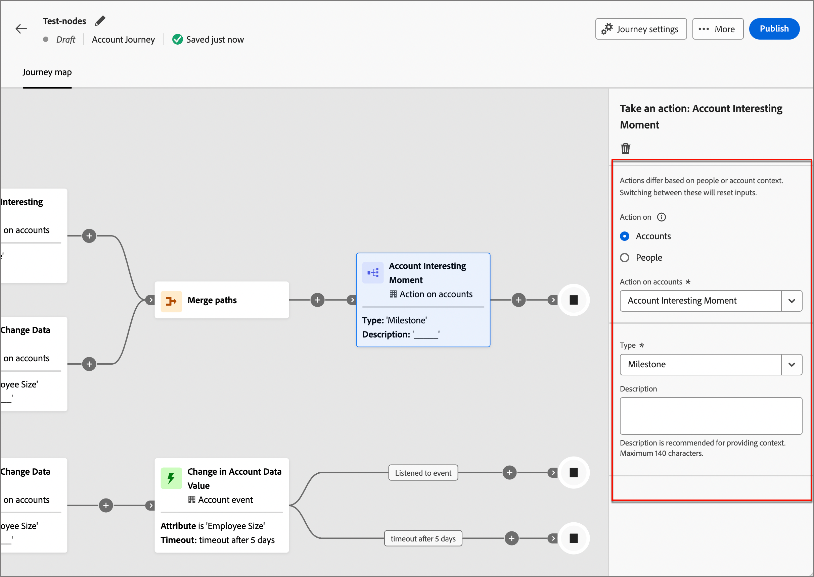{width="700" zoomable="yes"}

>[!BEGINSHADEBOX]

### LinkedInの宛先に対してアクティブ化

アカウントに対して&#x200B;_宛先に対してアクティブ化_ アクションを使用すると、ジャーニーから直接Experience Platform宛先にアカウントをアクティブ化できます。 このアクションを使用すると、購買グループのフィルター、エンゲージメントスコア、その他の基準にもとづいて、適格なアカウントを、サポートされている宛先の一致したオーディエンスにプッシュできます。 It

2025.10 リリース以降、**_LinkedIn_**&#x200B;が最初にサポートされる宛先タイプです。 LinkedInの宛先に対してアクションを使用すると、マルチシステムのハンドオフを排除し、待ち時間を短縮して、キャンペーンの実行を効率化できます。 たとえば、マーケターは、主要な購買役割が欠けている場合はリターゲティングのために、インテント率の高いアカウントをLinkedInで自動的に活用したり、非アクティブなフィルターにもとづいて休眠アカウントをリエンゲージしたりできます。

LinkedIn宛先にアカウントが一致するオーディエンスを使用する方法について詳しくは、[LinkedIn Account Matched Audiences](../data/linkedin-account-matched-audiences.md)を参照してください。

+++ LinkedInの宛先にアカウントのアクティベーションを設定

1. ジャーニーキャンバスで「_アクションを実行_」ノードを選択した状態で、「**[!UICONTROL アカウントに対するアクション]**」を「**[!UICONTROL 宛先に対するアクティブ化]**」に設定します。

1. **[!UICONTROL 宛先を選択]**&#x200B;をクリックします。

   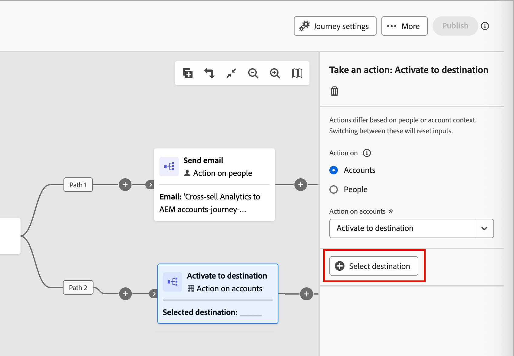{width="600" zoomable="yes"}

1. ダイアログで、設定したLinkedInの宛先を選択し、**[!UICONTROL 保存]**&#x200B;をクリックします。

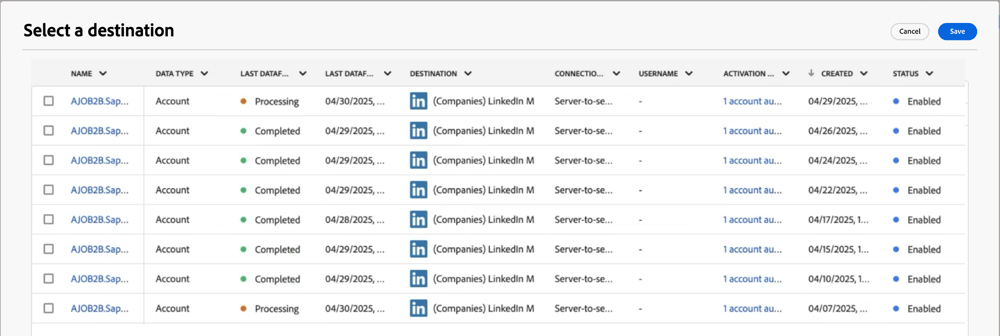{width="700" zoomable="yes"}

1. 宛先でアクティブ化されたオーディエンスを識別するために使用される&#x200B;**[!UICONTROL オーディエンス名]**&#x200B;を入力します。

   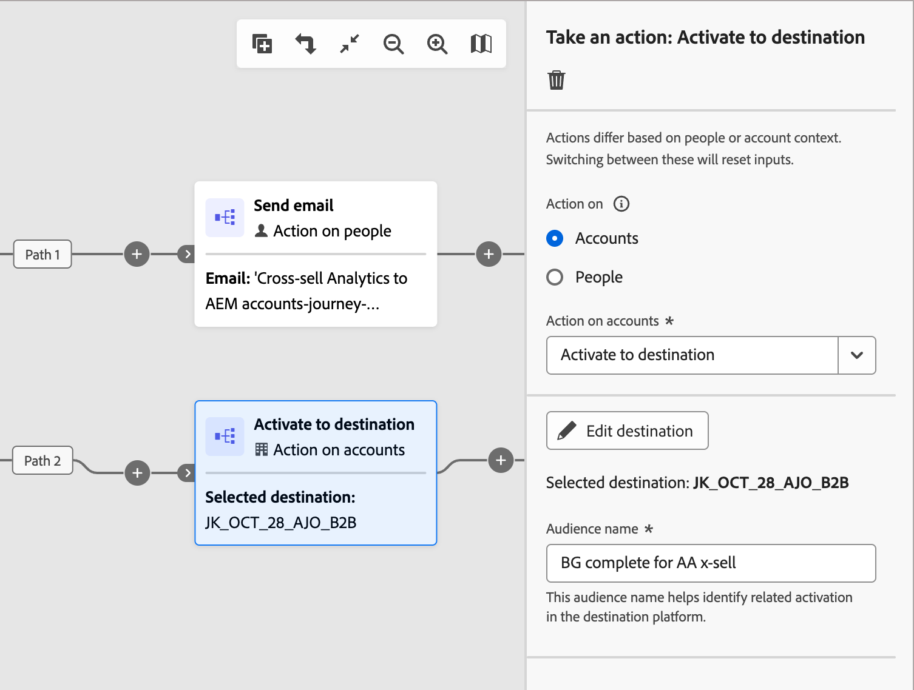{width="550" zoomable="yes"}

+++

>[!ENDSHADEBOX]

## 顧客のアクション

アカウントまたは個人のジャーニーで、ノードパス上のすべてのユーザーに変更を適用する場合は、ユーザーに対するアクションを使用します。 アカウントジャーニーの場合、このノードタイプは、_人でパスを分割_&#x200B;または&#x200B;_アカウントでパスを分割_&#x200B;内で使用できます。

### アクションと制約 {#people-action-constraints}

| コンテキスト | アクション | ジャーニータイプ | 制約 |
| ------- | ------ | ------------ | ----------- |
| [Journey Optimizer B2B](#journey-optimizer-b2b-actions) | [!UICONTROL 外部顧客オーディエンスに追加] | <li>アカウントジャーニー <li>ユーザージャーニー | <li>外部の顧客オーディエンスを選択 |
| | [!UICONTROL 購買グループに割り当て] | <li>アカウントジャーニー | <li>ソリューションに対する関心を選択 <li>役割を選択 |
| | [!UICONTROL &#x200B; スコアの変更] | <li>アカウントジャーニー | <li>スコア名 <li>スコアの変更 |
| | [!UICONTROL 興味深い瞬間] | <li>アカウントジャーニー <li>ユーザージャーニー | <li>タイプ <li>説明 |
| | [!UICONTROL web エクスペリエンスのパーソナライズ &#x200B;] （Beta） | <li>アカウントジャーニー | <li>web エクスペリエンスの作成/編集 |
| | [!UICONTROL 購買グループから削除] | <li>アカウントジャーニー | <li>ソリューションに対する関心を選択 |
| | [!UICONTROL 電子メールを送信] | <li>アカウントジャーニー <li>ユーザージャーニー | <li>メールを作成 <li>配信時間の最適化（オプション、個人ジャーニーのみ） |
| | [!UICONTROL SMSを送信] | <li>アカウントジャーニー | <li>SMS を作成 |
| | [!UICONTROL 人物プロファイルの更新] | <li>アカウントジャーニー <li>ユーザージャーニー | <li>人物属性を選択 <li>新しい値を設定 |
| [Marketo Engage](#marketo-engage-actions) | [!UICONTROL Marketo リクエストキャンペーンに追加] | <li>アカウントジャーニー <li>ユーザージャーニー | <li>Marketo Engage ワークスペースを選択 <li>「キャンペーンをリクエスト」を選択 |
| | [!UICONTROL Marketo リストに追加] | <li>アカウントジャーニー <li>ユーザージャーニー | <li>外部Marketo接続の名前 <li>リスト名 |
| | [!UICONTROL Marketo リストから削除] | <li>アカウントジャーニー <li>ユーザージャーニー | <li>外部Marketo接続の名前 <li>リスト名 |

>[!NOTE]
>
>Marketo Engage _の_&#x200B;人のパーティションを変更および&#x200B;_[!UICONTROL スコアを変更]_ アクションは、2025.10 リリースでは廃止され、Journey Optimizer B2B editionの[簡素化アーキテクチャ &#x200B;](../simplified-architecture.md)では使用できません。 
>
>2025.10 リリースでは、_[!UICONTROL Change Data Value]_ アクションは推奨されません。 簡素化されたアーキテクチャでは、_[!UICONTROL 個人プロファイルの更新]_&#x200B;に置き換えられます。

### 人物ベースのアクションの追加

1. ジャーニーマップに移動します。

1. パスのプラス（**+**）アイコンをクリックし、**[!UICONTROL アクションを実行]**&#x200B;を選択します。

1. 右側のノードプロパティで、アクションに「**[!UICONTROL 人物]**」を選択します。

1. リストからアクションを選択し、アクションの値を設定します。

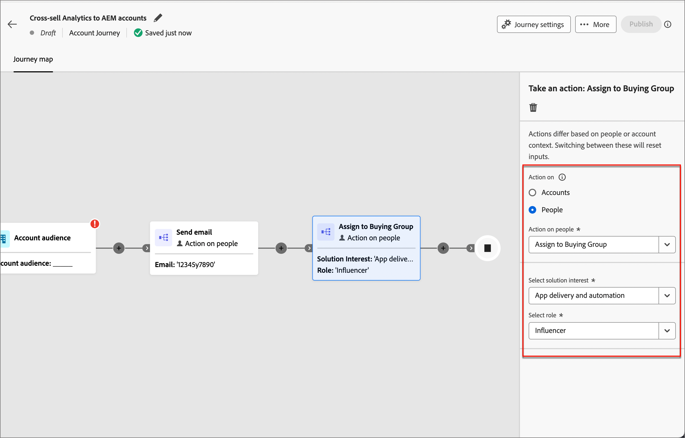{width="700" zoomable="yes"}

### Journey Optimizer B2B アクション

Journey Optimizer B2Bの人物ベースのアクションは、設定されたチャネルを通じたコミュニケーションを管理し、購買グループやアカウント内の人物の分類を管理するように設計されています。 ジャーニーは、個人プロファイルを持つ適格なアカウントがノードに到達したときにアクションを適用します。

+++[!UICONTROL 外部顧客オーディエンスに追加]

このアクションを使用して、有料メディアチャネルをまたいでアクティブ化できる外部オーディエンスに人物をプッシュし、購買グループのメンバーをさらにターゲットにします。 このアクションは、Real-Time CDP B2B editionを通じて実行されます。

>[!NOTE]
>
>人物プロファイルを持つ適格なアカウントが、公開されたジャーニーで&#x200B;_外部カスタマーオーディエンスに追加_ ノードに到達すると、それらのプロファイルが外部オーディエンスに入力されるまでに最大48時間かかる場合があります。

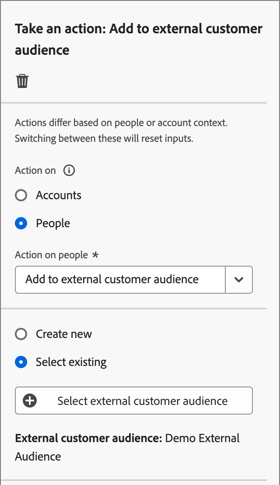{width="300"}

この人物ベースのアクションを選択すると、新しい外部オーディエンスを作成したり、既存の外部オーディエンスのリストから選択したりできます。

* 既存のオーディエンスの場合、[!DNL Journey Optimizer B2B Edition]でのみ作成された外部顧客オーディエンスから選択できます。
* オーディエンスを作成し、このジャーニーアクションに使用する場合は、宛先を接続してください。 詳しくは、[!DNL Experience Platform] ドキュメントの[新しい宛先接続の作成](https://experienceleague.adobe.com/ja/docs/experience-platform/destinations/ui/connect-destination){target="_blank"}および[&#x200B; アクティベーションの概要](https://experienceleague.adobe.com/ja/docs/experience-platform/destinations/ui/activate/activation-overview#activate-audiences-from-the-destinations-catalog){target="_blank"}を参照してください。

{width="30"} [有料メディアオーケストレーションのビデオ概要を見る](../data/linkedin-account-matched-audiences.md#orchestrate-paid-media-engagement)

2025.10 リリース以降では、[!DNL Adobe Target]宛先など、[!DNL Experience Platform]で作成された外部オーディエンスを通じてオーケストレーションすることもできます。 このオーディエンス統合について詳しくは、[Adobe Target外部オーディエンス &#x200B;](../audiences/target-external-audience.md)を参照してください。

_外部オーディエンスを作成するには&#x200B;:_

1. **[!UICONTROL 新規作成]**&#x200B;を選択します。

1. **[!UICONTROL 外部顧客オーディエンスの作成]**&#x200B;をクリックします。

1. 新しい外部オーディエンスの&#x200B;**[!UICONTROL 名前]** （必須）と&#x200B;**[!UICONTROL 説明]** （オプション）を入力します。

   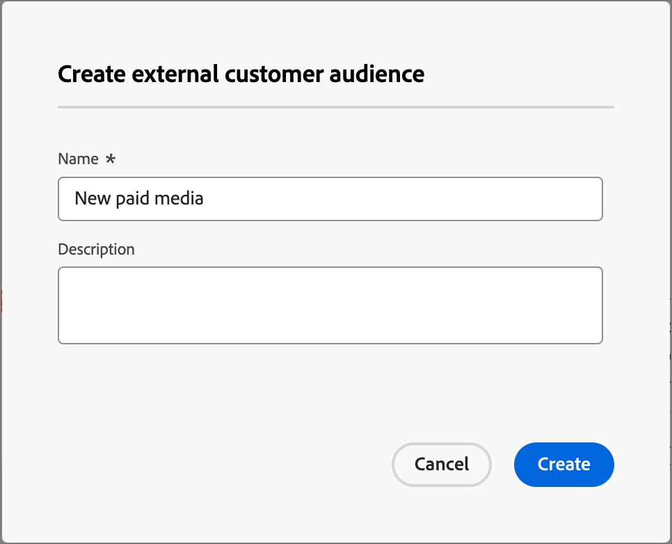{width="300"}

1. 「**[!UICONTROL 作成]**」をクリックします。

   新しいオーディエンスが作成され、確認メッセージが表示されます。 その後、ノードアクションの既存のオーディエンスとして使用できます。

   >[!NOTE]
   >
   >Journey Optimizer B2B editionから新しい外部カスタマーオーディエンスを作成すると、ダミーレコード （`test@email.com`）がシードされます。 このレコードは、最初の実際のプロファイルがジャーニーから外部オーディエンスに追加されるとすぐに上書きされます。

_既存のオーディエンスを使用するには&#x200B;:_

1. 「**[!UICONTROL 外部顧客オーディエンスを選択]**」をクリックします。

1. ダイアログで、使用するオーディエンスを選択します。

   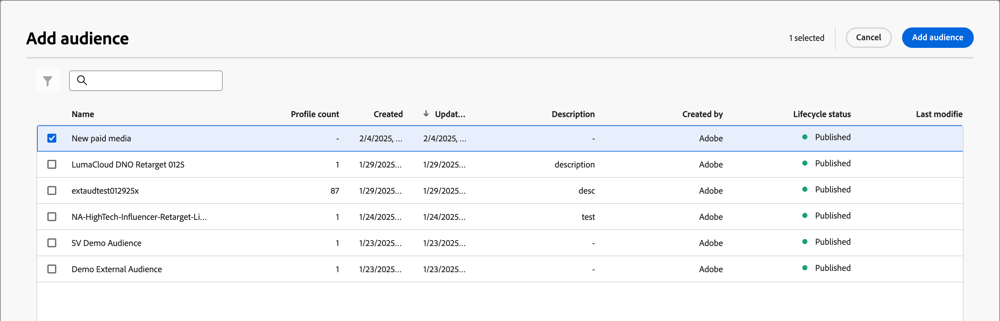{width="700" zoomable="yes"}

1. 「**[!UICONTROL オーディエンスを追加]**」をクリックします。

+++

+++[!UICONTROL 購買グループに割り当て]

このアクションを使用して、選択したソリューションの関心と役割に基づいて[購買グループ &#x200B;](../buying-groups/buying-groups-overview.md)に人物プロファイルを追加します。

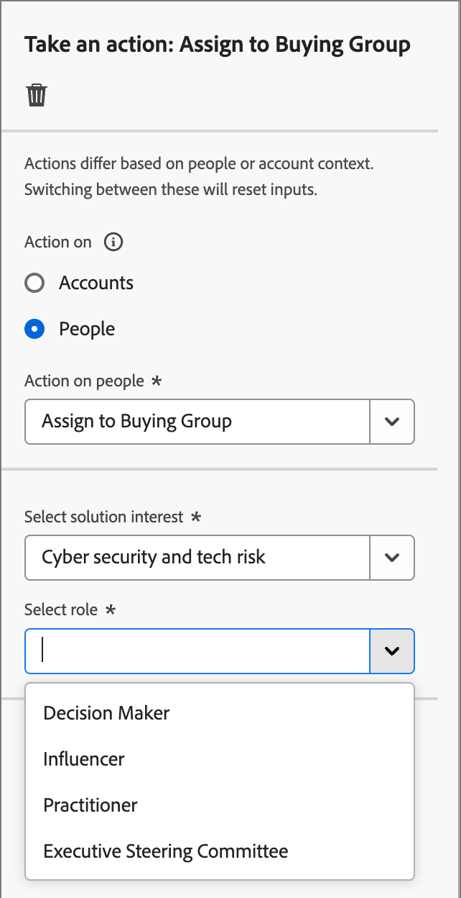{width="300"}

+++

+++[!UICONTROL &#x200B; スコアの変更]

このアクションを使用して、Marketo Engageの人物スコアを変更します。[詳細情報 &#x200B;](https://experienceleague.adobe.com/ja/docs/marketo-learn/tutorials/lead-and-data-management/lead-scoring-learn){target="_blank"}

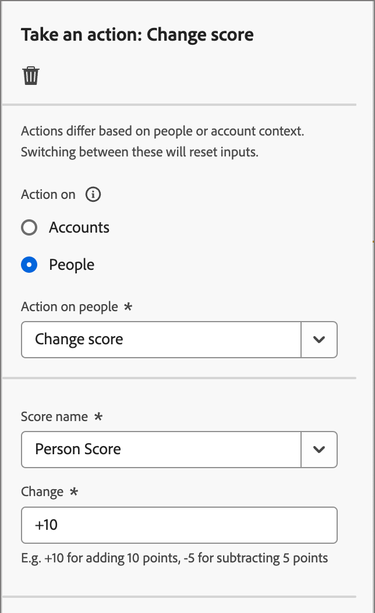{width="300"}

+++

+++[!UICONTROL 興味深い瞬間]

このアクションを使用して、人々にとって興味深い瞬間を記録します。 タイプ（メール、マイルストーン、またはWeb）を選択し、説明を追加します（オプション）。

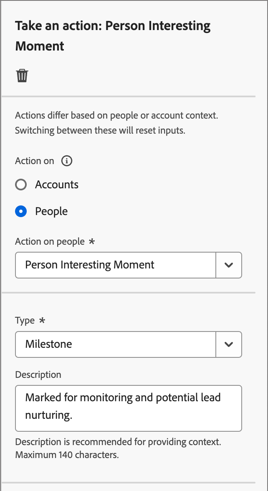{width="300"}

+++

+++[!UICONTROL web エクスペリエンスのパーソナライズ &#x200B;] （Beta）

このアクションを使用すると、web サイトで直接[&#x200B; パーソナライズされたエクスペリエンス &#x200B;](../content/web-experiences.md)を作成できます。 web チャネル機能は、カスタマイズされたweb コンテンツでエンゲージメントを強化するために使用できる柔軟なツールキットを提供します。

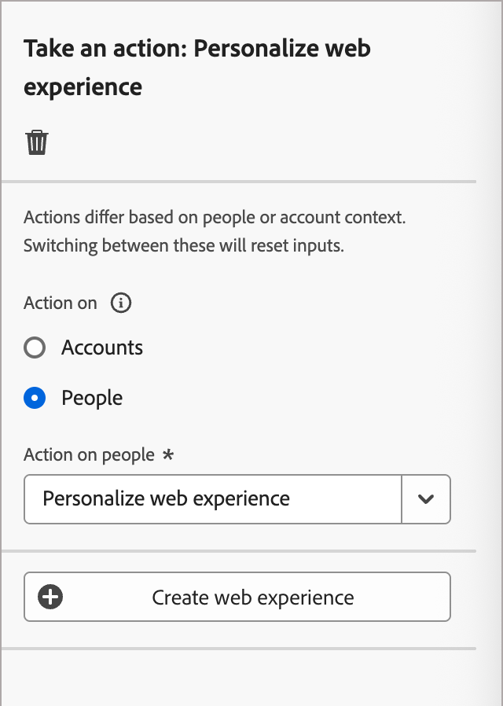{width="300"}

+++

+++[!UICONTROL 購買グループから削除]

このアクションを使用して、選択したソリューションの関心に基づいて[購買グループ &#x200B;](../buying-groups/buying-groups-overview.md)から人物プロファイルを削除します。

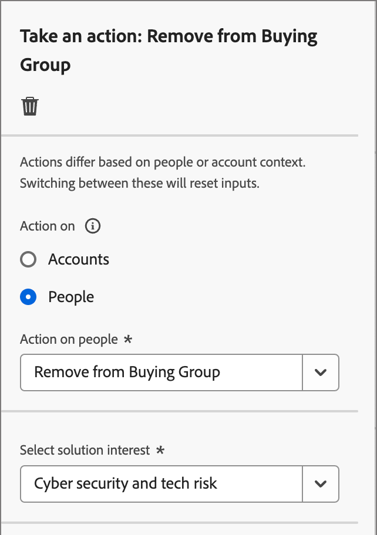{width="300"}

+++

+++[!UICONTROL 電子メールを送信]

このアクションを使用してメールを送信します。 ノードの電子メール [&#128279;](../content/add-email.md#add-an-email-to-your-journey)を[&#128279;](https://experienceleague.adobe.com/ja/docs/marketo/using/product-docs/email-marketing/general/creating-an-email/create-an-email)作成した後、電子メールデザインスペースで電子メールメッセージをデザイン、パーソナライズ、プレビューできます（[電子メールオーサリング &#x200B;](../content/email-authoring.md){target="_blank"}を参照）。 Marketo Engageから電子メールを送信することもできます。 Marketo Engage ワークスペースを選択し、送信するメールを選択します。

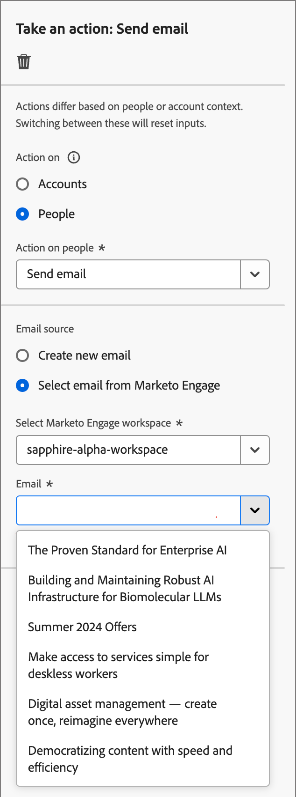{width="300"}

個人ジャーニーの場合、[送信時間の最適化](../content/email-send-time-optimization.md)を使用して、各プロファイルがエンゲージする可能性が最も高いタイミングを予測し、メール配信のタイミングをパーソナライズできます。

>[!NOTE]
>
>アカウントジャーニーでメールの重複排除を使用すると、ジャーニー内で同じメールアドレスに同じメールが複数回送信されないようにできます。 詳しくは、[電子メールの重複排除](../content/email-deduplication.md)を参照してください。

+++

+++[!UICONTROL SMSを送信]

このアクションを使用して、SMS メッセージを送信します。 ビジュアルデザイン空間でSMS メッセージを作成、パーソナライズ、プレビューできます（[SMS オーサリング &#x200B;](../content/sms-authoring.md)を参照）。

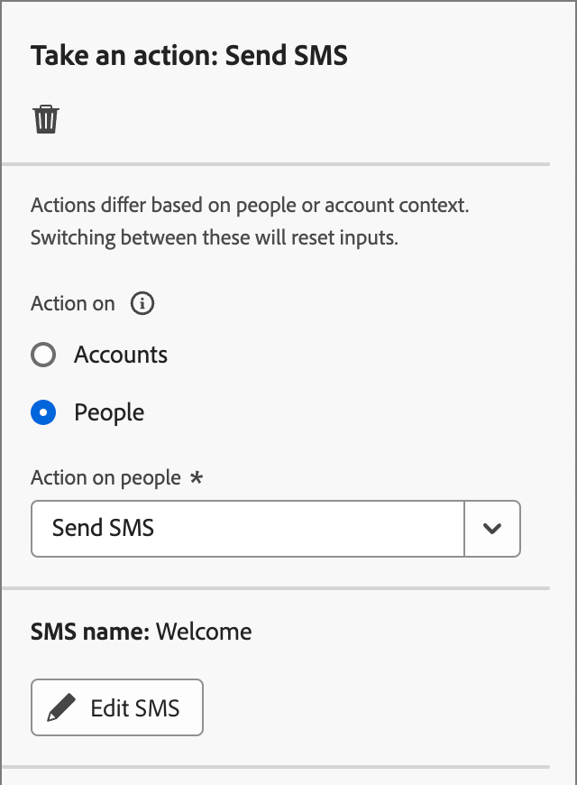{width="300"}

+++

+++[!UICONTROL 人物プロファイルの更新]

このアクションを使用して、[人物プロファイル属性](../admin/field-mapping.md#xdm-business-person-attributes)の値を変更します。 属性を選択し、新しい値を設定します。

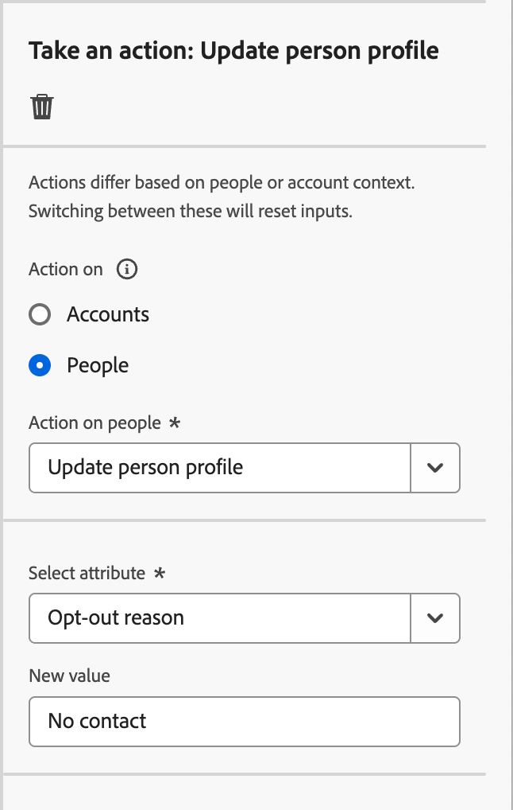{width="300"}

>[!NOTE]
>
>[簡素化されたアーキテクチャ &#x200B;](../simplified-architecture.md)内の&#x200B;_[!UICONTROL データ値の変更]_ アクションは、_[!UICONTROL 人物プロファイルの更新]_&#x200B;によって置き換えられます。 
>
>管理者は、_[!UICONTROL XDM クラス]_ > [!UICONTROL 標準クラス &#x200B;]のフィールドを更新することで、XDM個人プロファイルの使用可能な属性を設定できます。 詳しくは、[標準クラス &#x200B;](../admin/xdm-field-management.md#standard-classes)を参照してください。

+++

### Marketo Engage アクション

Marketo Engageのピープルベースのアクションは、Journey Optimizer B2B editionのアカウントベースドマーケティングのオーケストレーションと、Marketo Engageのリードベースのマーケティング施策を連携するように設計されています。 これらのアクションを使用して、リストメンバーシップを調整し、キャンペーンをリクエストします。

>[!NOTE]
>
>Marketo Engage アクションには、1つ以上の外部Marketo Engage インスタンスとの設定済み統合が必要です。 この設定について詳しくは、「[_Marketo Engage接続をアクティブ化してアクションをサポートする_](../admin/marketo-actions-connect.md)」を参照してください。

例えば、Journey Optimizer B2B editionの購買グループの一部である人物に対して、Marketo Engageのキャンペーンを抑制する場合があります。 この場合、ソリューションの関心に特化した静的リストをMarketo Engageで作成できます。 次に、購買グループによる分割パスで、ジャーニーノードから「_Marketo リストに追加_」アクションを使用します。 このアクションは、購買グループのメンバーを、接続されたMarketo Engage インスタンスの特定の静的リストに追加します。 次に、ソリューションの関心度に焦点を当てた静的リストをMarketo Engageのスマートリストフィルターに使用します。

+++[!UICONTROL Marketo リクエストキャンペーンに追加]

このアクションを使用して、接続されたMarketo Engage インスタンスの[&#x200B; リクエストキャンペーン &#x200B;](https://experienceleague.adobe.com/ja/docs/marketo/using/product-docs/core-marketo-concepts/smart-campaigns/flow-actions/request-campaign){target="_blank"}に人物プロファイルを追加します。

まず、接続されているMarketo Engage インスタンスを選択します。 次に、リクエストキャンペーン名を選択します。

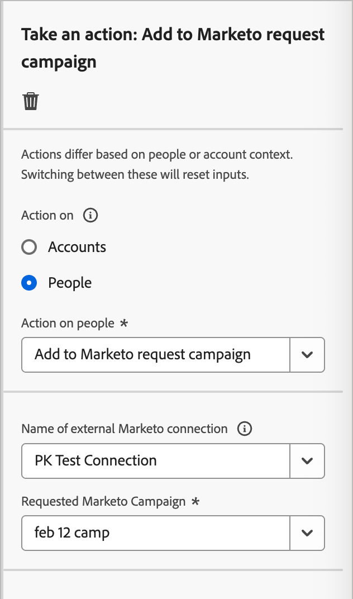{width="300"}

+++

+++[!UICONTROL Marketo リストに追加]

このアクションを使用して、接続されたMarketo Engage インスタンスの[静的リスト &#x200B;](https://experienceleague.adobe.com/ja/docs/marketo/using/product-docs/core-marketo-concepts/smart-lists-and-static-lists/static-lists/understanding-static-lists){target="_blank"}にユーザーを追加します。

まず、接続されているMarketo Engage インスタンスを選択します。 次に、リスト名を選択します。

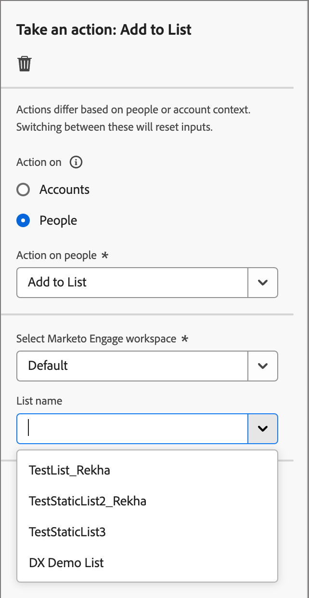{width="300"}

+++

+++[!UICONTROL Marketo リストから削除]

Marketo Engageの[静的リスト &#x200B;](https://experienceleague.adobe.com/ja/docs/marketo/using/product-docs/core-marketo-concepts/smart-lists-and-static-lists/static-lists/understanding-static-lists){target="_blank"}からユーザーを削除するには、この操作を使用します。

まず、接続されているMarketo Engage インスタンスを選択します。 次に、リスト名を選択します。

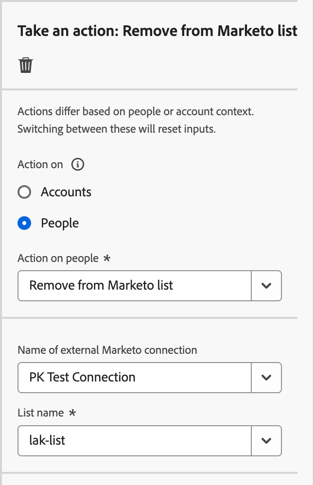{width="300"}

+++

## 概要動画

>[!VIDEO](https://video.tv.adobe.com/v/3443246/?captions=jpn&learn=on)
