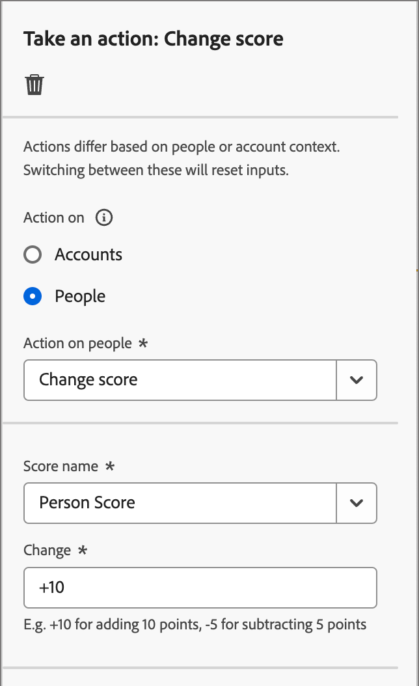

# アクションの実行

アカウントジャーニーで、_[!UICONTROL アクションの実行]_ ノードを追加して、メールの送信、スコアの変更、購入グループへの割り当てなどのアクションを実行できます。 アクションは、通常、イベントや以前のアクションなど、何らかのトリガーの結果として発生させるもので、

{width="30"} [概要ビデオを視聴](#overview-video)

## アカウントのアクション

ノードパス上のアカウントに属するすべてのユーザーに変更を適用する場合は、アカウントに対するアクションを使用します。

### アクションと制約 {#account-action-constraints}

| アクション | 制約 |
| ------ | ----------- |
| [!UICONTROL &#x200B; アカウント変更データ値 &#x200B;] | 属性   新しい値を選択 |
| [!UICONTROL &#x200B; アカウント興味深い瞬間 &#x200B;] | タイプ （メール、マイルストーン、web）   説明（オプション） |
| [!UICONTROL &#x200B; （その他）ジャーニーにアカウントを追加 &#x200B;] | ライブアカウントジャーニーを選択 |
| [!UICONTROL &#x200B; アカウントリストに追加 &#x200B;] | ライブの静的アカウントリストを選択 |
| [!UICONTROL ジャーニーからアカウントを削除 &#x200B;] | ライブアカウントジャーニーを選択 |
| [!UICONTROL &#x200B; アカウントリストから削除 &#x200B;] | ライブ静的アカウントリストの選択 |
| [!UICONTROL &#x200B; 販売アラートの送信 &#x200B;] | ソリューションの関心   メールの送信先を選択 |
| [!UICONTROL &#x200B; 購買グループの更新ステージ &#x200B;] | ソリューションの興味   購入グループのステージを選択 |
| [!UICONTROL &#x200B; 購買グループ・ステータスの更新 &#x200B;] | ソリューションの関心   ステータスを選択（必須、最大 50 文字） |

### アカウントベースのアクションの追加

1. ジャーニーマップに移動します。

1. パスのプラス（**+**）アイコンをクリックし、「**[!UICONTROL アクションを実行]**」を選択します。

   {width="400"}

1. 右側のノードプロパティで、アクションとして **[!UICONTROL アカウント]** を選択します。

1. リストからアクションを選択し、アクションの値を設定します。

   {width="700" zoomable="yes"}

## 顧客のアクション

ノードパス上のすべてのユーザーに変更を適用する場合は、「ユーザーに対するアクション」を使用します。 このノードタイプは、分割パス内で人物またはアカウントごとに使用できます。

### アクションと制約 {#people-action-constraints}

| コンテキスト | アクション | 制約 |
| ------- | ------ | ----------- |
| [Journey Optimizer B2B](#journey-optimizer-b2b-actions) | [!UICONTROL &#x200B; 外部顧客オーディエンスに追加 &#x200B;] | 外部の顧客オーディエンスを選択 |
| | [!UICONTROL &#x200B; 購買グループへの割当て &#x200B;] | ソリューションの関心   役割を選択 |
| | [!UICONTROL &#x200B; データ値を変更 &#x200B;] | 人物属性   新しい値を設定を選択 |
| | [!UICONTROL &#x200B; スコアを変更 &#x200B;] | スコア名   スコアの変更 |
| | [!UICONTROL &#x200B; 人物の興味深い瞬間 &#x200B;] | タイプ   説明 |
| | [!UICONTROL &#x200B; 購入グループから削除 &#x200B;] | ソリューションに対する関心を選択 |
| | [!UICONTROL &#x200B; メールを送信 &#x200B;] | 新しいメールを作成  Marketo Engageからメールを選択 |
| | [!UICONTROL SMS を送信 &#x200B;] | SMS を作成 |
| [Marketo Engage](#marketo-engage-actions) | [!UICONTROL &#x200B; リストに追加 &#x200B;] | Marketo Engage Workspace List 名を選択します。 |
| | [!UICONTROL Marketo Engage リクエストキャンペーンに追加 &#x200B;] | Marketo Engage Workspace を選択し   リクエストキャンペーンを選択します。 |
| | [!UICONTROL Marketo Engageの People パーティションの変更 &#x200B;] | 新規パーティション |
| | [!UICONTROL &#x200B; リストから削除 &#x200B;] | Marketo Engage Workspace List 名を選択します。 |

### ユーザーベースのアクションを追加

1. ジャーニーマップに移動します。

1. パスのプラス（**+**）アイコンをクリックし、「**[!UICONTROL アクションを実行]**」を選択します。

1. 右側のノードのプロパティで、アクションとして **[!UICONTROL People]** を選択します。

1. リストからアクションを選択し、アクションの値を設定します。

{width="700" zoomable="yes"}

### Journey Optimizer B2B アクション

Journey Optimizer B2B の人物ベースのアクションは、設定されたチャネルを通じてのコミュニケーションを管理し、購入グループおよびアカウント内の人物の分類を管理するように設計されています。 ジャーニーは、ユーザープロファイルを持つ資格のあるアカウントがノードに到達すると、アクションを適用します。

+++[!UICONTROL &#x200B; 外部顧客オーディエンスに追加 &#x200B;]

このアクションを使用して、外部オーディエンスにユーザーをプッシュします。このオーディエンスは、有料メディアチャネルでアクティブ化でき、購入グループのメンバーをさらにターゲットにすることができます。 このアクションは、Real-Time CDP B2B/P Edition を使用して実行されます。

>[!NOTE]
>
>個人プロファイルを含む資格のあるアカウントが公開済みのジャーニーの _外部顧客オーディエンスに追加_ ノードに達した場合、これらのプロファイルが外部オーディエンスに入力されるまで最大 48 時間かかる場合があります。

{width="300"}

この人物ベースのアクションを選択する場合は、新しい外部オーディエンスを作成するか、既存の外部オーディエンスから選択できます。 既存のオーディエンスの場合は、Journey Optimizer B2B editionでのみ作成された外部のカスタマーオーディエンスから選択できます。 オーディエンスを作成し、このジャーニーアクションに使用する場合は、必ず宛先に接続してください。 詳しくは、Experience Platform ドキュメントの [ 新しい宛先接続の作成 ](https://experienceleague.adobe.com/ja/docs/experience-platform/destinations/ui/connect-destination){target="_blank"} および [ アクティベーションの概要 ](https://experienceleague.adobe.com/ja/docs/experience-platform/destinations/ui/activate/activation-overview#activate-audiences-from-the-destinations-catalog){target="_blank"} を参照してください。

{width="30"}[ 有料メディアオーケストレーションの概要に関するビデオをご覧ください ](../data/linkedin-account-matched-audiences.md#orchestrate-paid-media-engagement)

_外部オーディエンスを作成するには：_

1. 「**[!UICONTROL 新規作成]**」を選択します。

1. **[!UICONTROL 外部顧客オーディエンスを作成]** をクリックします。

1. 新しい外部オーディエンスの **[!UICONTROL 名前]** （必須）と **[!UICONTROL 説明]** （オプション）を入力します。

   {width="300"}

1. 「**[!UICONTROL 作成]**」をクリックします。

   新しいオーディエンスが作成され、確認メッセージが表示されます。 その後、ノードアクションの既存のオーディエンスとして使用に進むことができます。

   >[!NOTE]
   >
   >Journey Optimizer B2B editionから新しい外部カスタマーオーディエンスが作成されると、ダミーレコードがシードされます（`test@email.com`）。 このレコードは、最初の実際のプロファイルがジャーニーから外部オーディエンスに追加されるとすぐに上書きされます。

_既存のオーディエンスを使用するには：_

1. **[!UICONTROL 外部顧客オーディエンスを選択]** をクリックします。

1. ダイアログで、使用するオーディエンスを選択します。

   {width="700" zoomable="yes"}

1. **[!UICONTROL オーディエンスを追加]** をクリックします。

+++

+++[!UICONTROL &#x200B; 購買グループへの割当て &#x200B;]

このアクションを使用して、選択したソリューションの関心と役割に基づいて、人物プロファイルを [ 購入グループ ](../buying-groups/buying-groups-overview.md) に追加します。

{width="300"}

+++

+++[!UICONTROL &#x200B; データ値を変更 &#x200B;]

[ 人物プロファイル属性 ](../data/field-mapping.md#xdm-business-person-attributes) の値を変更するには、このアクションを使用します。 属性を選択して、新しい値を設定します。

{width="300"}

+++

+++[!UICONTROL &#x200B; スコアを変更 &#x200B;]

Marketo Engageで人物スコアを変更するには、このアクションを使用します。 [詳細情報](https://experienceleague.adobe.com/ja/docs/marketo-learn/tutorials/lead-and-data-management/lead-scoring-learn){target="_blank"}

{width="300"}

+++

+++[!UICONTROL &#x200B; 人物の興味深い瞬間 &#x200B;]

人物プロファイルに興味深い瞬間を記録するには、このアクションを使用します。 タイプ（メール、マイルストーン、web）を選択し、説明（オプション）を追加します。

{width="300"}

+++

+++[!UICONTROL &#x200B; 購入グループから削除 &#x200B;]

このアクションを使用して、選択したソリューションの関心に基づいて [ 購入グループ ](../buying-groups/buying-groups-overview.md) から人物プロファイルを削除します。

{width="300"}

+++

+++[!UICONTROL &#x200B; メールを送信 &#x200B;]

メールを送信するには、このアクションを使用します。 ノードの [ メールを作成 ](../content/add-email.md#add-an-email-to-your-journey) した後は、メールデザイン領域でメールメッセージのデザイン、パーソナライズおよびプレビューを行うことができます（[ メールのオーサリング ](../content/email-authoring.md) を参照）。 [Marketo Engageからメールを送信する ](https://experienceleague.adobe.com/ja/docs/marketo/using/product-docs/email-marketing/general/creating-an-email/create-an-email){target="_blank"} ともできます。 Marketo Engage Workspace を選択し、送信するメールを選択します。

{width="300"}

+++

+++[!UICONTROL SMS を送信 &#x200B;]

SMS メッセージを送信するには、このアクションを使用します。 ビジュアルデザイナーで SMS メッセージの作成、パーソナライズ、プレビューを行えます（「[SMS オーサリング ](../content/sms-authoring.md)」を参照）。

{width="300"}

+++

### Marketo Engageアクション

Marketo Engageのユーザーベースのアクションは、Marketo Engage B2B editionのアカウントベースのマーケティングオーケストレーションとJourney Optimizerのリードベースのマーケティング活動を調整するように設計されています。 これらのアクションを使用して、リストメンバーシップ、人物パーティションおよびリクエストキャンペーンを調整します。

+++[!UICONTROL &#x200B; リストに追加 &#x200B;]

Marketo Engageの [ スマートリスト ](https://experienceleague.adobe.com/ja/docs/marketo/using/product-docs/core-marketo-concepts/smart-lists-and-static-lists/understanding-smart-lists){target="_blank"} からユーザーを削除するには、このアクションを使用します。

まず、接続されたMarketo Engage インスタンスのワークスペースを選択します。 次に、リスト名を選択します。

{width="300"}

+++

+++[!UICONTROL Marketo リクエストキャンペーンに追加 &#x200B;]

Marketo Engageの [ リクエストキャンペーン ](https://experienceleague.adobe.com/ja/docs/marketo/using/product-docs/core-marketo-concepts/smart-campaigns/flow-actions/request-campaign){target="_blank"} に人物プロファイルを追加するには、このアクションを使用します。

まず、接続されたMarketo Engage インスタンスのワークスペースを選択します。 次に、リクエストキャンペーン名を選択します。

{width="300"}

+++

+++[!UICONTROL Marketo Engageの人物パーティションの変更 &#x200B;]

Marketo Engageで [ 人物パーティション ](https://experienceleague.adobe.com/ja/docs/marketo/using/product-docs/administration/workspaces-and-person-partitions/understanding-workspaces-and-person-partitions#person-partitions){target="_blank"} を変更するには、このアクションを使用します。

{width="300"}

+++

+++[!UICONTROL &#x200B; リストから削除 &#x200B;]

Marketo Engageの [ スマートリスト ](https://experienceleague.adobe.com/ja/docs/marketo/using/product-docs/core-marketo-concepts/smart-lists-and-static-lists/understanding-smart-lists){target="_blank"} からユーザーを削除するには、このアクションを使用します。 まず、接続されたMarketo Engage インスタンスのワークスペースを選択します。 次に、リスト名を選択します。

{width="300"}

ユーザープロファイルがスマートリストのメンバーでない場合、アクションは無視されます。

+++

## 概要ビデオ

>[!VIDEO](https://video.tv.adobe.com/v/3443246/?learn=on&captions=jpn)
