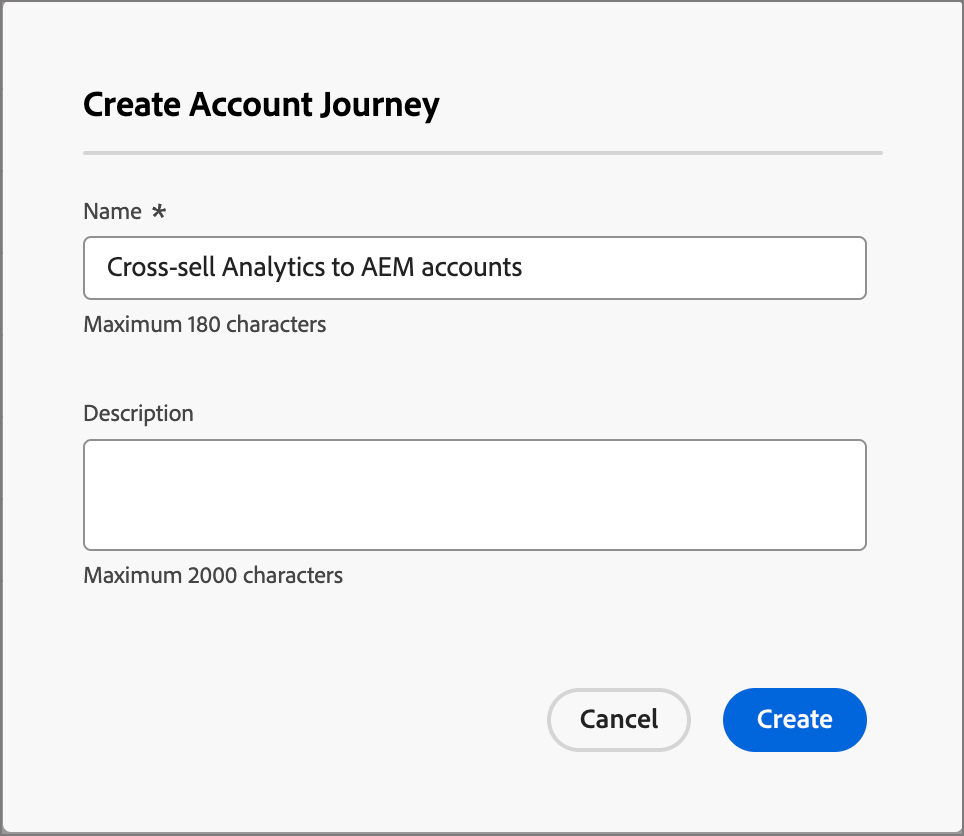

# ジャーニーの構築と公開

ジャーニーを開始するには、ジャーニーを作成し、ジャーニーマップでノードとジャーニーフローを構築します。

{width="30"} [概要ビデオを視聴](#overview-video)

## ジャーニーの作成

左側のナビゲーションの&#x200B;**[!UICONTROL ジャーニー管理]**&#x200B;で、作成するジャーニータイプを選択します。

* **[!UICONTROL アカウントジャーニー]**
* **[!UICONTROL ユーザージャーニー]** （Beta）

_新しいジャーニーを追加するには&#x200B;:_

+++アカウントジャーニー

1. ページの右上にある「**[!UICONTROL アカウントジャーニーを作成]**」をクリックします。

1. ダイアログで、一意の&#x200B;**[!UICONTROL 名前]** （必須）と&#x200B;**[!UICONTROL 説明]** （オプション）を入力します。

   {width="400"}

1. 「**[!UICONTROL 作成]**」をクリックします。

+++

+++ユーザージャーニー（Beta）

1. ページの右上にある「**[!UICONTROL ジャーニーを作成]**」をクリックします。

1. ダイアログで、一意の&#x200B;**[!UICONTROL 名前]** （必須）と&#x200B;**[!UICONTROL 説明]** （オプション）を入力します。

   {width="400"}

1. 「**[!UICONTROL 作成]**」をクリックします。

+++

## ジャーニーデザインの構成要素

_ジャーニーマップ_&#x200B;は、ジャーニーワークスペースの中央ゾーンです。 このゾーンでは、ジャーニーノードを追加して設定できます。 ノードをクリックして、カンバスの右側にあるプロパティパネルを開き、デザインに応じて設定します。 ジャーニーは常にオーディエンスノードから始まり、ジャーニーの入力を定義できます。

* [アカウントオーディエンスノード](./account-audience-nodes.md)
* [人物オーディエンスノード](./person-audience-nodes.md)

アカウントジャーニーを作成してオーディエンスを追加したら、ノードを使用してジャーニーを構築します。 ジャーニーマップにはキャンバスが用意されており、次のノードタイプを使用してマルチステップ B2B マーケティングのユースケースを構築し、アカウントジャーニーを構築することができます。

* [アクションの実行](./action-nodes.md)
* [イベントのリッスン](./listen-for-event-nodes.md)
* [パスを分割](./split-merge-paths-nodes.md)
* [待機](./wait-nodes.md)
* [パスを結合](./split-merge-paths-nodes.md)

## ガードレール

エラーが発生することなくジャーニーを構築できるように、次のガードレールを配置します。

* _分割パスノードの削除_: ノードを削除するには、各パス内のすべての後続ノードを削除する必要があります。
* _結合ノードの削除_：結合ノードは、結合ノードに1つのパスが接続されている場合にのみ削除できます。 結合ノードを削除するには、1つのパスのみを選択したままにします。
* _アカウントとユーザーの切り替え_：選択をアカウントからユーザーに変更すると、各パス内のその後のすべてのノードが削除されます。

## ノードを追加

1. ジャーニーマップに移動します。

1. パスのプラス（**+**）アイコンをクリックし、ノードタイプを選択します。

1. 右側のノードプロパティを設定します。

## ノードの削除

1. ジャーニーマップに移動します。

1. 右側のノードプロパティで、_削除_ （）アイコンをクリックします。

1. 設定ダイアログで、**[!UICONTROL 削除]**&#x200B;をクリックします。

## パスの追加と削除

1. ジャーニーマップに移動します。

1. パスのプラス（**+**）アイコンをクリックし、[ パスを分割ノード ](./split-merge-paths-nodes.md#split-paths)を追加します。

1. 右側のノードプロパティで、**[!UICONTROL アカウント]**&#x200B;を選択します。

1. パスをさらに追加するには、**[!UICONTROL パスを追加]**&#x200B;をクリックします。

   ジャーニーで作成された各パスで、新しいパスカードがプロパティに表示されます。

1. ジャーニー内のいずれかのパスに移動し、プラスアイコンを使用してこの[action](./action-nodes.md)または[event](./listen-for-event-nodes.md) ノードをこのパスに追加します。

1. [ パスを分割](./split-merge-paths-nodes.md) ノードを選択して、右側のプロパティを開きます。

   ノードが存在するパスは削除できません。

1. これらのパスを削除するには、最初にそのパス上のすべてのノードを削除する必要があります。

## ジャーニーのスケジュール

ジャーニーを公開すると、直ちに開始することも、スケジュールされた将来の日付に開始することもできます。 終了日は、開始日から最大3年までです。 ジャーニーが公開された後（_ライブ_ ステータス）、ジャーニーの終了日を更新できますが、開始日を更新することはできません。

1. ジャーニーマップに移動します。

1. ヘッダーの「**[!UICONTROL ジャーニー設定]**」をクリックして、ジャーニーをスケジュールします。

1. ダイアログで、スケジュールのオプションを設定します。

   * スケジュールの種類を選択します。

     公開時にジャーニーをアクティブにするには、**[!UICONTROL 即時]**&#x200B;を選択します。

     将来の日付でジャーニーをアクティブにするには、**[!UICONTROL 特定の日付]**&#x200B;を選択し、_カレンダー_ アイコンをクリックして日付を選択します。

     {width="400" zoomable="no"}

   * ジャーニーの&#x200B;**[!UICONTROL 終了日]**&#x200B;を指定します。 開始日から最大3年までです（このフィールドは公開するために必要です）。

1. 「**[!UICONTROL 保存]**」をクリックします。

   ジャーニーを公開する準備ができたら、_[!UICONTROL 公開]_&#x200B;をクリックして、これらの設定を確認できます。

## ジャーニーの公開

ブロッカーエラーがない場合は、ジャーニーを公開できます。 公開すると、ジャーニーのステータスが&#x200B;_ライブ_&#x200B;に変更されます。 ジャーニーにエラーがある場合、_[!UICONTROL 公開]_ ボタンはコンテンツ情報でグレー表示されます：`Resolve errors before publishing`。

>[!NOTE]
>
>アカウントジャーニーを公開した後、適格なアカウントがジャーニーに入るまでに最大24時間の遅延があります。

1. ジャーニーマップの右上にある「**[!UICONTROL 公開]**」をクリックします。

1. _[!UICONTROL ジャーニー設定を確認]_ ダイアログで、ジャーニー開始オプションを設定します。

   ジャーニー設定を既に設定してスケジュールを定義している場合は、設定を確認します。

   ジャーニーのアクティベーションを設定する必要がある場合は、スケジュールタイプを選択します。

   * 公開時にジャーニーをアクティブにするには、**[!UICONTROL 即時]**&#x200B;を選択します。

   * 将来の日付でジャーニーをアクティブにするには、**[!UICONTROL 特定の日付]**&#x200B;を選択し、_カレンダー_ アイコンをクリックして日付を選択します。

1. 必要に応じて、ジャーニーの&#x200B;**[!UICONTROL 終了日]**&#x200B;を指定します。

   {width="400" zoomable="no"}

   開始日から最大3年までです（このフィールドは公開するために必要です）。

1. 「**[!UICONTROL 次へ]**」をクリックします。

1. 確認ダイアログで、**[!UICONTROL 公開]**&#x200B;をクリックします。

## 概要動画

>[!VIDEO](https://video.tv.adobe.com/v/3443204/?learn=on)
