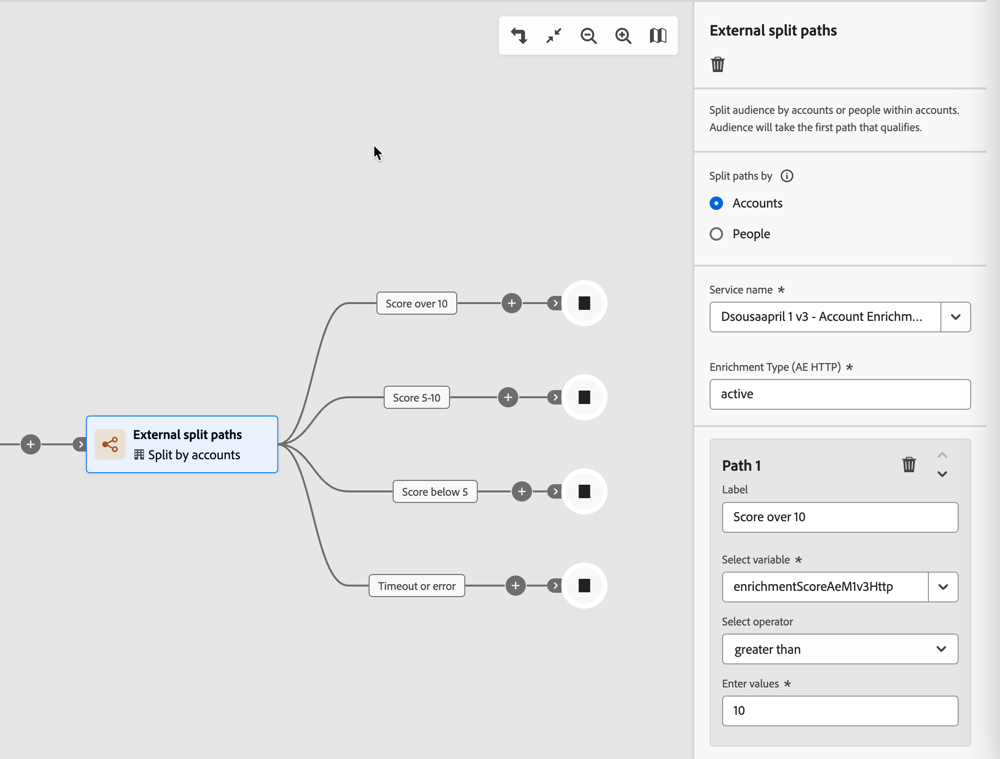

# 外部ノード

外部ノードを使用して、アカウントジャーニーを外部サービスと接続します。 アカウントオーディエンスがこれらのノードのいずれかに到達すると、Journey Optimizer B2B editionはオーディエンス属性データを非同期で外部サービスに送信します。 このサービスは、データを処理し、コールバックを使用して応答し、ジャーニーが続行するために使用するオーディエンス情報とメタデータを返します。

>[!NOTE]
>
>外部アクションノードは、アカウントジャーニーでのみ使用できます。 これらは対面ジャーニーではサポートされていません。
>
>マーケターがジャーニーにこれらのノードを追加して実装する前に、管理者は[外部アクション ](../admin/configure-external-actions.md)を設定してアクティブにする必要があります。

外部アクションノードタイプは2つあります。

* **[外部アクション](#external-action)** – 外部サービスを呼び出し、1つの送信パスに沿って続行します。 このノードは、外部システムのレコードの更新や下流サービスへのシグナルの送信など、分岐ロジックを使用せずに外部プロセスをトリガーする場合に使用します。
* **[外部分割パス](#external-split-paths)** – 外部サービスを呼び出し、定義された複数のパスのいずれかに沿ってアカウントをルーティングするために応答を評価します。 このノードは、外部サービスが、ジャーニーの次のステップを決定するスコア、層、分類などの値を返す場合に使用します。

## 外部アクションノード {#external-action}

_外部アクション_ ノードは、外部サービスを呼び出し、応答コンテンツに関係なく、単一の送信パスに沿って続行します。 外部呼び出し後に分岐が必要ない統合に使用します。

1. アカウントジャーニーマップに移動します。

1. パスのプラス（**+**）アイコンをクリックし、**[!UICONTROL 外部アクション]**&#x200B;を選択します。

   {width="400"}

1. 右側のノードプロパティで、外部アクションの&#x200B;]**コンテキストに**[!UICONTROL  アクションを設定します。

   * ノードパス上のアカウントの一部であるすべてのユーザーに外部アクションを適用する場合は、**[!UICONTROL アカウント]**&#x200B;を選択します。
   * ノードパスのすべてのユーザーに変更を適用する場合は、**[!UICONTROL ユーザー]**&#x200B;を選択します。

1. 外部&#x200B;**[!UICONTROL サービス名]**&#x200B;を選択します。

   {width="600" zoomable="yes"}

   リストには、_外部アクション_ タイプとコンテキストにアクティブで指定されているすべての設定済み外部アクションが含まれます。

1. サービスにグローバル属性がある場合は、サービス名の下に表示されるフィールドに必須の値を入力します。

1. ノードの発信パスからジャーニーの構築を続行します。

   _[!UICONTROL タイムアウトまたはエラー]_ パスが自動的に作成されます。 （サービスで設定された）タイムアウト期間が応答を受け取る前に経過した場合、アカウントまたは人物はこのパスに進みます。 エラー応答を受け取った場合も同じです。 ジャーニーノードをこのパスに追加して、これらのシナリオを処理するか、ジャーニーがオーディエンスメンバーに対して終了します。

## 外部分割パスノード {#external-split-paths}

外部スプリットパスノードは、外部サービスを呼び出し、応答を使用して、次に取得するパスアカウントを決定します。 各パスは、外部サービスによって返される変数（アクセサー）に基づく条件によって定義されます。 ジャーニーは、定義されたパス条件に対して応答を評価し、最初に一致するパスに沿って各アカウントをルーティングします。 パスの条件はトップダウンの順序で評価されます。 各アカウントは、条件が外部サービスから返された値と一致する最初のパスに沿って進みます。

1. アカウントジャーニーマップに移動します。

1. パスのプラス（**+**）アイコンをクリックし、**[!UICONTROL 外部分割パス]**&#x200B;を選択します。

   {width="400"}

1. 右側のノードプロパティで、**[!UICONTROL パスを]** タイプで分割を選択します。

   * **[!UICONTROL アカウント]** - アカウントごとにパスを分割する場合は、定義されたパス内にアカウントノードと人物ノードの両方を追加できます。
   * **[!UICONTROL 人物]** - パスを人物ごとに分割する場合は、定義されたパス内に人物アクションノードのみを追加できます。 ユーザーベースの分割は、_[!UICONTROL パスを結合]_ ノードで自動的に閉じられるため、すべてのユーザーはアカウントコンテキストを失うことなく次のステップに進むことができます。

1. **[!UICONTROL サービス名]**&#x200B;を選択します。

1. サービス設定に&#x200B;_グローバル属性_&#x200B;がある場合は、サービス名の下に表示されるフィールドに必要な値を入力します。

1. _[!UICONTROL パス 1]_&#x200B;の場合、分岐条件を定義します。

   * **[!UICONTROL Label]**&#x200B;の場合、デフォルト値をより説明的なラベルに置き換えます。
   * **[!UICONTROL 変数を選択]**&#x200B;で、アクセサーを選択します。 アクセサーは、外部サービスによって返される値で、アクションの設定時に定義されます。
   * **[!UICONTROL 演算子を選択]**&#x200B;するには、演算子を選択します。
   * **[!UICONTROL 値を入力]**&#x200B;するには、一致する値を入力します。

   {width="600" zoomable="yes"}

   >[!NOTE]
   >
   >使用可能な条件変数とサポートされているジャーニーコンテキスト（_アカウント_、_人物_、または&#x200B;_アカウント内の人物_）は、外部アクション設定によって決定されます。 想定されるサービスまたは変数が利用できない場合は、管理者に連絡してください。

1. さらにパスを追加するには、**[!UICONTROL パスを追加]**&#x200B;をクリックし、必要なパスごとに条件を定義します。

1. ノードの各送信パスからジャーニーの構築を続行します。

   _[!UICONTROL タイムアウトまたはエラー]_ パスが自動的に作成されます。 （サービスで設定された）タイムアウト期間が応答を受け取る前に経過した場合、アカウントまたは人物はこのパスに進みます。 エラー応答を受け取った場合も同じです。 ジャーニーノードをこのパスに追加して、これらのシナリオを処理するか、ジャーニーがオーディエンスメンバーに対して終了します。

1. _アカウントで分割_&#x200B;する場合、[ パスを結合ノード ](./split-merge-paths-nodes.md#merge-paths)を追加して、必要に応じて2つ以上のパスを結合できます。
