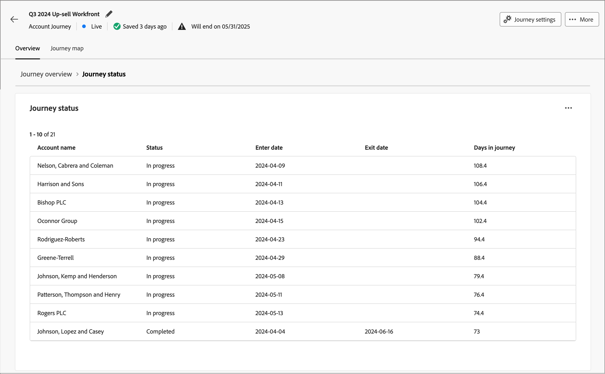

# ジャーニーの詳細

アクティブなアカウントジャーニーの名前をクリックすると、ジャーニーの詳細が表示されます。 「_[!UICONTROL 概要]_」タブには、生成 AI による要約など、ジャーニーに関する有用な情報が表示されます。

このダッシュボードは、選択したアカウントジャーニーの包括的な概要を提供し、完了、進行中のアクティビティ、中止の推移を分類および定量化する円グラフと折れ線グラフを使用して、アカウントの進行状況の詳細を示します。 これは、マーケターが、主要な配信とエンゲージメント指標を通じてメールおよび SMS チャネルの有効性を評価するのに役立ちます。

この概要は、公開済みアカウントジャーニーで使用でき、データがグラフとテーブルに入力され始めるまで約 4 時間かかります。

{width="700" zoomable="yes"}

## ジャーニー完了

このセクションには、次の 2 つの完了指標が表示されます。

* **[!UICONTROL ジャーニーのステータス]** – この円グラフは、アカウントを _完了_、_処理中_、_中止_ に分類することで、ジャーニーのステータスの分類を提供します。 各セグメントには、グラフの外側の端に、対応する割合と口座番号のラベルが付けられます。
* **[!UICONTROL ジャーニーの完了の推移]** – この折れ線グラフは、ジャーニーを完了したアカウント数を経時的に追跡します。 横軸はタイムラインをマッピングし、縦軸は勘定科目を定量化し、完了トレンドをわかりやすく表示します。

## ジャーニーのエンゲージメント

このセクションには、次の 2 つの完了指標が表示されます。

* **[!UICONTROL アカウント別のエンゲージメント]** – この円グラフは、ジャーニーのアカウントを _エンゲージメント_ および _エンゲージメントなし_ カテゴリにセグメント化します。 中央の図は、合計数を示しています。 このビジュアライゼーションは、アカウントのエンゲージメント全体を一目で把握できるようにします。
* **ユーザー別のエンゲージメント** – このビジュアライゼーションは、ジャーニーにおいて _エンゲージメント_ と認定されたユーザーの合計数を表示します。

## ジャーニー性能

この節では、次の 2 つの重要な指標を示します。

* **[!UICONTROL ジャーニーの完了率]** - ジャーニーを正常に完了したアカウントの割合。
* **[!UICONTROL ジャーニー期間]** - アカウントがジャーニーを完了するまでにかかった平均時間。

## メールと SMS のパフォーマンス

パフォーマンステーブルは、メールと SMS チャネルの有効性を詳しく示します。 各表には、配信率やクリックスルー率など、各通信タッチポイントの影響を評価するのに役立つ指標が表示されます。

**[!UICONTROL メールのパフォーマンス]** テーブル列：

* _[!UICONTROL アセット名]_ - アセットの名前
* _[!UICONTROL 送信済み]_ – 送信されたメールの数
* _[!UICONTROL 配信率]_ – 配信されたメール数を送信数で割った値
* _[!UICONTROL 開封率]_ – 開封されたメールの数を、配信された数で割った値
* _[!UICONTROL クリックスルー率]_ - クリックされたメールの数を、配信された数で割った値

**[!UICONTROL SMS パフォーマンス]** テーブル列：

* _[!UICONTROL アセット名]_ - アセットの名前
* _[!UICONTROL 送信済み]_ – 送信された SMS メッセージの数
* _[!UICONTROL 配信率]_ – 配信された SMS メッセージの数を送信数で割った値
* _[!UICONTROL クリックスルー率]_ - クリックされた SMS メッセージの数を、配信された数で割った値
<!-- 
To generate a shareable PDF of your current view, click **[!UICONTROL Export]** at the top right of the page. -->

## インタラクションの強化

各グラフまたはテーブルの右上にあるアクションアイコン（**...**）を使用して、データをさらにエンゲージします。

### ドリルスルー

_[!UICONTROL ジャーニーのステータス]_ グラフで、個々のアカウントのステータスを詳細に分析するには、「**[!UICONTROL ドリルスルー]**」を選択します。

{width="600" zoomable="yes"}
<!--
The applied global filters are carried over to the view and displayed at the top. Click the _Filter_ icon at the top left to filter the data display by journey.-->

### さらに表示

**[!UICONTROL さらに表示]** を選択すると、拡張データにアクセスできます。 表示されるポップアップには、データの分類が表示されます。

{width="600" zoomable="yes"}

データをダウンロードするには、データテーブルの右上にある **[!UICONTROL CSV をダウンロード]** をクリックします。 _概要_ ダッシュボードに戻るには、「**[!UICONTROL 閉じる]**」をクリックします。
