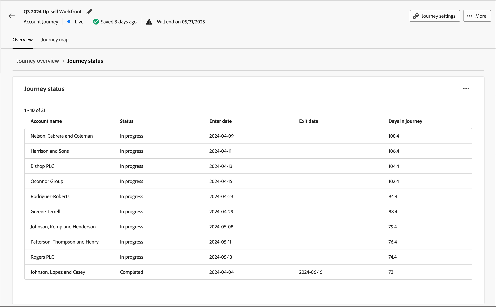
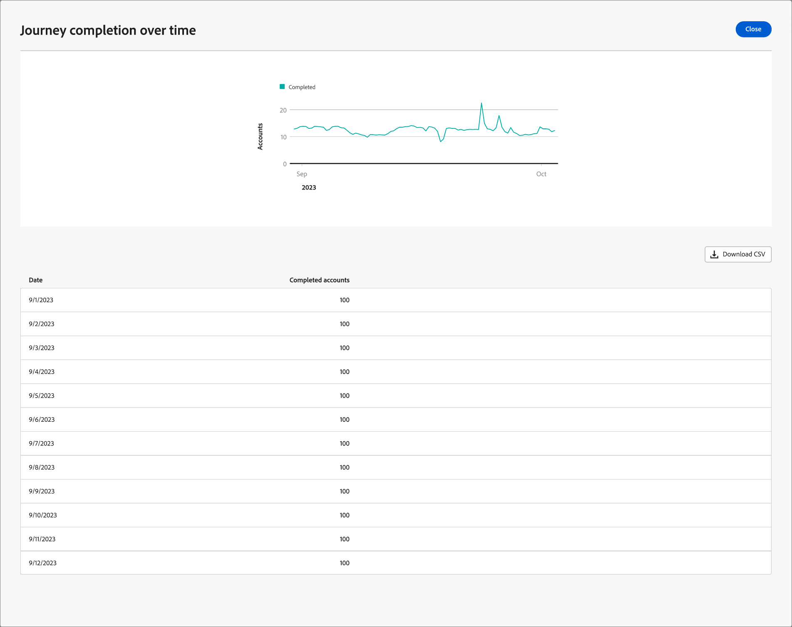

# ジャーニーの詳細

アクティブなアカウントジャーニーの名前をクリックすると、ジャーニーの詳細が表示されます。 「_[!UICONTROL 概要]_」タブには、生成AIの概要など、ジャーニーに関する有用な情報が表示されます。

このダッシュボードでは、選択したアカウントジャーニーの包括的な概要を把握し、完了、進行中のアクティビティ、長期的な中止を分類および定量化する円グラフと折れ線グラフを使用して、アカウントの進捗状況を詳細に把握できます。 マーケターは、主要な配信とエンゲージメント指標を通じて、メールとSMS チャネルの有効性を評価できます。

この概要は、公開されたアカウントジャーニーで利用でき、データがチャートとテーブルの入力を開始するのに約4時間かかります。

{width="700" zoomable="yes"}

## ジャーニー完了

このセクションでは、次の2つの完了指標を示します。

* **[!UICONTROL ジャーニーステータス]** – この円グラフは、アカウントを&#x200B;_完了_、_進行中_、_中止_&#x200B;に分類することで、ジャーニーのステータスの内訳を示します。 各セグメントには、グラフの外側の端に対応するパーセンテージとアカウント番号がラベル付けされています。
* **[!UICONTROL 時間の経過に伴うジャーニーの完了]** – この折れ線グラフは、時間の経過に伴ってジャーニーを完了したアカウントの数を追跡します。 横軸はタイムラインをマッピングし、縦軸はアカウントを定量化し、完了傾向をわかりやすく提示します。

## ジャーニーのエンゲージメント

このセクションでは、次の2つの完了指標を示します。

* **[!UICONTROL アカウント別エンゲージメント]** – この円グラフは、ジャーニー内のアカウントを&#x200B;_エンゲージ_&#x200B;と&#x200B;_エンゲージしていない_ カテゴリーにセグメント化します。 中央の図は合計数を示しています。 このビジュアライゼーションにより、アカウントエンゲージメント全体を一目で把握することができます。
* **人物によるエンゲージメント** – このビジュアライゼーションには、ジャーニーで&#x200B;_エンゲージメント_&#x200B;として認定された人物の合計数が表示されます。

## ジャーニーパフォーマンス

このセクションでは、次の2つの重要な指標を紹介します。

* **[!UICONTROL ジャーニー完了率]** - ジャーニーを正常に完了したアカウントの割合。
* **[!UICONTROL ジャーニー期間]** - アカウントがジャーニーを完了するのにかかる平均時間です。

## 電子メールとSMSのパフォーマンス

パフォーマンステーブルでは、メールとSMS チャネルの有効性を詳細に確認できます。 各表には、各コミュニケーション接点の影響を評価するのに役立つ配信率やクリックスルー率などの指標が示されています。

**[!UICONTROL 電子メールパフォーマンス]**&#x200B;のテーブル列：

* _[!UICONTROL アセット名]_ - アセットの名前
* _[!UICONTROL 送信済み]_ – 送信されたメール数
* _[!UICONTROL 配信率]_ – 配信されたメールの数を送信数で割った数
* _[!UICONTROL 開封率]_ – 開封数を配信数で割ったメール数
* _[!UICONTROL クリック率]_ - クリックされた電子メールの数を配信数で割った数

**[!UICONTROL SMS パフォーマンス]**&#x200B;のテーブル列：

* _[!UICONTROL アセット名]_ - アセットの名前
* _[!UICONTROL 送信済み]_ - SMS メッセージ送信数
* _[!UICONTROL 配信率]_ – 配信されたSMS メッセージの数を送信数で割った数
* _[!UICONTROL クリック率]_ - クリックされたSMS メッセージの数を配信数で割った数
<!--
To generate a shareable PDF of your current view, click **[!UICONTROL Export]** at the top right of the page. 
-->

## インタラクションの強化

アクションアイコン （**...**）を使用して、データをさらにエンゲージします グラフや表の右上にカーソルを合わせます。

### ドリルスルー

_[!UICONTROL ジャーニーステータス]_&#x200B;のグラフで、個々のアカウントのステータスを詳細に分析するには、**[!UICONTROL ドリルスルー]**&#x200B;を選択します。

{width="600" zoomable="yes"}
<!--
The applied global filters are carried over to the view and displayed at the top. Click the _Filter_ icon at the top left to filter the data display by journey.
-->

### さらに表示

拡張データにアクセスするには、**[!UICONTROL 詳細を表示]**&#x200B;を選択します。 表示されるポップアップには、データの内訳が表示されます。

{width="600" zoomable="yes"}

データをダウンロードするには、データテーブルの右上にある「**[!UICONTROL CSVをダウンロード]**」をクリックします。 _概要_ ダッシュボードに戻るには、**[!UICONTROL 閉じる]**&#x200B;をクリックします。
