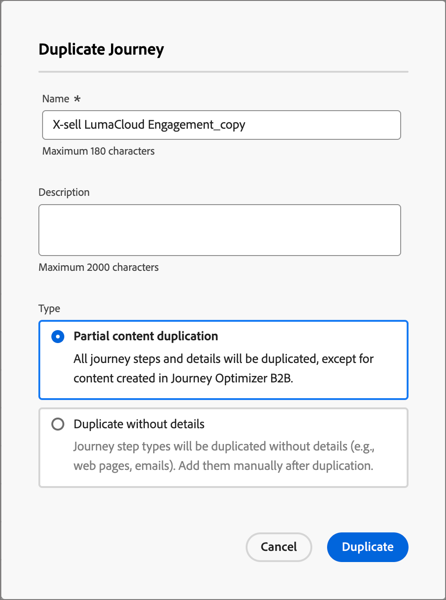

# アカウントジャーニー

アカウントジャーニーを使用すると、デマンドジェネレーションと購買グループの選定を効率化し、獲得、アップセル／クロスセル、保持の各プログラムに対するより選定された需要を推進できます。メール、SMS、イベントなどを通じて自動化されたエンゲージメントを使用して、各購買グループと、購買グループのメンバーに合わせてジャーニーを調整します。

アカウントジャーニー内でメール、SMS などを含む販売主導のエンゲージメントを定義して、各購買グループメンバーのインバウンドマーケティングとアウトバウンド販売のアクティビティを調整します。

{width="30"} [概要ビデオを視聴](#overview-video)

## ジャーニーの開始

アカウントジャーニーを開始するには：

1. [ジャーニーを作成します](./create-publish-journey.md#create-an-account-journey)。
1. [ノードを追加](./create-publish-journey.md#add-a-node)し、ジャーニーマップで[ジャーニーフローを定義](./create-publish-journey.md#add-and-delete-a-path)します。
1. [ジャーニーを公開します](./create-publish-journey.md#publish-an-account-journey)。

## アカウントジャーニーへのアクセスと参照

左側のナビゲーションで、**[!UICONTROL アカウント管理]**&#x200B;を展開し、「**[!UICONTROL アカウントジャーニー]**」をクリックします。

リストの上部にある&#x200B;_検索_&#x200B;ツールにテキストを入力して、表示されるリストを名前でフィルタリングします。

{width="800" zoomable="yes"}

_[!UICONTROL アカウントジャーニー]_&#x200B;リストページには、次の列が含まれています。

* [!UICONTROL 名前]（名前をクリックすると、ジャーニーが編集用に開きます）
* [!UICONTROL ステータス]
* [!UICONTROL 説明]
* [!UICONTROL 作成者]
* [!UICONTROL 最終更新日]
* [!UICONTROL 最終更新者]
* [!UICONTROL 公開日]
* [!UICONTROL 公開者]

列ヘッダーをクリックすると、_[!UICONTROL ステータス]_&#x200B;でリストを並べ替えることができます。

右上隅の「_テーブルをカスタマイズ_」（）アイコンをクリックすると、テーブルに表示される列をカスタマイズできます。ダイアログのチェックボックスをオンまたはオフにして、「**[!UICONTROL 適用]**」をクリックします。

{width="800" zoomable="yes"}

## アカウントジャーニーの詳細

_[!UICONTROL アカウントジャーニー]_&#x200B;リスト内の名前（リンクとして表示）をクリックすると、詳細の確認、変更の実行、アクションの実行を行うことができます。

{width="800" zoomable="yes"}

各アカウントジャーニーマップのヘッダーには、次のものが含まれます。

* ジャーニー名
* ジャーニー名の編集ツール（ 「_編集_」アイコン）
* ジャーニーのステータス

ジャーニーのステータスは、適用したアクションに基づいて変更される場合があります。ジャーニーのステータスに基づいて、ヘッダーの右側から特定のアクションを使用できるかどうかが決まります。

| ステータス | 説明 | 使用可能なアクション |
| ------ | ----------- | ----------------- |
| _**ドラフト**_ | 編集可能な非公開のジャーニー。 | <li>[公開](./create-publish-journey.md#publish-an-account-journey)<li>[複製](#duplicate-journey) <li>[削除](#delete-journey) |
| _**ライブ**_ | ジャーニーを公開すると、ジャーニーのステータスがドラフトからライブに変更されます。この状態では、編集できなくなります。 | <li>[複製](#duplicate-journey)<li>[新規エントリに対してクローズ](#close-to-new-entries) <li>[中止](#abort-journey) |
| _**新規エントリに対してクローズ済み**_ | 上部のナビゲーションで「[!UICONTROL 新規エントリに対してクローズ]」をクリックすると、ジャーニーのステータスが&#x200B;_ライブ_&#x200B;から&#x200B;_新規エントリに対してクローズ済み_&#x200B;に変更されます。 | <li>[複製](#duplicate-journey) <li>[中止](#abort-journey) |
| _**中止**_ | ジャーニーを中止すると、ジャーニーのステータスが&#x200B;_ライブ_&#x200B;または&#x200B;_新規エントリに対してクローズ済み_&#x200B;に変更されます。中止したジャーニーは再起動できません。 | <li>[複製](#duplicate-journey) <li>[削除](#delete-journey) |
| _**終了**_ | ジャーニー内のすべてのアカウントがジャーニーを完了すると、ステータスが「_ライブ_」または「_新規エントリに対してクローズ済み_」から「_終了_」に変わります。 | <li>[複製](#duplicate-journey) <li>[削除](#delete-journey) |

## ジャーニーの管理

_アカウントジャーニー_&#x200B;リストには、Journey Optimizer B2B Edition インスタンスのすべてのジャーニーが含まれます。

### ジャーニーを中止

ライブまたはスケジュール済みジャーニーを中止（停止）すると、ジャーニー内のアカウントは直ちに進行を停止し、それ以上のジャーニーへのエントリはできなくなります。中止したジャーニーは再起動できません。

>[!IMPORTANT]
>
>アカウントジャーニーが&#x200B;_（他の）ジャーニーにアカウントを追加_&#x200B;アクションを使用して&#x200B;_アクションを実行_&#x200B;ノードの別のジャーニーで使用されている場合、ジャーニーを中止すると、そのジャーニーのアクションがブロックされます。

1. ジャーニー名をクリックして開きます。

1. 右上の&#x200B;**[!UICONTROL 詳細...]** メニューをクリックし、「**[!UICONTROL 中止]**」を選択します。

   {width="450"}

1. 確認ダイアログで、「**[!UICONTROL 中止]**」をクリックします。

### 新規エントリに対してクローズ

ライブジャーニーを閉じると、現在ジャーニー内にあるアカウントはジャーニー内のパスを継続し、それ以上のジャーニーへのエントリは発生しません。クローズしたジャーニーは再起動できません。クローズしたジャーニーは複製できます。

>[!IMPORTANT]
>
>アカウントジャーニーが&#x200B;_（他の）ジャーニーにアカウントを追加_&#x200B;アクションを含む&#x200B;_アクションを実行_&#x200B;ノードからの別のジャーニーで使用されている場合、新規エントリに対してクローズすると、そのジャーニーからのアクションがブロックされます。

1. ジャーニー名をクリックして開きます。

1. 右上の&#x200B;**[!UICONTROL 詳細...]** メニューをクリックし、「**[!UICONTROL 新規エントリに対してクローズ]**」を選択します。

1. 確認ダイアログで、「**[!UICONTROL 新規エントリに対してクローズ]**」をクリックします。

### ジャーニーを複製

このアクションはクローン機能に似ていますが、複製したジャーニーに作成したジャーニーコンテンツアセットは含まれません。アカウントジャーニーの詳細を複製するか、フローとパス構造のシンプルな&#x200B;_スケルトン_&#x200B;のみを複製できます。

1. ジャーニー名の横にある&#x200B;_詳細_&#x200B;アイコン（**...**）をクリックし、「**[!UICONTROL 複製]**」を選択します。

   {width="450"}

   アカウントジャーニーのステータスに応じて、ジャーニーの詳細またはジャーニーマップから複製アクションにアクセスすることもできます。

   * ドラフトのジャーニーの場合は、右上の&#x200B;**[!UICONTROL 詳細...]** メニューをクリックし、「**[!UICONTROL 複製]**」を選択します。

   * その他のすべてのジャーニーのステータスについては、右上の「**[!UICONTROL 複製]**」をクリックします。

     {width="450"}

1. _ジャーニーを複製_&#x200B;ダイアログで、新しいジャーニーの&#x200B;**[!UICONTROL 名前]**&#x200B;と&#x200B;**[!UICONTROL 説明]**&#x200B;を設定します。

   デフォルトでは、ダイアログは、複製したジャーニーの名前に __copy_ を追加して使用します。必要に応じて、ジャーニーの別の一意の名前を入力します。

   {width="400"}

1. 複製の&#x200B;**[!UICONTROL タイプ]**&#x200B;を選択します。

   * **[!UICONTROL 部分的なコンテンツの複製]** - 作成したメールや SMS メッセージを除く、ジャーニー内のすべてをコピーするには、このタイプを使用します。Marketo Engage のメールまたは SMS メッセージを参照するノードは、完全にそのまま残ります。

   * **[!UICONTROL 詳細なしで複製]** - このタイプを使用して、ノード構造とパスのみをコピーします。すべてのノード設定とパス条件は未定義（デフォルト）なので、異なるオーディエンス、アクション、パスセグメント化設定で基本フローを再利用できます。すべての&#x200B;_待機_&#x200B;ノードは、デフォルトの 5 日間を使用します。

1. 「**[!UICONTROL 複製]**」をクリックします。

   複製したアカウントジャーニーがジャーニーマップで開き、必要に応じて詳細を設定し、ジャーニーコンテンツを作成できます。

### ジャーニーを削除

ジャーニーを完全に削除するには、削除アクションを使用します。ライブジャーニーまたはスケジュール済みジャーニーは削除できません。

1. ジャーニー名の横にある&#x200B;_詳細_&#x200B;アイコン（**…**）をクリックし、「**[!UICONTROL 削除]**」を選択します。

   アカウントジャーニーのステータスに応じて、ジャーニーの詳細またはジャーニーマップから削除アクションにアクセスすることもできます。

   * ドラフトのジャーニーの場合は、右上の&#x200B;**[!UICONTROL 詳細...]** メニューをクリックし、「**[!UICONTROL 削除]**」を選択します。

   * _完了_&#x200B;や&#x200B;_中止_&#x200B;など、その他のジャーニーのステータスについては、右上の「**[!UICONTROL 削除]**」をクリックします。

1. 確認ダイアログで、「**[!UICONTROL 削除]**」をクリックします。

## 概要ビデオ

>[!VIDEO](https://video.tv.adobe.com/v/3443208/?learn=on&captions=jpn)
