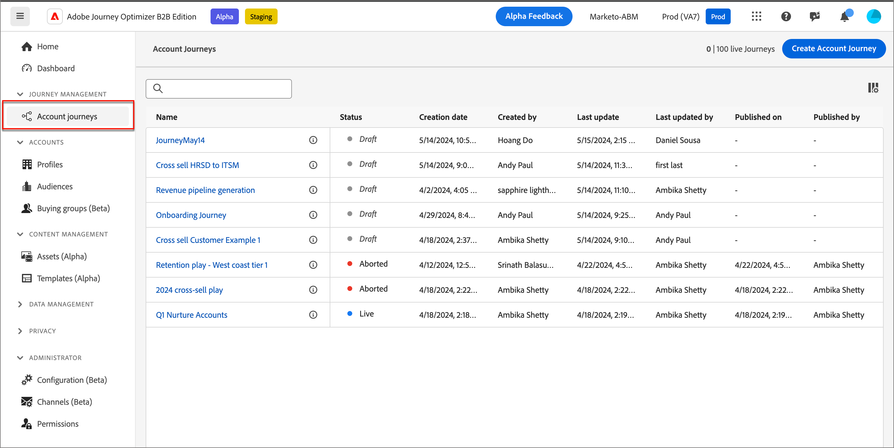

# アカウントジャーニー

メール、SMS、イベントなどの自動エンゲージメントを使用して、購入グループと購入グループメンバーごとにカスタマイズされたジャーニーを作成および実行します。 アカウントジャーニーを使用すると、需要発生と購入グループの選定を合理化し、獲得、アップセル/クロスセル、保持の各プログラムに対するより適格な需要を推進できます。

電子メール、SMS、その他の内部アカウントジャーニーを含む、販売主導型のエンゲージメントを定義し、各購入グループメンバーのアウトバウンド販売アクティビティでインバウンドマーケティングを調整します。

## アカウントジャーニーへのアクセスと参照

1. Adobe Experience Platformのホームページで、「Adobe Journey Optimizer B2B edition」をクリックします。

1. 左側のナビゲーションで、「**[!UICONTROL アカウントジャーニー]**」をクリックします。

   {width="800" zoomable="yes"}

   表示されたジャーニーページには、次の列が含まれています。

   * [!UICONTROL  名前 ] （名前をクリックすると、アカウントジャーニーが編集用に開きます）
   * [!UICONTROL ステータス]
   * [!UICONTROL 説明]
   * [!UICONTROL 作成者]
   * [!UICONTROL  最終更新日 ]
   * [!UICONTROL 最終更新者]
   * [!UICONTROL  公開日 ]
   * [!UICONTROL  公開者 ]

このテーブルには、名前と作成者で検索する機能が含まれています。 並べ替えは現在利用できません。

右上隅の _列_ アイコンをクリックし、チェックボックスをオンまたはオフにすることで、表示されるテーブルをカスタマイズできます。

{width="800" zoomable="yes"}

## アカウントジャーニーの詳細

_[!UICONTROL アカウントジャーニー]_ リストで（リンクとして表示）名前をクリックすると、詳細の確認、変更、アクションの実行ができます。

{width="800" zoomable="yes"}

各アカウントジャーニーのエディターヘッダーには、次のものが含まれます。

* ジャーニー名
* 名前を編集する機能（_編集_ アイコン
* ジャーニーのステータス

ヘッダーでは、次のアクションを使用できます。

* **Publish** - ブロッカーエラーがない場合は、ジャーニーを公開できます。 公開すると、ジャーニーのステータスが _ライブ_ に変わります。 ジャーニーにエラーがある場合、ボタンはコンテンツ情報 `Resolve errors before publishing` でグレー表示されます。
* **複製** – このアクションはクローン関数に似ていますが、複製されたジャーニーにアセットが含まれていません。
* **新しいエントリをクローズ** - ジャーニーをクローズすると、現在ジャーニー内にあるアカウントはジャーニー内のパスを続行し、ジャーニーへの新規エントリは発生しなくなります。 クローズしたジャーニーを再開することはできません。 クローズしたジャーニーを複製できます。
* **中止** - ジャーニーを停止すると、ジャーニー内のアカウントの進行が直ちに停止し、ジャーニーへの新規エントリは発生しなくなります。 停止したジャーニーを再開することはできません。 ユーザーの進行を停止せずに新規エントリをブロックする場合は、代わりにジャーニーをクローズすることを検討してください。
* **削除** – このアクションは、ジャーニーを完全に削除します。

適用するアクションに応じて、ジャーニーのステータスが変わります。 ジャーニーのステータスに応じて、ヘッダーで特定のアクションを使用できません。

| ステータス | 説明 | 使用可能なアクション |
| ------ | ----------- | ----------------- |
| _**ドラフト**_ | 編集可能な非公開のジャーニーです。 | <ul><li>公開</li><li>複製 </li><li>削除 </li></ul> |
| _**ライブ**_ | ジャーニーが公開されると、ジャーニーのステータスがドラフトからライブに変わります。 この状態では、編集できなくなります。 | <ul><li>複製 </li><li>新規エントリをクローズ </li><li>中止 </li></ul> |
| _**新規エントリに対してクローズ**_ | 上部のナビゲーションで _新規エントリをクローズ_ をクリックすると、ジャーニーのステータスは _ライブ_ から [!UICONTROL  新規エントリをクローズ ] に変更されます。 | <ul><li>複製 </li><li>中止 </li></ul> |
| _**中止**_ | ジャーニーを中止すると、ジャーニーのステータスが _ライブ_ または _新規エントリにクローズ_ に変わります。 中止されたジャーニーを再開することはできません。 | <ul><li>複製 </li><li>削除 </li></ul> |
| _**完了**_ | ジャーニー内のすべてのアカウントがジャーニーを完了すると、ステータスがライブまたはクローズ済みから新しいエントリに変更され完了します。 | <ul><li>複製 </li><li>削除 </li></ul> |

## ジャーニーの概要

アカウントジャーニーを開始するには、ジャーニーを作成してから、ジャーニーエディターでノードとジャーニーフローを構築します。

### アカウントジャーニーの作成

1. 左側のナビゲーションで、「**[!UICONTROL アカウントジャーニー]**」をクリックします。

1. ページの右上にある **[!UICONTROL アカウントジャーニーを作成]** をクリックします。

1. ダイアログで、一意の **[!UICONTROL 名前]** （必須）と **[!UICONTROL 説明]** （オプション）を入力します。

   {width="400"}

1. 「**[!UICONTROL 作成]**」をクリックします。

### ジャーニーの構成要素

_ジャーニーマップ_ は、ジャーニーデザイナーの中心にあるゾーンです。 ジャーニーノードを追加して設定できるのは、このゾーンです。 ノードをクリックして、キャンバスの右側にあるプロパティペインを開き、デザインに従って設定します。 アカウントジャーニーは常に [ アカウントオーディエンスノード ](./account-audience-nodes.md) で開始し、ジャーニーに入力を追加できます。

アカウントジャーニーを作成しオーディエンスを追加したら、ノードを使用してジャーニーを構築します。 ジャーニーマップはキャンバスを提供し、次のノードタイプを使用して、複数の手順からなる B2B マーケティングのユースケースを構築し、アカウントジャーニーを構築できます。

* [アクションを実行](./action-nodes.md)
* [イベントをリッスン](./listen-for-event-nodes.md)
* [パスを分割](./split-merge-paths-nodes.md)
* [待機](./wait-nodes.md)
* [パスを結合](./split-merge-paths-nodes.md)

### ガードレール

エラーが発生せずにジャーニーを構築できるように、次のガードレールが用意されています。

* _分割パスノードの削除_：各パス内の後続のノードをすべて削除しない限り、ノードを削除することはできません。
* _マージノードの削除_：マージノードは、1 つのパスが接続されている場合にのみ削除できます。 結合ノードを削除するには、パスを 1 つだけ選択したままにします。
* _アカウントとユーザーの切り替え_：各パス内の後続のすべてのノードを削除しない限り、選択をアカウントからユーザーに変更することはできません。

### ノードを追加

1. ジャーニーエディターに移動します。

1. パスのプラス（**+**）アイコンをクリックし、ノードタイプを選択します。

1. 右側にノードプロパティを設定します。

### ノードの削除

1. ジャーニーエディターに移動します。

1. 右側のノードのプロパティで、「_削除_」（）アイコンをクリックします。

1. 設定ダイアログで、「**[!UICONTROL 削除]**」をクリックします。

### パスの追加と削除

1. ジャーニーエディターに移動します。

1. パス上でプラス（**+**）アイコンをクリックし、[ 分割パスノード ](./split-merge-paths-nodes.md#split-paths) を追加します。

1. 右側のノードプロパティで、「**[!UICONTROL アカウント]**」を選択します。

1. パスを追加するには、「**[!UICONTROL パスを追加]**」をクリックします。

   ジャーニーで作成されたパスごとに、新しいパスカードがプロパティに表示されます。

1. ジャーニーのパスの 1 つに移動し、プラスアイコンを使用してこのパスに [action](./action-nodes.md) または [event](./listen-for-event-nodes.md) ノードを追加します。

1. [ 分割パス ](./split-merge-paths-nodes.md) ノードを選択して、右側のプロパティを開きます。

   ノードが存在するパスは削除できません。

1. これらのパスを削除するには、まずパス上のすべてのノードを削除する必要があります。

### ジャーニーのスケジュール

ジャーニーを公開する際、すぐに開始することも、スケジュールされた将来の日付に開始することもできます。 終了日は、開始日から最大 3 年間である必要があります。 ジャーニーが公開された後（_ライブ_ ステータス）、ジャーニーの終了日は更新できますが、開始日は更新できません。

1. ジャーニーエディターに移動します。

1. ヘッダーの [!UICONTROL ジャーニー設定 ] をクリックして、ジャーニーをスケジュールします。

1. ダイアログで、スケジュールオプションを設定します。

   * スケジュールのタイプを選択しました。

     公開時にジャーニーをアクティベートするには、「**[!UICONTROL 即時]**」を選択します。

     将来の日付にジャーニーをアクティブにするには、「**[!UICONTROL 特定の日付に]** を選択し、「_カレンダー_ アイコンをクリックして日付を選択します。

     {width="400" zoomable="no"}

   * ジャーニー **[!UICONTROL 終了日]** を指定します。 開始日から最大 3 年間です（このフィールドは必須です）。

1. 「**[!UICONTROL 保存]**」をクリックします。

   ジャーニーを公開する準備が整ったら、_[!UICONTROL Publish]_ をクリックすると、これらの設定を確認できます。

### Publishとアカウントジャーニー

