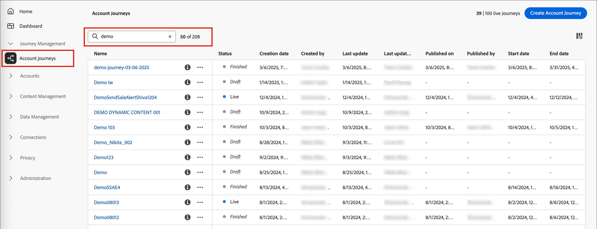
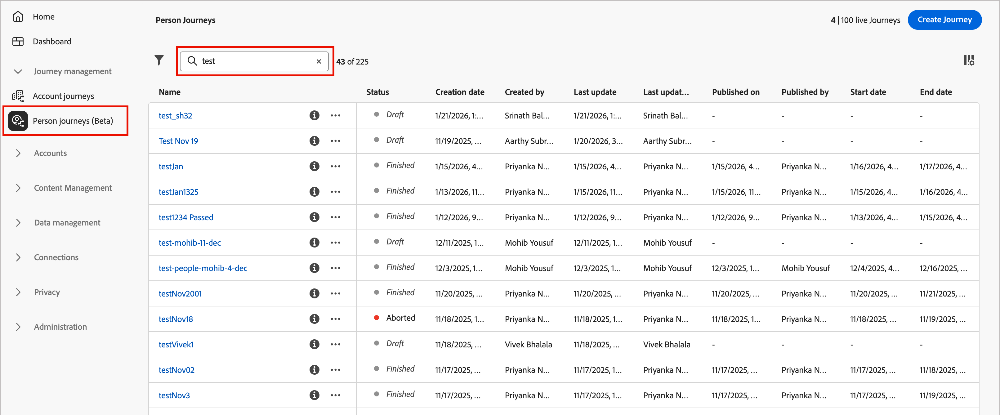
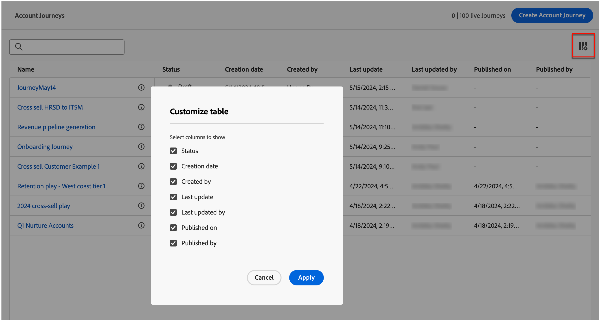
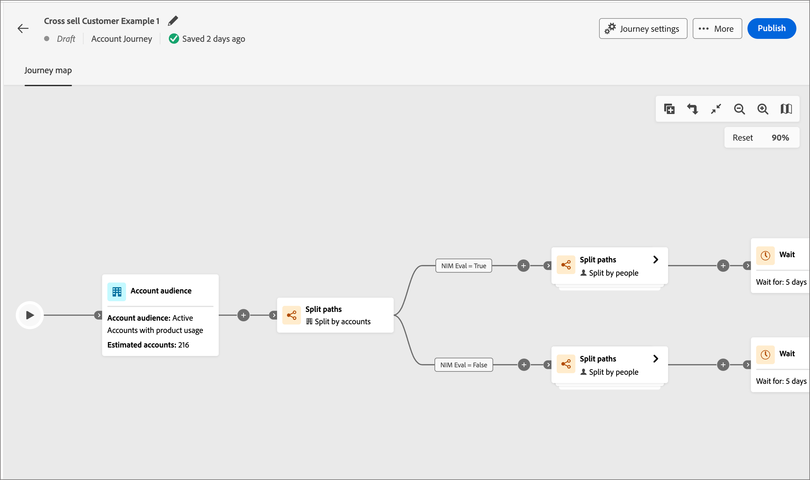
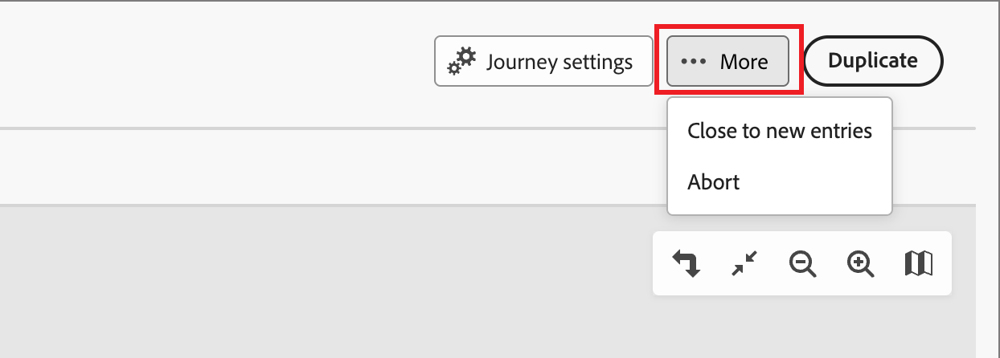
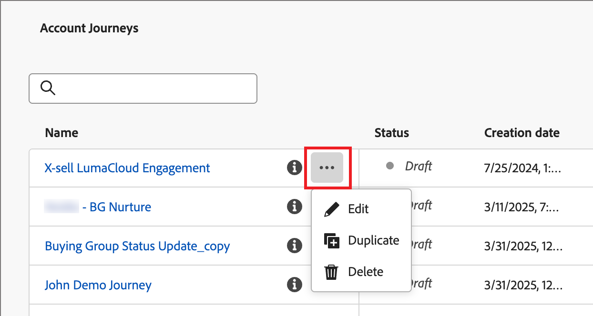
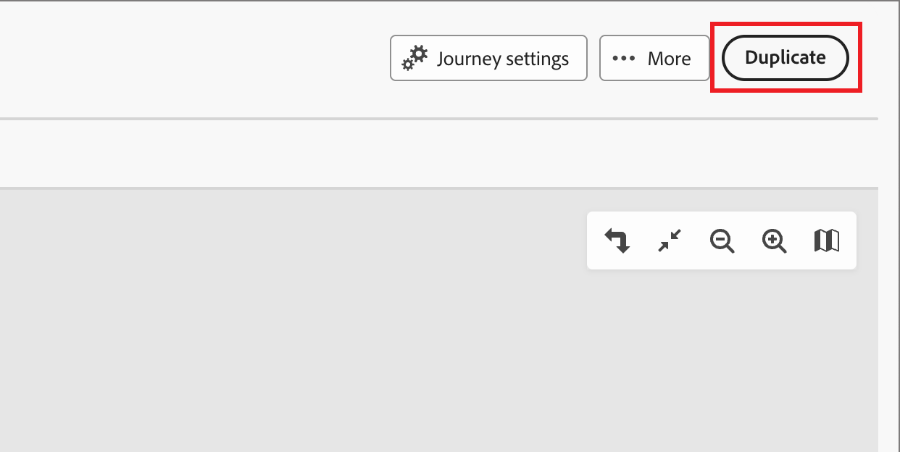
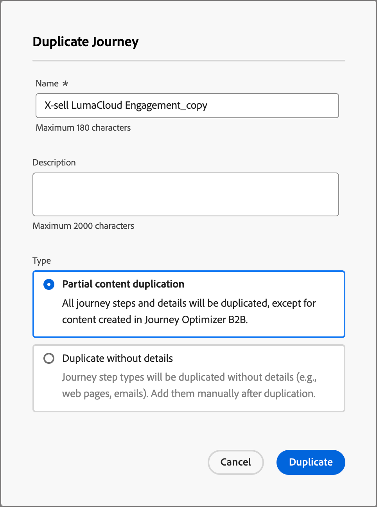
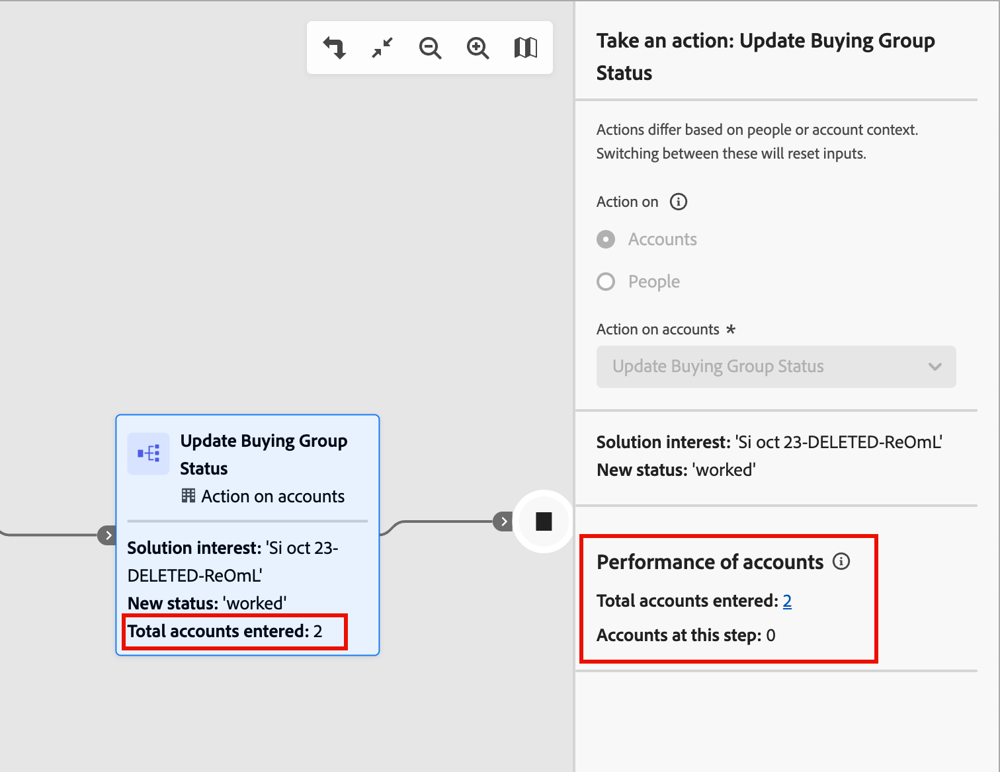
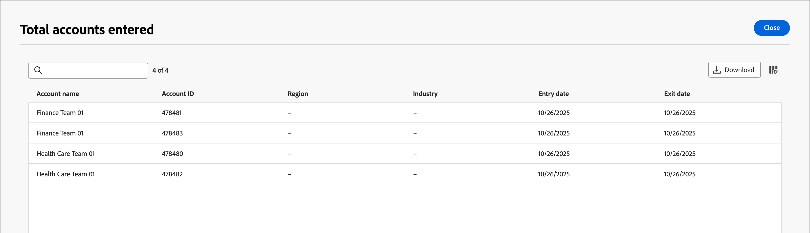

# ジャーニー管理

Journey Optimizer B2B editionでは、ジャーニーを自動化し、マルチステップのアカウントベースおよびリードベースのマーケティングプランを利用して、エンゲージメント、ビジネスイベント、スケジュール型のキャンペーンに応じて、チャネルをまたいでパーソナライズされたエクスペリエンスを連携できます。 電子メールやSMSなどを含むセールス主導のエンゲージメントを定義し、インバウンドマーケティングと各購買グループメンバーのアウトバウンドセールス活動を連携させます。

Journey Optimizer B2B editionでは、次の2種類のジャーニーをサポートしています。

* **アカウントジャーニー** – 需要創出と購買グループの選定を合理化し、獲得、アップセル/クロスセル、および維持プログラムに対するより適格な需要を促進します。 メール、SMS、イベントなどを通じて自動化されたエンゲージメントを使用して、各購買グループと、購買グループのメンバーに合わせてジャーニーを調整します。

  {width="30"} [&#x200B; アカウントジャーニーの概要ビデオを見る](#overview-video)

* **人物ジャーニー** - （Beta）Experience Platform オーディエンスとデータを使用してリードベースマーケティングを調整します。 ユーザージャーニーを活用すれば、マーケティング業務をMarketo EngageやAdobe Campaign/B2C ツールチェーンの回避策に依存させることなく、B2Bのユースケースに対応できます。

  カスタマージャーニーをアカウントジャーニーと購買グループと組み合わせて利用することで、マーケターは購買ジャーニーに包括的なオーケストレーションを適用できます。

  +++個人ジャーニーにおける現在の限界

  企業によっては、特定のユースケースをブロックしたり、カスタマージャーニーの構築に困難を伴ったりする可能性のある制限があります。 多くの問題は、最初のベータプログラム実装の結果であり、今後対処する必要があります。

   * イベントをプロファイル属性と組み合わせて、オーディエンス定義を絞り込むことはできません。
   * ジャーニーのプロファイルを示すイベントのコンテキストは、パーソナライゼーションやオーケストレーションには使用できません。
   * 現在、ジャーニーにイベントセグメントとプロファイルセグメントの両方のエントリ条件を設定することはできません。
   * イベントリスナーは、複数のイベントをリッスンできません。
   * 待機ノードには、現在、曜日または時間帯の終了条件のオプションの完全なスイートがありません。
   * メールエディターが、アカウントジャーニーでのみ使用できる機能と属性を誤って参照する
   * カスタムジャーニートークン （_マイトークン_）のサポートはまだ利用できません。
   * 個人ジャーニーノードの追加と削除は、現在、どちらのジャーニータイプからも使用できません。
   * イベント履歴は、オーケストレーションやパーソナライゼーションには使用できません。
   * 関連オブジェクト（アカウント、購買グループ、商談、カスタムオブジェクトなど）は、オーケストレーションやパーソナライゼーションに使用できません。
   * Web、SMS、広告プラットフォームのチャネルは現在サポートされていません。

  +++

## ジャーニーの開始

最初のジャーニーを始めるには、次の手順に従います。

1. [ジャーニーを作成します](./create-publish-journey.md#create-a-journey)。
1. [ノードを追加](./create-publish-journey.md#add-a-node)し、ジャーニーマップで[ジャーニーフローを定義](./create-publish-journey.md#add-and-delete-a-path)します。
1. [ジャーニーを公開します](./create-publish-journey.md#publish-a-journey)。

## ジャーニーへのアクセスと参照

>[!BEGINTABS]

>[!TAB  アカウントジャーニー]

左側のナビゲーションで、**[!UICONTROL ジャーニー管理]**&#x200B;を展開し、**[!UICONTROL アカウントジャーニー]**&#x200B;をクリックします。

リストの上部にある&#x200B;_検索_&#x200B;ツールにテキストを入力して、表示されるリストを名前でフィルタリングします。

{width="800" zoomable="yes"}

>[!TAB  ユーザージャーニー（Beta） ]

[!BADGE Beta]{type=Informative tooltip="簡素化されたアーキテクチャのベータ機能として利用可能"}

左側のナビゲーションで、**[!UICONTROL ジャーニー管理]**&#x200B;を展開し、**[!UICONTROL 人物ジャーニー]**&#x200B;をクリックします。

リストの上部にある&#x200B;_検索_&#x200B;ツールにテキストを入力して、表示されるリストを名前でフィルタリングします。

{width="800" zoomable="yes"}

>[!ENDTABS]

### ジャーニーリストの列

ジャーニーリストページには、次の列が含まれます。

* [!UICONTROL 名前]（名前をクリックすると、ジャーニーが編集用に開きます）
* [!UICONTROL ステータス]
* [!UICONTROL 作成日]
* [!UICONTROL 作成者]
* [!UICONTROL 最終更新]
* [!UICONTROL 最終更新者]
* [!UICONTROL 公開日]
* [!UICONTROL 公開者]
* [!UICONTROL 開始日]
* [!UICONTROL 終了日]

列ヘッダーをクリックすると、リストを&#x200B;_[!UICONTROL ステータス]_、_[!UICONTROL 作成日]_、または&#x200B;_[!UICONTROL 最終更新]_&#x200B;で並べ替えることができます。

テーブルに表示される列をカスタマイズ（表示/非表示）するには、右上隅にある「_テーブルをカスタマイズ_ （）」アイコンをクリックします。 ダイアログのチェックボックスをオンまたはオフにして、「**[!UICONTROL 適用]**」をクリックします。

{width="800" zoomable="yes"}

### ジャーニーステータス

ジャーニーのステータスは、適用したアクションに基づいて変更される場合があります。 ジャーニーのステータスに基づいて、ヘッダーの右側から特定のアクションを使用できるかどうかが決まります。

| ステータス | 説明 | 使用可能なアクション |
| ------ | ----------- | ----------------- |
| _&#x200B;**ドラフト**&#x200B;_ | 編集可能な非公開のジャーニー。 | <li>[公開](./create-publish-journey.md#publish-a-journey)<li>[複製](#duplicate-journey) <li>[削除](#delete-journey) |
| _&#x200B;**ライブ**&#x200B;_ | ジャーニーが公開されると、ジャーニーのステータスが&#x200B;_ドラフト_&#x200B;から&#x200B;_ライブ_&#x200B;に変更されます。 この状態では、編集できなくなります。 | <li>[複製](#duplicate-journey)<li>[新規エントリに対してクローズ](#close-to-new-entries) <li>[中止](#abort-journey) |
| _&#x200B;**新規エントリに対してクローズ済み**&#x200B;_ | 上部のナビゲーションで「[!UICONTROL 新規エントリに対してクローズ]」をクリックすると、ジャーニーのステータスが&#x200B;_ライブ_&#x200B;から&#x200B;_新規エントリに対してクローズ済み_&#x200B;に変更されます。 | <li>[複製](#duplicate-journey) <li>[中止](#abort-journey) |
| _&#x200B;**中止**&#x200B;_ | ジャーニーを中止すると、ジャーニーのステータスが&#x200B;_ライブ_&#x200B;または&#x200B;_新規エントリに対してクローズ済み_&#x200B;に変更されます。 中止したジャーニーは再起動できません。 | <li>[複製](#duplicate-journey) <li>[削除](#delete-journey) |
| _&#x200B;**終了**&#x200B;_ | ジャーニー内のすべてのアカウントまたは個人のオーディエンスメンバーがジャーニーを完了すると、ステータスは&#x200B;_ライブ_&#x200B;または&#x200B;_クローズから新規エントリ_&#x200B;から&#x200B;_終了_&#x200B;に変更されます。 | <li>[複製](#duplicate-journey) <li>[削除](#delete-journey) |

## ジャーニーマップ

ジャーニーリストの名前（リンクとして表示）をクリックして、詳細を確認し、変更を加え、アクションを実行します。

{width="800" zoomable="yes"}

各ジャーニーマップのヘッダーには、次のものが含まれます。

* ジャーニー名
* ジャーニー名の編集ツール（ 「_編集_」アイコン）
* ジャーニーの[&#x200B; ステータス &#x200B;](#journey-status)

ジャーニーマップから、[&#x200B; ノードを追加](./create-publish-journey.md#add-a-node)し、[&#x200B; ジャーニーフローを定義](./create-publish-journey.md#add-and-delete-a-path)できます。

## ジャーニーアクション

ジャーニーリストページには、Journey Optimizer B2B edition インスタンス内のすべてのアカウントまたは人物のジャーニーが含まれます。 リストページから、ジャーニーに複数のアクションを適用できます。

### ジャーニーを中止

実行中またはスケジュール済みのジャーニーを中止（停止）すると、ジャーニー内のアカウントまたはユーザーはすぐに進行状況を停止し、ジャーニーのエントリはそれ以上発生しません。 中止したジャーニーは再起動できません。

>[!IMPORTANT]
>
>ジャーニーが別のジャーニーで使用されている場合、_アカウントを追加&#x200B;_[!UICONTROL &#x200B;ジャーニー&#x200B;]_&#x200B;でアクション_ ノードを実行し、そのジャーニー内のそのアクションを中止します。

1. ジャーニー名をクリックして開きます。

1. 右上の&#x200B;**[!UICONTROL 詳細...]** メニューをクリックし、「**[!UICONTROL 中止]**」を選択します。

   {width="450"}

1. 確認ダイアログで、「**[!UICONTROL 中止]**」をクリックします。

### 新規エントリに対してクローズ

ライブジャーニーを閉じると、現在ジャーニー内にあるアカウントはジャーニー内のパスを継続し、それ以上のジャーニーへのエントリは発生しません。 クローズしたジャーニーは再起動できません。 クローズしたジャーニーは複製できます。

>[!IMPORTANT]
>
>ジャーニーを&#x200B;_別のジャーニーで使用している場合、「_[!UICONTROL &#x200B; アカウントを追加&#x200B;]_」アクションを持つアクション_ ジャーニーを実行し、そのジャーニーからそのアクションをブロックします。

1. ジャーニー名をクリックして開きます。

1. 右上の&#x200B;**[!UICONTROL 詳細...]** メニューをクリックし、「**[!UICONTROL 新規エントリに対してクローズ]**」を選択します。

1. 確認ダイアログで、「**[!UICONTROL 新規エントリに対してクローズ]**」をクリックします。

### ジャーニーの複製 {#duplicate-journey}

このアクションはクローン機能に似ていますが、複製したジャーニーに作成したジャーニーコンテンツアセットは含まれません。 ジャーニーの詳細、またはフローとパス構造の単純な&#x200B;_スケルトン_&#x200B;を複製できます。

>[!NOTE]
>
>このアクションは現在、個人ジャーニーでは使用できません。

1. _詳細_ アイコン （**...**）をクリックします ジャーニー名の横にある「**[!UICONTROL 複製]**」を選択します。

   {width="450"}

   ジャーニーのステータスに応じて、ジャーニーの詳細またはジャーニーマップから重複アクションにアクセスすることもできます。

   * ドラフトのジャーニーの場合は、右上の&#x200B;**[!UICONTROL 詳細...]** メニューをクリックし、「**[!UICONTROL 複製]**」を選択します。

   * その他のすべてのジャーニーのステータスについては、右上の「**[!UICONTROL 複製]**」をクリックします。

     {width="450"}

1. _ジャーニーを複製_&#x200B;ダイアログで、新しいジャーニーの&#x200B;**[!UICONTROL 名前]**&#x200B;と&#x200B;**[!UICONTROL 説明]**&#x200B;を設定します。

   デフォルトでは、ダイアログは、複製したジャーニーの名前に __ copy_ を追加して使用します。 必要に応じて、ジャーニーの別の一意の名前を入力します。

   {width="400"}

1. 複製の&#x200B;**[!UICONTROL タイプ]**&#x200B;を選択します。

   * **[!UICONTROL 部分的なコンテンツの複製]** - 作成したメールや SMS メッセージを除く、ジャーニー内のすべてをコピーするには、このタイプを使用します。 Marketo Engage のメールまたは SMS メッセージを参照するノードは、完全にそのまま残ります。

   * **[!UICONTROL 詳細なしで複製]** - このタイプを使用して、ノード構造とパスのみをコピーします。 すべてのノード設定とパス条件は未定義（デフォルト）なので、異なるオーディエンス、アクション、パスセグメント化設定で基本フローを再利用できます。 すべての&#x200B;_待機_&#x200B;ノードは、デフォルトの 5 日間を使用します。

1. 「**[!UICONTROL 複製]**」をクリックします。

   重複したジャーニーがジャーニーマップで開き、詳細を設定し、必要に応じてジャーニーコンテンツを作成できます。

### ジャーニーの削除

ジャーニーを完全に削除するには、削除アクションを使用します。 ライブジャーニーまたはスケジュール済みジャーニーは削除できません。

1. _詳細_ アイコン （**...**）をクリックします ジャーニー名の横にある「**[!UICONTROL 削除]**」を選択します。

   ジャーニーのステータスに応じて、ジャーニーの詳細またはジャーニーマップから削除アクションにアクセスすることもできます。

   * ドラフトのジャーニーの場合は、右上の&#x200B;**[!UICONTROL 詳細...]** メニューをクリックし、「**[!UICONTROL 削除]**」を選択します。

   * _完了_&#x200B;や&#x200B;_中止_&#x200B;など、その他のジャーニーのステータスについては、右上の「**[!UICONTROL 削除]**」をクリックします。

1. 確認ダイアログで、「**[!UICONTROL 削除]**」をクリックします。

## アカウントの進行状況の確認

_ライブ_、_新しいエントリに対してクローズ_、_中断_、または&#x200B;_完了_ ステータスの公開済みアカウントジャーニーの場合、ジャーニーマップを開いて、ジャーニーノードのアカウントの進行状況を確認できます。 マップ上の各ノードには、そのノードに到達するアカウント数が表示されます。ライブジャーニーの場合は、現在そのノードにいるアカウント数が表示されます。

{width="400"}

ノードを選択して、その数をクリックすると、そのノードにエントリ済みのアカウントや現在ジャーニーのそのステップにいるアカウントのリストが表示されます。

{width="700" zoomable="yes"}

## アカウントジャーニーの概要ビデオ {#overview-video}

>[!VIDEO](https://video.tv.adobe.com/v/3443208/?captions=jpn&learn=on)
