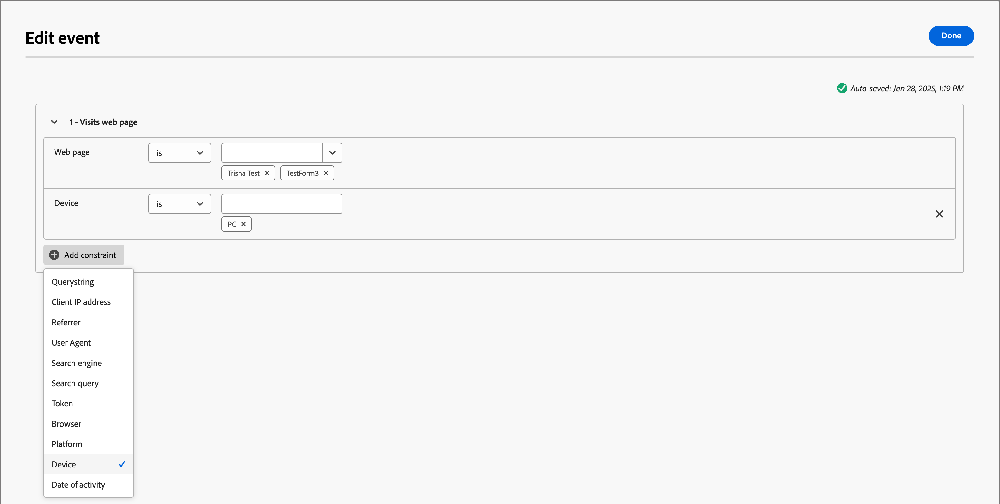
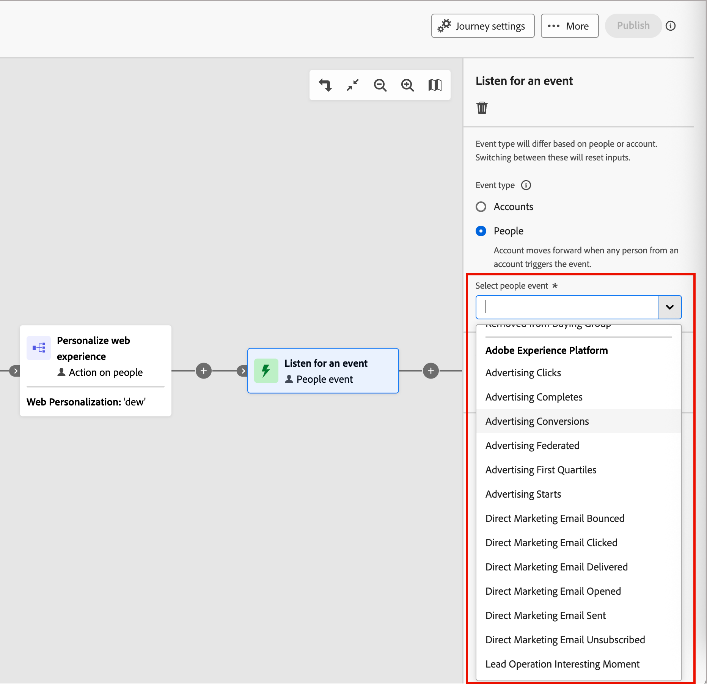
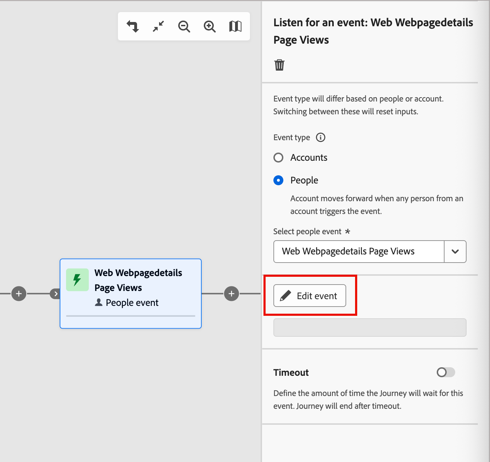

# イベントのリッスン

イベントが発生したときにオーディエンスをジャーニーの次のステップに進めるために、_イベントをリッスン_ ノードを追加します。

{width=&quot;30&quot;, vertical-align=&quot;middle&quot;} [概要動画を見る](#overview-video)

>[!NOTE]
>
>アカウントジャーニーの場合、このノードタイプを分割パスに追加することはできません。

## アカウントイベント

アカウントジャーニーでは、アカウントアクティビティによってトリガーされるイベントに従ってジャーニー内でアカウントを前進させる場合、アカウントに基づいてイベントをリッスンできます。

### イベントと制約

| イベント | 制約 |
| ----- | ----------- |
| [!UICONTROL &#x200B; アカウントに興味深い瞬間がありました] | 種類（電子メール、マイルストーン、またはWeb）  追加の制約（オプション）: <li>説明</li><li>ソース</li><li>アクティビティの日付</li>   タイムアウト （オプション） |
| [!UICONTROL &#x200B; アカウントデータ値の変更] | 属性 追加の制約（オプション）: <li>新しい値</li><li>前回の値</li><li>アクティビティの日付</li>   タイムアウト （オプション） |
| 購買グループステージの[!UICONTROL 変更] | ソリューションの関心 追加の制約（オプション）: <li>新規ステージ</li><li>前のステージ</li><li>アクティビティの日付</li>  タイムアウト （オプション） |
| [!UICONTROL 購買グループのステータスの変更] | ソリューションの関心 追加の制約（オプション）: <li>新規ステータス</li><li>前のステータス</li><li>アクティビティの日付</li>  タイムアウト （オプション） |
| [!UICONTROL 完全性スコアの変更] | ソリューションの関心 追加の制約（オプション）: <li>新規スコア</li><li>前のスコア</li><li>アクティビティの日付</li>  タイムアウト （オプション） |
| [!UICONTROL &#x200B; エンゲージメントスコアの変更] | ソリューションの関心 追加の制約（オプション）: <li>新規スコア</li><li>前のスコア</li><li>アクティビティの日付</li>  タイムアウト （オプション） |

### アカウントイベントの追加

1. ジャーニーマップに移動します。

1. パスのプラス（**+**）アイコンをクリックし、**[!UICONTROL イベントをリッスン]**&#x200B;を選択します。

1. 右側のノードプロパティで、イベントタイプに「**[!UICONTROL アカウント]**」を選択します。

   {width="700" zoomable="yes"}

1. リストからイベントを選択します。

1. 「**[!UICONTROL イベントを編集]**」をクリックし、イベントの詳細を定義します。

## 人物イベント

アカウントジャーニーでは、人物アクティビティによってトリガーされたイベントに従って、ジャーニー内でアカウントを前進させたい場合、人物に基づいてイベントをリッスンできます。 人物の属性に応じてイベントをフィルタリングすることもできます。

### イベントと制約

| 入力タイプ | イベント | 制約 |
| ---------- | ----- | ----------- |
| Journey Optimizer B2B | [!UICONTROL 購買グループに割り当て] | ソリューションの関心  追加の制約（オプション）: <li>役割</li><li>アクティビティの日付</li>  タイムアウト （オプション） |
| | [!UICONTROL 電子メール内のリンクをクリック &#x200B;] | 電子メール   追加の制約（オプション）: <li>リンク</li><li>リンク ID</li><li>モバイルデバイスである</li><li>デバイス</li><li>プラットフォーム</li><li>ブラウザー</li><li>予測コンテンツ</li><li>ボットアクティビティ</li><li>ボットアクティビティパターン</li><li>ブラウザー</li><li>アクティビティの日付</li><li>分 回数</li>  タイムアウト （オプション） |
| | [!UICONTROL SMSのリンクをクリック &#x200B;] | 電子メール   追加の制約（オプション）: <li>リンク</li><li>デバイス</li><li>プラットフォーム</li><li>アクティビティの日付</li><li>分 回数</li>  タイムアウト （オプション） |
| | [!UICONTROL &#x200B; データ値の変更] | 人物の属性  追加の制約（オプション）: <li>新しい値</li><li>前回の値</li><li>理由</li><li>ソース</li><li>アクティビティの日付</li><li>分 回数</li>  タイムアウト （オプション） |
| | [!UICONTROL 電子メールを開く] | 電子メール   追加の制約（オプション）: <li>リンク</li><li>リンク ID</li><li>モバイルデバイスである</li><li>デバイス</li><li>プラットフォーム</li><li>ブラウザー</li><li>予測コンテンツ</li><li>ボットアクティビティ</li><li>ボットアクティビティパターン</li><li>ブラウザー</li><li>アクティビティの日付</li><li>分 回数</li>  タイムアウト （オプション） |
| | [!UICONTROL 購買グループから削除されました] | ソリューションの関心  アクティビティの日付（オプション）   タイムアウト（オプション） |
| | [!UICONTROL &#x200B; スコアが変更されました] | スコア名  追加の制約（オプション）:<li>変更</li><li>新規スコア</li><li>緊急度</li><li>優先度</li><li>相対スコア</li><li>相対的緊急度</li><li>アクティビティの日付</li><li>分 回数</li>  タイムアウト （オプション） |
| | [!UICONTROL SMS バウンス &#x200B;] | SMS メッセージ   追加の制約（オプション）: <li>アクティビティの日付</li><li>最小回数</li>  タイムアウト （オプション） |
| Marketo Engage | [!UICONTROL Web ページへの訪問] | Web ページ  一致する1つ以上のMarketo Engage ページを選択します。   追加の制約（オプション）: <li>クエリ文字列</li><li>クライアント IP アドレス</li><li>参照元</li><li>ユーザ エージェント</li><li>検索エンジン</li><li>検索クエリ</li><li>トークン</li><li>ブラウザー</li><li>プラットフォーム</li><li>デバイス</li><li>アクティビティの日付</li> |
| | [!UICONTROL &#x200B; フォームに入力] | フォーム  一致する1つ以上のMarketo Engage フォームを選択します。   追加の制約（オプション）: <li>アクティビティの日付</li><li>クエリ文字列</li><li>クライアント IP アドレス</li><li>参照元</li><li>ユーザーエージェント</li><li>プラットフォーム</li><li>デバイス</li>  タイムアウト （オプション） |
| Adobe Experience Platform | [!UICONTROL &#x200B; イベント定義] | イベントタイプ   追加の制約（オプション）: <li>フィールド</li>  追加の制約（サポートされていません）: <li>アクティビティの日付</li><li>分 回数</li>  タイムアウト （オプション） |

### 人物イベントフィルター

| フィルター | 説明 |
| ------------ | ----------- |
| [!UICONTROL &#x200B; アクティビティ履歴] > [!UICONTROL 電子メール &#x200B;] | ジャーニーの前の段階で選択した1つ以上のメールメッセージを使用して評価される条件に基づいて、メールアクティビティを実行します。 <li>[!UICONTROL 電子メール内のリンクをクリック &#x200B;] <li>メール開封済み <li>メールで配信されました <li>さんがメール <!--  **[!UICONTROL Switch to inactivity filter]** - Use this option to filter based on lack of activity (a person did not have the email activity).-->を送信しました |
| [!UICONTROL &#x200B; アクティビティ履歴] > [!UICONTROL SMS メッセージ &#x200B;] | ジャーニーの前の段階で選択した1つ以上のSMS メッセージを使用して評価される条件に基づくSMS アクティビティ： <li>[!UICONTROL SMSでリンクをクリック &#x200B;] <li>[!UICONTROL SMS バウンス &#x200B;] <!--   **[!UICONTROL Switch to inactivity filter]** - Use this option to filter based on lack of activity (a person did not have the SMS activity). --> |
| [!UICONTROL &#x200B; アクティビティ履歴] > [!UICONTROL &#x200B; データ値が変更されました] | 選択した人物属性に対して、値の変更が発生しました。 次の変更タイプがあります。 <li>新しい値<li>前回の値<li>理由<li>ソース<li>アクティビティの日付<li>分 回数<!--   **[!UICONTROL Switch to inactivity filter]** - Use this option to filter based on lack of activity (a person did not have a data value change). --> |
| [!UICONTROL &#x200B; アクティビティ履歴] > [!UICONTROL 興味深い瞬間がありました] | 関連するMarketo Engage インスタンスで定義される、興味深いモーメントアクティビティ。 制約事項は次のとおりです。 <li>マイルストーン<li>メール<li>Web <!--  **[!UICONTROL Switch to inactivity filter]** - Use this option to filter based on lack of activity (a person did not have an interesting moment).--> |
| [!UICONTROL &#x200B; アクティビティ履歴] > [!UICONTROL 訪問したweb ページ &#x200B;] | 関連するMarketo Engage インスタンスによって管理される1つ以上のweb ページのweb ページアクティビティ。 制約事項は次のとおりです。 <li>Web ページ （必須）<li>アクティビティの日付<li>クライアント IP アドレス <li>クエリ文字列 <li>参照元 <li>ユーザーエージェント <li>検索エンジン <li>検索クエリ <li>パーソナライズ URL <li>トークン <li>ブラウザー <li>プラットフォーム <li>デバイス <li>分 回数<!--  **[!UICONTROL Switch to inactivity filter]** - Use this option to filter based on lack of activity (a person did not visit the web page). --> |
| [!UICONTROL 人物の属性] | 人物プロファイルの属性（以下を含む）: <li>市町村 <li>国 <li>生年月日 <li>メールアドレス <li>メール無効 <li>メール中断済み <li>名 <li>推測される都道府県 / 地域<li>役職 <li>姓 <li>携帯電話番号 <li>人物エンゲージメントスコア <li>電話番号 <li>郵便番号 <li>状態 <li>購読解除完了 <li>登録解除の理由 |
| [!UICONTROL 特殊フィルター] > [!UICONTROL 購買グループのメンバー] | 個人が購買グループのメンバーであるか、またはメンバーでない場合は、次の基準の1つ以上に対して評価されます。 <li>ソリューションへの関心</li><li>購買グループのステータス</li><li>完全性スコア</li><li>エンゲージメントスコア</li><li>が削除されました</li><li>役割</li> |
| [!UICONTROL 特殊フィルター] > [!UICONTROL &#x200B; リストのメンバー] | ユーザーは、1つ以上のMarketo Engage リストのメンバーであるか、またはメンバーではありません。 |
| [!UICONTROL 特殊フィルター] > [!UICONTROL &#x200B; プログラムのメンバー] | ユーザーは、1つ以上のMarketo Engage プログラムのメンバーであるか、メンバーではありません。 |

### 人物イベントを追加

1. ジャーニーマップに移動します。

1. パスのプラス（**+**）アイコンをクリックし、**[!UICONTROL イベントをリッスン]**&#x200B;を選択します。

1. 右側のノードプロパティで、イベントタイプに「**[!UICONTROL 人]**」を選択します。

   {width="700" zoomable="yes"}

1. リストからイベントを選択します。

1. 「**[!UICONTROL イベントを編集]**」をクリックし、イベントの詳細を定義します。

### Marketo Engage イベントのリッスン {#listen-for-marketo-engage-event}

コネクテッド Marketo Engage インスタンスにweb ページがある場合、これらのweb ページへの訪問/非訪問に基づいてイベントをトリガーできます。また、入力された/未入力のMarketo Engage フォームも実行できます。

1. ジャーニーマップのイベント **ノードの** リッスンを選択します。

1. 右側のノードプロパティで、イベントタイプに「**[!UICONTROL 人]**」を選択します。

1. 「**[!UICONTROL 人選びイベント]**」セレクターの矢印をクリックし、**[!UICONTROL Marketo Engage]** セクションまでスクロールします。

1. Marketo Engage アクティビティタイプを選択します。

   * **[!UICONTROL Web ページにアクセス]**。
   * **[!UICONTROL フォームに入力]**

   {width="700" zoomable="yes"}

1. 「**[!UICONTROL イベントを編集]**」をクリックし、一致する1つ以上のweb ページと、イベントの追加の制約を定義します。

   * （必須）「_[!UICONTROL イベントを編集]_」ダイアログで、**[!UICONTROL Web ページ]**&#x200B;または&#x200B;**[!UICONTROL フォームの入力]**&#x200B;制約を定義します。 **[!UICONTROL is]** （既定値）を使用して、選択した1つ以上のページまたはフォームに一致させます。 **[!UICONTROL is not]**&#x200B;を使用すると、選択した1つ以上のページ/フォームを除外して、すべてのページ訪問/フォームに一致させることができます。 または、**[!UICONTROL is any]**&#x200B;演算子を使用して、任意のMarketo Engage web ページ訪問または入力済みフォームで一致させます。

   * （オプション）「**[!UICONTROL 制約を追加]**」をクリックし、制約に使用するフィールドを選択します。 フィールドの演算子と値を設定します。

     {width="700" zoomable="yes"}

     この操作を繰り返して、必要に応じてフィールドの制約を追加できます。

   * 必要に応じて、「**[!UICONTROL フィルター]**」タブを選択して、イベント [&#128279;](#add-a-filter-to-the-people-event)のフィルターを追加します。

   * 制約とフィルターが定義されたら、**[!UICONTROL 完了]**&#x200B;をクリックします。

1. 必要に応じて、**[!UICONTROL タイムアウト]** オプションを設定して、イベントをリッスンする期間を制限します（[&#x200B; イベントノードにタイムアウトを追加](#add-a-timeout-to-an-event-node)を参照）。

1. ジャーニーマップで、イベントが発生したときに実行する次のノードを追加します。

### エクスペリエンスイベントをリッスンする

管理者は[Adobe Experience Platform （AEP） Experience Events](https://experienceleague.adobe.com/ja/docs/experience-platform/xdm/classes/experienceevent){target="_blank"}を選択できます。これにより、マーケターは、イベントにほぼリアルタイムで反応するアカウントと個人のジャーニーを作成できます。 ジャーニーでExperience Eventsを使用するには、次の2つの手順を実行します。

1. 管理者[は、関心のあるイベントタイプとフィールド &#x200B;](../admin/configure-aep-events.md#select-an-event)を選択して、ジャーニーで使用できるようにします。

2. ジャーニーで、_Listen for an event_ ノードを追加し、people-based eventにExperience Platform イベントタイプを選択します。

<!--
{width="30", vertical-align="middle"} [Watch the video overview](../admin/configure-aep-events.md#overview-video) 
-->

_ジャーニーにエクスペリエンスイベントを含めるには&#x200B;:_

1. ジャーニーマップのイベント **ノードの** リッスンを選択します。

1. （アカウントジャーニーのみ）右側のノードプロパティで、イベントタイプに「**[!UICONTROL 人物]**」を選択します。

1. イベントを選択します。

   **_アカウントジャーニー_**&#x200B;の場合、**[!UICONTROL 人物を選択]** セレクターの矢印をクリックし、**[!UICONTROL Adobe Experience Platform]** セクションまでメニューをスクロールします。

   {width="700" zoomable="yes"}

   ユーザージャーニーの場合、**[!UICONTROL イベントを選択]** セレクターの矢印をクリックし、イベントを選択します。

1. 「**[!UICONTROL イベントを編集]**」をクリックし、イベントの1つ以上の制約を定義します。

   {width="400" zoomable="yes"}

   使用可能な制約は、イベント設定の管理フィールドとして定義されます。

   * **[!UICONTROL 制約を追加]**&#x200B;をクリックし、制約に使用するフィールドを選択します。

   * 制約の条件を完了します。

     デフォルトの&#x200B;**[!UICONTROL is]**&#x200B;演算子を使用して、1つ以上のフィールド値を一致させることができます。 または、**[!UICONTROL is not]**&#x200B;演算子を使用して、1つ以上の指定された値を除外してすべての値に一致させることができます。

     {width="700" zoomable="yes"}

   * 必要に応じて、「**[!UICONTROL フィルター]**」タブを選択して、イベント [&#128279;](#add-a-filter-to-the-people-event)のフィルターを追加します。

   * （オプション）「**[!UICONTROL 制約を追加]**」をクリックし、必要に応じて追加のフィールド制約を含めるためにこれらの手順を繰り返します。

   * 制約とフィルターが定義されたら、**[!UICONTROL 完了]**&#x200B;をクリックします。

1. 必要に応じて、**[!UICONTROL タイムアウト]** オプションを設定して、イベントをリッスンする期間を制限します（[&#x200B; イベントノードにタイムアウトを追加](#add-a-timeout-to-an-event-node)を参照）。

1. ジャーニーマップで、イベントが発生したときに実行する次のノードを追加します。

1. ジャーニーの残りのノードを完了し、[公開します](./journeys-overview.md)。

   ジャーニーがライブ（公開）になり、_イベントをリッスン_ ノードに到達すると、AEP Experience Eventsのリッスンが開始されます。

### 人物イベントへのフィルターの追加

（アカウントジャーニーのみ）

1. イベントを定義したら、_[!UICONTROL イベントを編集]_ ダイアログで「**[!UICONTROL フィルター]**」タブを選択します。

   {width="700" zoomable="yes"}

1. イベントの人物をターゲットにする1つ以上のフィルターを追加します。

   * 左側のナビゲーションから[人物フィルター](#people-event-filters)のいずれかをドラッグ&amp;ドロップして、一致の定義を完了します。

     >[!NOTE]
     >
     >Experience Platformのアカウントオーディエンススキーマでカスタム人物フィールドを定義している場合、これらのフィールドは&#x200B;**[!UICONTROL 属性]**&#x200B;でも使用でき、フィルターで人物属性として使用できます。

   * 上部の&#x200B;**[!UICONTROL フィルターロジック]**&#x200B;を適用して、フィルタリングを微調整します。 すべてのフィルターまたは任意のフィルターを一致させます。

     {width="700" zoomable="yes"}

   * 「**[!UICONTROL 完了]**」をクリックします。

## イベントノードへのタイムアウトの追加

必要に応じて、ジャーニーがイベントを待機する時間を定義します。 タイムアウトパスを定義しない限り、ジャーニーはタイムアウト後に終了します。このパスでは、他のノードを追加できます。

1. **[!UICONTROL タイムアウト]** オプションを有効にします。

1. ジャーニーがタイムアウトする前にイベントが発生するのを待つ期間を選択します。

   ここでパスを終了するか、別のパスを設定して別のアクションを実行するかを選択できます。

1. イベントが発生しない場合にアカウントに適用できるアクションとイベントを追加できるジャーニーに新しいパスを作成するには、「**[!UICONTROL タイムアウトパスを設定]**」チェックボックスをオンにします。

   {width="700" zoomable="yes"}

<!--
 ## Overview video

>[!VIDEO](https://video.tv.adobe.com/v/3443219/?learn=on) 
-->
