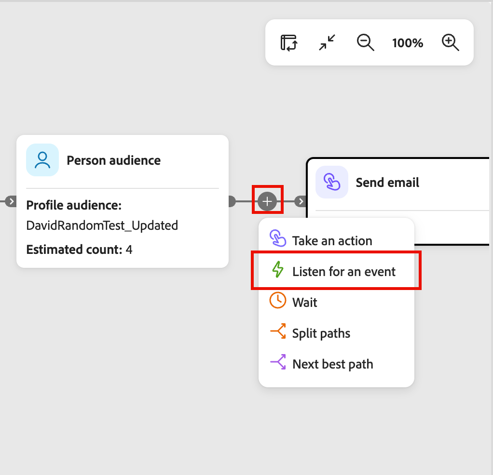
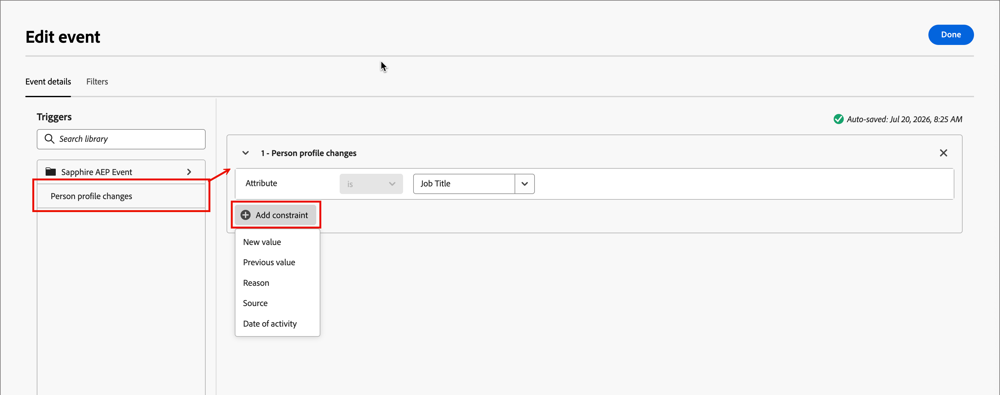
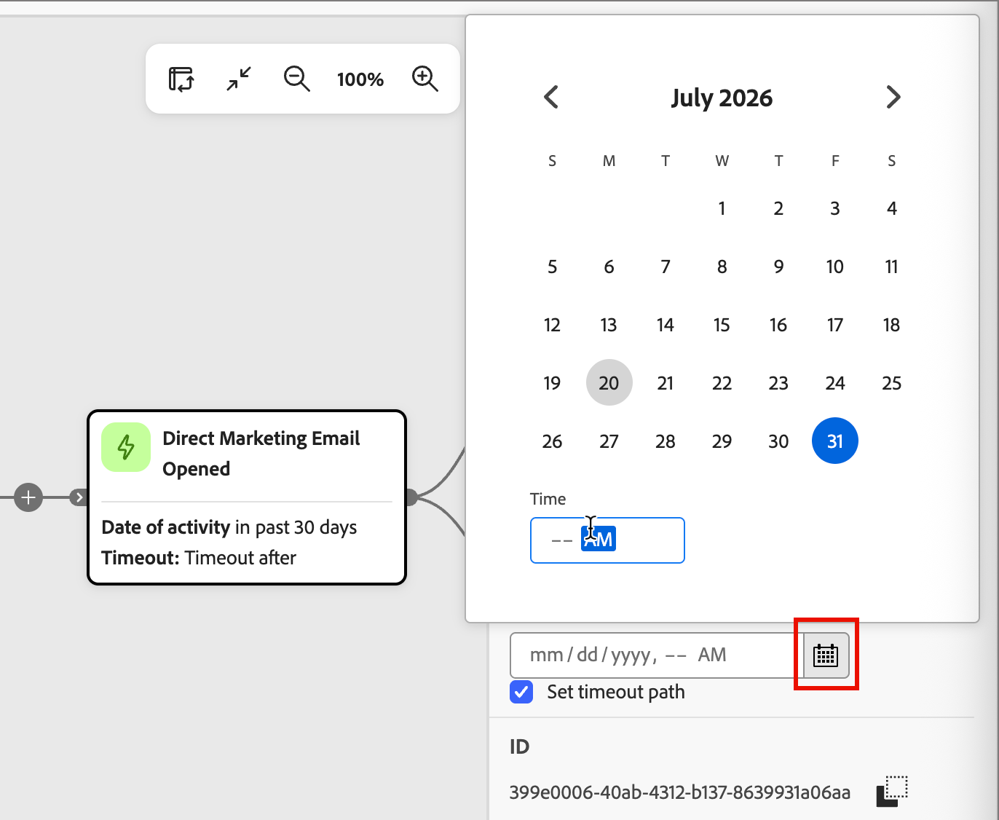

# イベントのリッスン

イベントが発生したときに[ ジャーニー](./journeys-overview.md)の次のステップにオーディエンスを進めるには、_イベントをリッスン_ ノードを追加します。 ジャーニーのタイプに応じて、このノードを使用して、人物イベントまたはアカウントイベントに応じてジャーニーの次のノードをトリガーできます。

<!--
{width="30", vertical-align="middle"} [Watch the overview video](#overview-video)
-->

## アカウントジャーニー {#account-journeys}

>[!NOTE]
>
>アカウントジャーニーの場合、分割パスに&#x200B;_[!UICONTROL Listen for an event]_ ノードタイプをユーザーごとに追加することはできません。

1. アカウントジャーニーキャンバスを開きます。

1. パスのプラス（**+**）アイコンをクリックし、**[!UICONTROL イベントをリッスン]**&#x200B;を選択します。

   {width="400"}

1. 右側のノードプロパティで、_イベントタイプ_ セレクターを使用して、**[!UICONTROL アカウント]**&#x200B;と&#x200B;**[!UICONTROL 人物]**&#x200B;のいずれかを選択します。

1. リストからイベントを選択します。

   * イベントの種類&#x200B;_People_&#x200B;の場合は、トリガーに使用する[people event](#people-events)を選択します。

     {width="500" zoomable="yes"}

   * _Accounts_ イベントタイプに対して、トリガーに使用する[account event](#account-events)を選択します。

     {width="500" zoomable="yes"}のイベントをリッスンします

1. 「**[!UICONTROL イベントを編集]**」をクリックし、イベントの詳細を定義します。

   選択したイベントタイプとイベントに応じて、イベント一致条件を定義します。

   * [人物イベント](#people-events)
   * [アカウントイベント](#account-events)

   イベントに[ フィルター](#filters-people-event)を含めることもできます。

1. 「**[!UICONTROL 完了]**」をクリックします。

   イベントとフィルターの定義は、ノードとノードプロパティに表示されます。

   {width="500"}

### アカウントジャーニーの人物イベント {#people-events}

アカウントジャーニーでは、人物アクティビティによってトリガーされたイベントに従って、ジャーニー内でアカウントを前進させたい場合、人物に基づいてイベントをリッスンできます。 また、イベント履歴やユーザー属性に応じてイベントをフィルタリングすることもできます。

>[!TIP]
>
>エクスペリエンスイベントは、ジャーニーに参加する&#x200B;_前_&#x200B;のユーザーに発生する可能性があります（以前のメールのクリックやweb インタラクションなど）。 これらのイベントに基づいてユーザーをルーティングするには、[ パスをユーザー](./split-merge-paths-nodes.md#experience-event-history-filtering) ノードで分割する[!UICONTROL  イベント履歴] フィルターを使用します。

#### Journey Optimizer B2B events {#events-account-people}

| イベント | 制約 |
| ----- | ----------- |
| [!UICONTROL 購買グループに割り当て] | ソリューションへの関心（必須）   追加の制約（オプション）: <li>役割</li><li>アクティビティの日付</li>  タイムアウト （オプション） |
| [!UICONTROL 人物プロファイルの変更] | 属性（必須）   アクティビティの日付（オプション）  新しい値（オプション）  前の値（オプション）  理由（オプション）  Source（オプション） |
| [!UICONTROL 購買グループから削除されました] | ソリューションの関心（必須）   アクティビティの日付（オプション）   タイムアウト（オプション） |

1. イベントに一致する必要な値を設定します。

   必要に応じて、評価の演算子を設定します。

1. イベント一致に含めるオプションの制約ごとに、**[!UICONTROL 制約を追加]**&#x200B;をクリックし、リストから制約を選択します。

   {width="700" zoomable="yes"}

1. （オプション）「**[!UICONTROL フィルター]**」タブを選択して、イベント ](#filters-people-event)のフィルターを[追加します。

1. 「**[!UICONTROL 完了]**」をクリックします。

#### エクスペリエンスイベント {#experience-events-account-people}

>[!PREREQUISITES]
>
>管理者は[Adobe Experience Platform （AEP） Experience Events](https://experienceleague.adobe.com/en/docs/experience-platform/xdm/classes/experienceevent){target="_blank"}を設定します。これにより、マーケターは、イベントにほぼリアルタイムで反応するアカウントと個人のジャーニーを作成できます。
>
>Experience Eventsをジャーニーで利用できるようにするには、製品管理者が最初に[関心のあるイベントタイプとフィールド ](../admin/configure-aep-events.md#add-an-event)を[!DNL Journey Optimizer B2B Edition]に追加する必要があります。

1. **[!UICONTROL 制約を追加]**&#x200B;をクリックし、制約に使用するフィールドを選択します。

   使用可能な制約は、イベント設定の管理フィールドとして定義されます。

1. 制約の条件を完了します。

   デフォルトの&#x200B;**[!UICONTROL is]**&#x200B;演算子を使用して、1つ以上のフィールド値を一致させることができます。 または、**[!UICONTROL is not]**&#x200B;演算子を使用して、1つ以上の指定された値を除外してすべての値に一致させることができます。

   {width="700" zoomable="yes"}

1. （オプション）「**[!UICONTROL フィルター]**」タブを選択して、イベント ](#filters-people-event)のフィルターを[追加します。

1. 「**[!UICONTROL 完了]**」をクリックします。

### アカウントイベント {#account-events}

アカウントジャーニーでは、アカウントアクティビティによってトリガーされるイベントに従ってジャーニー内でアカウントを前進させる場合、アカウントに基づいてイベントをリッスンできます。

| イベント | 制約 |
| ----- | ----------- |
| [!UICONTROL  アカウントに興味深い瞬間がありました] | 種類（電子メール、マイルストーン、またはWeb）  追加の制約（オプション）: <li>説明</li><li>ソース</li><li>アクティビティの日付</li>   タイムアウト （オプション） |
| [!UICONTROL  アカウントデータ値の変更] | 属性 追加の制約（オプション）: <li>新しい値</li><li>前回の値</li><li>アクティビティの日付</li>   タイムアウト （オプション） |
| 購買グループステージの[!UICONTROL 変更] | ソリューションの関心 追加の制約（オプション）: <li>新規ステージ</li><li>前のステージ</li><li>アクティビティの日付</li>  タイムアウト （オプション） |
| [!UICONTROL 購買グループのステータスの変更] | ソリューションの関心 追加の制約（オプション）: <li>新規ステータス</li><li>前のステータス</li><li>アクティビティの日付</li>  タイムアウト （オプション） |
| [!UICONTROL 完全性スコアの変更] | ソリューションの関心 追加の制約（オプション）: <li>新規スコア</li><li>前のスコア</li><li>アクティビティの日付</li>  タイムアウト （オプション） |
| [!UICONTROL  エンゲージメントスコアの変更] | ソリューションの関心 追加の制約（オプション）: <li>新規スコア</li><li>前のスコア</li><li>アクティビティの日付</li>  タイムアウト （オプション） |

1. イベントに一致する必要な制約を設定します。

1. イベント一致に含めるオプションの制約ごとに、**[!UICONTROL 制約を追加]**&#x200B;をクリックしてフィールドを選択します。

   {width="700" zoomable="yes"}

   評価の演算子と値を設定します。

1. 「**[!UICONTROL 完了]**」をクリックします。

<!--

Removed from AJO B2B people events 

| [!UICONTROL Clicks link in email] | Email  Additional constraints (optional): <li>Link</li><li>Link ID</li><li>Is mobile device</li><li>Device</li><li>Platform</li><li>Browser</li><li>Is predictive content</li><li>Is bot activity</li><li>Bot activity pattern</li><li>Browser</li><li>Date of activity</li><li>Min. number of times</li> Timeout (optional) |
| [!UICONTROL Clicks link in SMS] | Email  Additional constraints (optional): <li>Link</li><li>Device</li><li>Platform</li><li>Date of activity</li><li>Min. number of times</li> Timeout (optional) |
| [!UICONTROL Data value changes] | Person attribute  Additional constraints (optional): <li>New value</li><li>Previous value</li><li>Reason</li><li>Source</li><li>Date of activity</li><li>Min. number of times</li> Timeout (optional) |
| [!UICONTROL Opens email] | Email  Additional constraints (optional): <li>Link</li><li>Link ID</li><li>Is mobile device</li><li>Device</li><li>Platform</li><li>Browser</li><li>Is predictive content</li><li>Is bot activity</li><li>Bot activity pattern</li><li>Browser</li><li>Date of activity</li><li>Min. number of times</li> Timeout (optional) |
| [!UICONTROL Score is changed] | Score name  Additional constraints (optional):<li>Change</li><li>New score</li><li>Urgency</li><li>Priority</li><li>Relative score</li><li>Relative urgency</li><li>Date of activity</li><li>Min. number of times</li> Timeout (optional) |
| [!UICONTROL SMS Bounces]| SMS message  Additional constraints (optional): <li>Date of activity</li><li>Min number of times</li> Timeout (optional) |

### Listen for a Marketo Engage event {#listen-for-marketo-engage-event}

| Marketo Engage | [!UICONTROL Visits Web Page] | Web page   Select one or more Marketo Engage pages to match.   Additional constraints (optional): <li>Querystring</li><li>Client IP address</li><li>Referrer</li><li>User Agent</li><li>Search engine</li><li>Search query</li><li>Token</li><li>Browser</li><li>Platform</li><li>Device</li><li>Date of activity</li> |
| | [!UICONTROL Fills out form] | Form   Select one or more Marketo Engage forms to match.   Additional constraints (optional): <li>Date of activity</li><li>Querystring</li><li>Client IP address</li><li>Referrer</li><li>User agent</li><li>Platform</li><li>Device</li> Timeout (optional) |
| Adobe Experience Platform | [!UICONTROL Event definition] | Event type   Additional constraints (optional): <li>Fields</li>  Additional constraints (not supported): <li>Date of activity</li><li>Min. number of times</li>  Timeout (optional) |

If you have web pages in your connected Marketo Engage instance, you can trigger an event based on a visit/no visit to these web pages, as well as Marketo Engage forms that were/were not filled. 

1. Use the **[!UICONTROL Select people event]** selector and scroll the menu to the **[!UICONTROL Marketo Engage]** section.

1. Select a Marketo Engage activity type:

   * **[!UICONTROL Visits Web Page]**.
   * **[!UICONTROL Fills Out Form]**

   {width="700" zoomable="yes"}

1. Click **[!UICONTROL Edit event]** and define one or more web pages to match and any additional constraints for the event.

   * (Required) In the _[!UICONTROL Edit event]_ dialog, define the **[!UICONTROL Web page]** or **[!UICONTROL Fills out form]** constraint. Use **[!UICONTROL is]** (default) to match on one or more selected pages or forms. Use **[!UICONTROL is not]** to match on all page visits/forms with the exclusion of one or more selected pages/forms. Or, use the **[!UICONTROL is any]** operator to match on any Marketo Engage web page visit or filled form.

   * (Optional) Click **[!UICONTROL Add constraint]** and choose the field that you want to use for the constraint. Set the operator and the value for the field.

     {width="700" zoomable="yes"}

     To include additional field constraints as needed, repeat this action.

   * If needed, select the **[!UICONTROL Filters]** tab to [add filters for the event](#add-a-filter-to-the-people-event).

   * When the constraints and filters are defined, click **[!UICONTROL Done]**.

1. If needed, set the **[!UICONTROL Timeout]** option to limit the time period to listen for the event (see [Add a timeout to an event node](#add-a-timeout-to-an-event-node)). 

1. In the journey canvas, add the next node to execute when the event occurs.

-->

## 顧客ジャーニー {#person-journeys}

1. 個人ジャーニーキャンバスを開きます。

1. パスのプラス（**+**）アイコンをクリックし、**[!UICONTROL イベントをリッスン]**&#x200B;を選択します。

   {width="350"}

1. 右側のノードプロパティで、**[!UICONTROL イベント条件を追加]**&#x200B;をクリックします。

   {width="450"}

1. イベントを追加し、トリガーに一致させる制約を設定します。

   [Experience Events](#experience-events-person)および[人物プロファイルの変更](#person-profile-changes)を使用して、イベントトリガーを定義できます。

   イベントトリガーをビルダースペースにドラッグ&amp;ドロップして、定義を設定します。 イベントの一致を絞り込むために使用する各制約について、**[!UICONTROL 制約を追加]**&#x200B;をクリックします。

   一致するように複数のイベントを追加できます。 最初の適格イベントは、ジャーニー内で人物プロファイルを前進させます。

1. （オプション）「**[!UICONTROL フィルター]**」タブを選択して、イベント ](#filters-people-event)のフィルターを[追加します。

1. 「**[!UICONTROL 完了]**」をクリックします。

   イベントとフィルターの定義は、ノードとノードプロパティに表示されます。

   {width="450"}

### 個人ジャーニーのエクスペリエンスイベント {#experience-events-person}

>[!PREREQUISITES]
>
>管理者は[Adobe Experience Platform （AEP） Experience Events](https://experienceleague.adobe.com/en/docs/experience-platform/xdm/classes/experienceevent){target="_blank"}を設定します。これにより、マーケターは、イベントにほぼリアルタイムで反応するアカウントと個人のジャーニーを作成できます。
>
>Experience Eventsをジャーニーで利用できるようにするには、製品管理者が最初に[関心のあるイベントタイプとフィールド ](../admin/configure-aep-events.md#add-an-event)を[!DNL Journey Optimizer B2B Edition]に追加する必要があります。

Experience Eventsを使用して、_[!UICONTROL イベントを編集]_ ダイアログで、対面ジャーニーのノードをトリガーできます。

1. 左側の&#x200B;_[!UICONTROL トリガー]_ リストで&#x200B;**[!UICONTROL Sapphire AEP イベント]**&#x200B;を展開します。

1. エクスペリエンスイベントを、ビルダースペースに一致するイベントスペースにドラッグ&amp;ドロップします。

   _検索_ フィールドを使用して、イベント名のキーワード（`email`など）をフィルタリングできます。

1. 「**[!UICONTROL 制約を追加]**」をクリックし、イベントの一致を絞り込むために使用するフィールドを選択します。

   使用可能な制約は、イベント設定の管理フィールドとして定義されます。

   {width="700" zoomable="yes"}

1. イベントフィールドに一致する演算子と値を設定します。

1. （オプション）別のエクスペリエンスイベントまたは[人のプロファイル変更](#person-profile-changes)を追加します。

   複数のイベントを追加します。 最初の適格イベントは、ジャーニー内で人物プロファイルを前進させます。

1. （オプション）「**[!UICONTROL フィルター]**」タブを選択して、イベント ](#filters-people-event)のフィルターを[追加します。

1. 「**[!UICONTROL 完了]**」をクリックします。

### ユーザープロファイルの変更 {#person-profile-changes}

B2Bの人物プロファイル属性の変更を使用して、_[!UICONTROL イベントを編集]_ ダイアログで、人物ジャーニー内のノードをトリガーできます。

1. **_[!UICONTROL トリガー]_ リストの[!UICONTROL 人物プロファイルの変更]**を、イベントに一致するビルダースペースにドラッグ&amp;ドロップします。

1. 「**[!UICONTROL 制約を追加]**」をクリックし、イベントトリガーに使用する属性変更を選択します。

   一致させる変更に応じてフィールド値を設定します。

   {width="700" zoomable="yes"}

1. （オプション）イベントトリガーとして使用する別の&#x200B;_人物プロファイル変更_&#x200B;属性、または[Experience Event](#experience-events-person)を追加します。

   複数のイベントを追加します。 最初の適格イベントは、ジャーニー内で人物プロファイルを前進させます。

1. （オプション）「**[!UICONTROL フィルター]**」タブを選択して、イベント ](#filters-people-event)のフィルターを[追加します。

1. 「**[!UICONTROL 完了]**」をクリックします。

## イベントのフィルター {#filters-people-event}

アカウントジャーニー](#people-events)の[人イベントまたは人物ジャーニー](#person-journeys)の[人イベントを定義する場合、フィルタリングを含めて、様々な条件に基づいて一致するイベントトリガーを制限できます。

| フィルター | 説明 |
| ------------ | ----------- |
| [!UICONTROL  イベント履歴] | 管理者によって設定されたエクスペリエンスイベント。 _[エクスペリエンスイベントとフィールドの選択](../admin/configure-aep-events.md)_&#x200B;を参照してください。 |
| [!UICONTROL 人物の属性] | B2B人物プロファイルの属性（以下を含む）: <li>市区町村 <li>国 <li>生年月日 <li>メールアドレス <li>メール無効 <li>メール中断済み <li>名 <li>推測される都道府県 / 地域<li>役職 <li>姓 <li>携帯電話番号 <li>ユーザーエンゲージメントスコア <li>電話番号 <li>郵便番号 <li>都道府県 <li>配信停止完了 <li>登録解除の理由 |
| [!UICONTROL 人物の属性] | （個人ジャーニーのみ）属性値 |
| [!UICONTROL 特殊フィルター] > [!UICONTROL 購買グループのメンバー] | 個人が購買グループのメンバーであるか、またはメンバーでない場合は、次の基準の1つ以上に対して評価されます。 <li>ソリューションへの関心</li><li>購買グループのステータス</li><li>完全性スコア</li><li>エンゲージメントスコア</li><li>が削除されました</li><li>ロール</li> |

<!--
| [!UICONTROL Special filters] > [!UICONTROL Member of List] | The person is or is not a member of one or more Marketo Engage lists. |
| [!UICONTROL Special filters] > [!UICONTROL Member of Program] | The person is or is not a member of one or more Marketo Engage programs. |
-->

1. イベントトリガーを定義したら、_[!UICONTROL イベントを編集]_ ダイアログで「**[!UICONTROL フィルター]**」タブを選択します。

   {width="700" zoomable="yes"}

1. イベントの一致をフィルタリングするには、1つ以上のフィルター条件を追加します。

   * 左側のナビゲーションからいずれかのフィルターをドラッグ&amp;ドロップし、一致定義を完了します。

     >[!NOTE]
     >
     >Experience Platformのアカウントオーディエンススキーマでカスタム人物フィールドを定義している場合、これらのフィールドは&#x200B;**[!UICONTROL 属性]**&#x200B;でも使用でき、フィルターで人物属性として使用できます。

   * 上部の&#x200B;**[!UICONTROL フィルターロジック]**&#x200B;を適用して、フィルタリングを絞り込みます。 すべてのフィルターまたは任意のフィルターを一致させることができます。

     {width="600" zoomable="yes"}

1. イベントとフィルターの定義が完了したら、**[!UICONTROL 完了]**&#x200B;をクリックします。

## イベントノードへのタイムアウトの追加 {#timeouts}

必要に応じて、ジャーニーがイベントを待機する時間を定義します。 タイムアウトパスを定義しない限り、ジャーニーはタイムアウト後に終了します。このパスでは、他のノードを追加できます。

ノードプロパティで「**[!UICONTROL タイムアウト]**」オプションを有効にして、_イベントをリッスン_ ノードのタイムアウトを指定します。

1. オプションを有効にして、_Type_&#x200B;を選択し、タイムアウトのパラメーターを指定します。

   * **[!UICONTROL 期間]** – このタイプを使用して、イベントトリガーの期間を指定します。 その期間内にイベントがトリガーしない場合、個人またはアカウントはジャーニーに進みません。

     ジャーニーがタイムアウトする前にイベントが発生するのを待つ期間を選択します。 分、時間、日、週、または月の数を指定します。

     {width="500" zoomable="yes"}

     期間を特定の曜日に終了する場合は、「**[!UICONTROL 終了日]**」オプションを有効にします。 **[!UICONTROL 任意の日]**&#x200B;がデフォルトで選択され、すべての日が選択されています。 チェックボックスをオフにして、終了日として1日以上を選択します。 次に、**時間**&#x200B;と&#x200B;**[!UICONTROL タイムゾーン]**&#x200B;を選択します。

     {width="300"}に終了する必要があります

   * **[!UICONTROL 日付]** – このタイプを使用して、ノードの有効期限を設定します。 指定された日時までにイベントがトリガーしない場合、個人またはアカウントはジャーニーに進みません。

     _カレンダー_ アイコンをクリックして、タイムアウトの日時を設定します。

     {width="500" zoomable="yes"}

1. タイムアウトパスを定義します。

   **[!UICONTROL タイムアウトパスの設定]** オプションがデフォルトで選択されています。 このパスを使用して、「イベントをリッスン」ノードがタイムアウトした場合の処理を定義できます。 イベントが発生しない場合に個人プロファイルに適用される代替アクションとイベントを追加できます。

   {width="600" zoomable="yes"}

   パスを定義しない場合は、「_[!UICONTROL タイムアウトパスを設定]_」チェックボックスをオフにします。

<!--
 ## Overview video

>[!VIDEO](https://video.tv.adobe.com/v/3443219/?learn=on) 
-->
