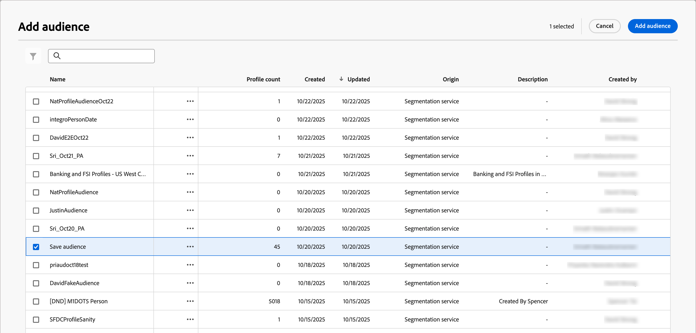

# 人物オーディエンスジャーニーノード

_人物オーディエンス_ ノードは、ジャーニーにエントリする人物プロファイルを指定します。 ユーザーのジャーニー[を作成する場合、ジャーニーは常に、入力を定義するユーザーのオーディエンスノードから始まります。 &#x200B;](./create-publish-journey.md#create-a-journey)個人オーディエンスノードには、CDP セグメントまたはイベントベースのメンバーシップという2つのオーディエンス入力タイプのいずれかを設定できます。 セグメントおよびイベントベースのオーディエンス定義は組み合わせることはできません。

人物オーディエンスジャーニーノードには、次のいずれかの入力オプションを使用します。

* **プロファイルオーディエンス** - CDPで定義されたセグメントオーディエンスを使用します。 オーディエンスに適格なすべてのプロファイルが、ジャーニーのメンバーとして追加されます。 セグメントの新しい適格プロファイルは、毎日の[&#x200B; プロファイル取り込み](#profile-ingestion) タスク中にジャーニーに追加されます。 プロファイルがセグメントに適格でなくなった場合、そのプロファイルはジャーニーから&#x200B;**_not_**&#x200B;削除されます。

* **イベントオーディエンス** – 選定イベントを使用してオーディエンスを定義します。 これらのイベントはノード設定で定義され、管理設定[&#128279;](../admin/configure-aep-events.md)で設定されたXDM イベントを使用する必要があります。 イベントベースのオーディエンスメンバーシップでは、最大10個のイベントがサポートされます。 プロファイルは、プロファイルが取る最初のマッチングイベントの直後にジャーニーの対象となります。

  >[!NOTE]
  >
  >イベントをプロファイル属性と組み合わせて、オーディエンス定義を絞り込むことはできません。 この制限に対処するための改善は、今後のリリースで計画されています。

## プロファイル取り込み

Journey Optimizer B2B editionでは、夜間のオーディエンス取り込みタスクにより、プロファイルがExperience Platformと同期されます。 イベントベースの個人ジャーニーは、Journey Optimizer B2B editionによって取り込まれ、使用されているプロファイルまたはアカウントオーディエンスに含まれていないプロファイルを選定できますが、取り込まれたプロファイルは、個人ジャーニー、アカウントジャーニー、購買グループによって使用されるオーディエンスの一部でない限り、陳腐化したままになります。 プロファイルが取り込まれ、後でオーディエンスに追加された場合、プロファイルの合成が実行され、プロファイルはExperience Platformと同期したままになります。 このプロファイルデータ同期の改善は、今後のリリースで計画されています。

イベントベースの人物ジャーニーによって取り込まれた新しく作成されたプロファイルには、取り込み時に更新されたプロファイル情報がない場合があります。 例えば、フォーム入力イベントを通じてプロファイルが作成され、個人のジャーニーが適格なフォーム入力イベントからプロファイルを取り込んだ場合、フォームで送信されたデータは、ジャーニーが取り込んだときにプロファイルにまだ同期されない可能性があります。 その結果、パーソナライゼーション用のデータ（メールコンテンツなど）が不完全になる可能性があります。 このプロファイルイベントデータ同期の改善は、今後のリリースで計画されています。

イベントベースの人物ジャーニーは、まだ匿名またはメールアドレスがなく、ECIDのみを含むプロファイルを選定できます。 この問題が最も一般的に発生するのは、web ページアクティビティの選定ロジックがある場合です。 イベントベースのオーディエンスロジックが広すぎると、条件を満たすプロファイルが多すぎると、インスタンスが4,000万件のプロファイルキャップに達する可能性があります。 このシナリオを防ぐために、オーディエンスの可能な範囲を制限します。

>[!IMPORTANT]
>
>現在のベータプログラムでは、個人ジャーニーの理想的な使い方は、アカウントジャーニーと購買グループの定義でターゲットにしているプロファイルのみを選定することです。 この使用により、Experience Platformと同期した完全なプロファイルが維持されます。

## 個人オーディエンスノードのオーディエンスの設定

1. 「**[!UICONTROL 人物オーディエンス]**」ノードをクリックします。

   このアクションは、右側にノードプロパティを表示します。

   {width="700" zoomable="yes"}

1. ジャーニーにエントリするユーザーの入力タイプを選択します。

   * **[!UICONTROL プロファイルオーディエンス]**

     「_[!UICONTROL プロファイルオーディエンス]_」オプションを選択します。 次に、**[!UICONTROL プロファイルオーディエンスを追加]**&#x200B;をクリックします。

     _[!UICONTROL オーディエンスを追加]_ ダイアログで、以前に作成したオーディエンスセグメントを選択します。 次に、**[!UICONTROL オーディエンスを追加]**&#x200B;をクリックします。

     {width="700" zoomable="yes"}

   * **[!UICONTROL イベントオーディエンス]**

     「_[!UICONTROL イベントオーディエンス]_」オプションを選択します。 次に、**[!UICONTROL イベント条件を追加]**&#x200B;をクリックします。

     _[!UICONTROL イベント条件を編集]_ ダイアログで、オーディエンスメンバーの選定に使用する1つ以上のイベントを追加します。 追加する各イベントについて、**[!UICONTROL 制約を追加]**&#x200B;をクリックして、一致するイベント属性を選択します。 一致に使用する評価を設定します。 イベントに合わせて複数の制約を追加できます。

     {width="700" zoomable="yes"}

     イベント条件が定義されたら、**[!UICONTROL 保存]**&#x200B;をクリックします。

     ジャーニーでサポートされるイベントの設定について詳しくは、[&#x200B; エクスペリエンスイベントの管理](../admin/configure-aep-events.md#manage-experience-events)を参照してください。
