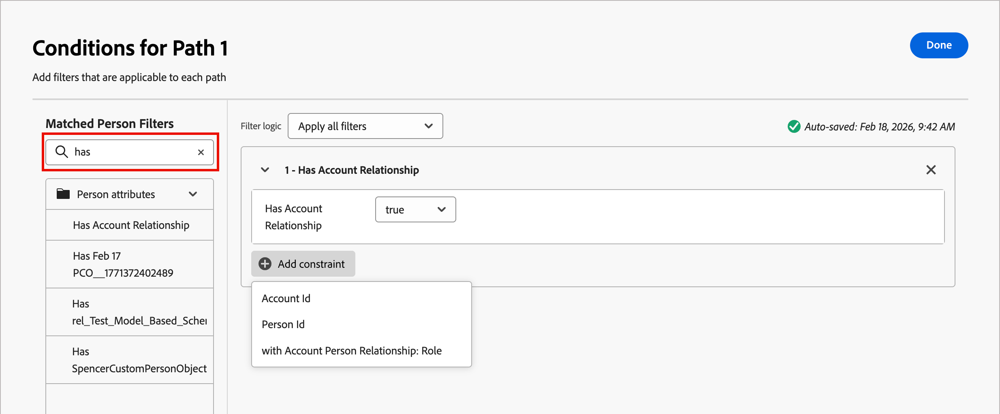

# パスの分割と結合

パスの分割ノードと結合ノードを使用して、定義した条件に従って人物やアカウントをセグメント化します。 条件に従ってオーディエンスまたはアカウントリストのパスを作成し、セグメントのアクションノードとイベントノードで各パスを定義し、パスを組み合わせてジャーニーを続行します。

{width="30"} [概要ビデオを視聴](#overview-video)

_パスを分割_ ノードは、**_アカウントまたはユーザーのフィルターに基づいて、1つ以上のセグメント化されたパスを定義します。_**&#x200B;人物フィルターに基づく分割は、結合パスノードで自動的に閉じられ、すべての人物がアカウントコンテキストを失うことなく次のステップに進むことができます。

>[!NOTE]
>
>最大25個のパスがサポートされています。

## アカウント別にパスを分割

_（アカウントジャーニーのみ）_

アカウント別に分割するパスには、アカウントと人物のアクションとイベントの両方を含めることができます。 これらのパスをさらに分割できます。

_**アカウントノードによるパスの分割の仕組み**_

* 追加する各パスには、各エッジにノードを追加する機能を持つ終了ノードが含まれます。
* アカウント別に分割ノードをネストできます（パスをアカウント別に繰り返し分割できます）。
* 各パスの評価は上から下まで行われます。 アカウントが最初のパスと2番目のパスに一致した場合、最初のパスに沿ってのみ進みます。
* 結合ノードを使用して、複数のパスを組み合わせることができます。
* ノードは&#x200B;_[!UICONTROL その他のアカウント]_ パスの定義をサポートしています。このパスでは、定義されたセグメントまたはパスのいずれかに一致しないアカウントのアクションまたはイベントを追加できます。

{width="700" zoomable="yes"}

### アカウントパスの条件

| パス条件 | 説明 |
| --------------- | ----------- |
| [!UICONTROL  アカウント属性] | アカウントプロファイルの属性（以下を含む）: <li>年間売上高 <li>市町村 <li>国 <li>従業員数 <li>業種 <li>名前 <li>SIC コード <li>状態 |
| [!UICONTROL  アカウント属性] >に`<custom object>`があります | [!BADGE Beta]{type=Informative tooltip="Betaの機能"} アカウントにリレーショナルスキーマレコードがないか、またはリレーショナルスキーマレコードがありません。 また、[XDM リレーショナルスキーマ ](../admin/xdm-field-management.md#relational-schemas)で設定されているように、選択したカスタムオブジェクトの条件に対して評価することもできます。 （[ カスタムデータフィルタリング ](#custom-data-filtering)を参照）。 |
| [!UICONTROL 特殊フィルター] > [!UICONTROL  アカウントが購買グループ ]と一致しました | アカウントが1つ以上の購買グループと一致しています。 マッチングされた購買グループに対して、次の1つ以上の制約に対して評価できます。 <li>ソリューションへの関心 <li>購買グループステージ <li>購買グループのステータス <li>エンゲージメントスコア <li>完全性スコア <li> 購買グループの役割の人数 |
| [!UICONTROL 特殊フィルター] > [!UICONTROL 購買グループ ]があります | アカウントに購買グループのメンバーが存在しないか、存在しません。 また、次のいずれかの基準または複数の基準に対して評価することもできます。 <li>ソリューションへの関心 <li>購買グループステージ <li>購買グループのステータス <li>エンゲージメントスコア <li>完全性スコア |

>[!NOTE]
>
>_[!UICONTROL 購買グループあり]_ フィルターは、今後の非推奨化にマークされています。 新しいジャーニーの場合は、_[!UICONTROL アカウントが購入グループ]_&#x200B;に一致したフィルターを使用します。このフィルターには、同じ制約がすべて含まれています。

### アカウントノードによる分割パスの追加

1. ジャーニーマップに移動します。

1. パスのプラス（**+**）アイコンをクリックし、「**[!UICONTROL パスを分割]**」を選択します。

   {width="300" zoomable="no"}

1. 右側のノードプロパティで、分割に「**[!UICONTROL アカウント]**」を選択します。

1. _[!UICONTROL パス 1]_&#x200B;に適用できる条件を定義するには、「**[!UICONTROL 条件を適用]**」をクリックします。

   {width="500" zoomable="yes"}

1. 条件エディターで、分割パスを定義する1つ以上のフィルターを追加します。

   * 左側のナビゲーションからフィルター属性をドラッグ&amp;ドロップして、一致定義を完了します。

   * 上部の&#x200B;**[!UICONTROL フィルターロジック]**&#x200B;を適用して、条件を微調整します。 すべてのフィルターまたは任意のフィルターを一致させます。

     {width="700" zoomable="yes"}

   * 「**[!UICONTROL 完了]**」をクリックします。

1. さらにパスを追加するには、**[!UICONTROL パスを追加]**&#x200B;をクリックし、前の手順を繰り返して、このパスに適用できる条件を追加します。

   これらの条件に基づいて各パスにラベルを付けることも、デフォルトのラベルを使用することもできます。

1. 必要に応じて、分割する優先度に従ってパスを並べ替えます。

   パスのフィルタリングは、トップダウンの順序で評価されます。 各アカウントは、一致する最初のパスに沿って進みます。

   各パスカードの右上にある上下の矢印をクリックして、パスのリストで上下に移動します。

   {width="500" zoomable="yes"}

1. 定義されたセグメント/パスと一致しないアカウントのデフォルトパスを定義するには、**[!UICONTROL その他のアカウント]** オプションを有効にします。

   このオプションが有効になっていない場合、分割で定義されたセグメント/パスに一致しないアカウントのジャーニーは終了します。

### アカウントの購買グループのフィルタリング {#buying-group-filtering-accounts}

購買グループに関連付けられたアカウントのパスを定義し、購買グループの基準を使用してパスをフィルタリングできます。 **[!UICONTROL アカウントが購買グループに一致しました]** フィルターを使用して、一致した購買グループを使用してパスセグメントを定義します。 このフィルターには、一致した購買グループ内の割り当てられた役割の数に基づいてアカウントを識別するオプションも含まれています。

たとえば、3人の意思決定者や2人のインフルエンサーなど、異なる役割における深さ（人数）にもとづいて、購買グループの準備状況を評価することができます。 この場合、条件を設定して、一致する購買グループ内の最低3人の（3）意思決定者と2人の（2）インフルエンサーのアカウントをターゲットアカウントにします。

1. **[!UICONTROL フィルターを追加]**&#x200B;をクリックし、購買グループの役割&#x200B;]**フィルターの**[!UICONTROL &#x200B;人数を選択します。

   {width="700" zoomable="yes"}

1. 最初の役割パラメーターを定義します。

   * 人数評価を`at least`に設定し、値を`3`にします。
   * 役割の評価を`is`に設定し、役割のリストから`Decision Maker`を選択します。

1. 手順1を繰り返して、別の購買グループの役割パラメーターを追加します。

1. 2番目の役割パラメーターを定義します。

   * 人数評価を`at least`に設定し、値を`2`にします。
   * 役割の評価を`is`に設定し、役割のリストから`Influencer`を選択します。

   {width="700" zoomable="yes"}

1. パスに対するすべての条件が定義されている場合は、**[!UICONTROL 完了]**&#x200B;をクリックします。

特定されたアカウントの場合は、パスにアクションノードを追加して、購買グループまたはステージのステータスを更新したり、セールスアラートメールを送信したりすることができます。

## パスを人物で分割

_（アカウントとユーザーのジャーニー）_

人物ごとに分割されたパスには、人物アクションのみを含めることができます。 これらのパスを再度分割して自動的に結合することはできません。

_**ユーザー別の分割パスの仕組み**_

* 人で分割ノードは、_グループ化されたノード_&#x200B;の分割結合の組み合わせ内で機能します。 分割されたパスは自動的にマージされるため、すべてのユーザーはアカウントコンテキストを失うことなく次のステップに進むことができます。
* 人物で分割ノードはネストできません（このグループ化されたノードにあるパスに人物の分割パスを追加することはできません）。
* 各パスの評価は上から下まで行われます。 人が最初と2番目のパスに一致した場合、最初のパスに沿ってのみ進みます。
* このノードは&#x200B;_アカウントと個人の関係_&#x200B;の使用をサポートしています。これにより、関係で定義されている役割（請負業者やフルタイムの従業員など）に基づいて人物をフィルタリングできます。
* ノードは、_[!UICONTROL その他のユーザー]_ パスの定義をサポートしています。このパスでは、定義されたセグメントまたはパスのいずれかに一致しないユーザーのアクションまたはイベントを追加できます。

{width="700" zoomable="yes"}

### 人物パスフィルター

| フィルター | 説明 |
| ------------ | ----------- |
| [!UICONTROL  アクティビティ履歴] > [!UICONTROL 電子メール ] | ジャーニーの前の段階で選択した1つ以上のメールメッセージを使用して評価される条件に基づいて、メールアクティビティを実行します。 <li>[!UICONTROL 電子メール内のリンクをクリック ] <li>メール開封済み <li>メール配信済み <li>メールが送信されました **[!UICONTROL 非アクティビティフィルターに切り替え&#x200B;]**– このオプションを使用して、アクティビティ不足に基づいてフィルタリングします（ユーザーがメールアクティビティを持っていない）。 |
| [!UICONTROL  アクティビティ履歴] > [!UICONTROL SMS メッセージ ] | ジャーニーの前の段階で選択した1つ以上のSMS メッセージを使用して評価される条件に基づくSMS アクティビティ： <li>[!UICONTROL SMSでリンクをクリック ] <li>[!UICONTROL SMS バウンス ]  **[!UICONTROL 非アクティビティフィルターに切り替え&#x200B;]**– このオプションを使用して、アクティビティの不足（ユーザーがSMS アクティビティを持っていない）に基づいてフィルタリングします。 |
| [!UICONTROL  アクティビティ履歴] > [!UICONTROL  データ値が変更されました] | 選択した人物属性に対して、値の変更が発生しました。 次の変更タイプがあります。 <li>新しい値<li>前回の値<li>理由<li>ソース<li>アクティビティの日付<li>分  **[!UICONTROL 非アクティビティフィルターに切り替える回数&#x200B;]**– このオプションを使用して、アクティビティ不足に基づいてフィルタリングします（ユーザーにデータ値の変更はありませんでした）。 |
| [!UICONTROL  アクティビティ履歴] > [!UICONTROL 興味深い瞬間がありました] | 関連する[!DNL Marketo Engage] インスタンスで定義されている興味深いモーメント アクティビティ。 制約事項は次のとおりです。 <li>マイルストーン<li>メール<li>Web  **[!UICONTROL 非アクティビティフィルターに切り替え&#x200B;]**– このオプションを使用して、アクティビティの欠如に基づいてフィルターを実行します（ユーザーには興味深い瞬間がありませんでした）。 |
| [!UICONTROL  アクティビティ履歴] > [!UICONTROL 訪問したweb ページ ] | 関連付けられた[!DNL Marketo Engage] インスタンスによって管理される1つ以上のweb ページのWeb ページアクティビティ。 制約事項は次のとおりです。 <li>Web ページ （必須）<li>アクティビティの日付<li>クライアント IP アドレス <li>クエリ文字列 <li>参照元 <li>ユーザーエージェント <li>検索エンジン <li>検索クエリ <li>パーソナライズ URL <li>トークン <li>ブラウザー <li>プラットフォーム <li>デバイス <li>分  **[!UICONTROL 非アクティビティフィルターに切り替える回数&#x200B;]**– このオプションを使用して、アクティビティの不足（ユーザーがweb ページにアクセスしなかった）に基づいてフィルターを実行します。 |
| [!UICONTROL 人物の属性] | [人物プロファイル ](../admin/field-mapping.md#xdm-business-person-attributes)の属性（以下を含む）: <li>市町村 <li>国 <li>メールアドレス <li>メール無効 <li>メール中断済み <li>名 <li>推測される都道府県 / 地域 <li>役職 <li>姓 <li>携帯電話番号 <li>人物エンゲージメントスコア <li>電話番号 <li>郵便番号 <li>状態 |
| [!UICONTROL 人物の属性] >に`<custom object>`があります | [!BADGE Beta]{type=Informative tooltip="Betaの機能"}この人物には、リレーショナルスキーマレコードがないか、またはリレーショナルスキーマレコードがありません。 また、[XDM リレーショナルスキーマ ](../admin/xdm-field-management.md#relational-schemas)で設定されているように、選択したカスタムオブジェクトの条件に対して評価することもできます。 （[ カスタムデータフィルタリング ](#custom-data-filtering)を参照） |
| [!UICONTROL 特殊フィルター] > [!UICONTROL 購買グループのメンバー] | （非推奨）人物が購買グループメンバーであるか、または購買グループメンバーでない場合、次の1つ以上の基準に照らして評価されます。 <li>ソリューションへの関心</li><li>購買グループのステータス</li><li>完全性スコア</li><li>エンゲージメントスコア</li><li>が削除されました</li><li>役割</li> |
| [!UICONTROL 特殊フィルター] > [!UICONTROL  リストのメンバー] | （非推奨）人物は、1つ以上の[!DNL Marketo Engage] リストのメンバーであるか、メンバーではありません。 |
| [!UICONTROL 特殊フィルター] > [!UICONTROL  プログラムのメンバー] | （非推奨）人物は、1つ以上の[!DNL Marketo Engage] プログラムのメンバーであるか、メンバーではありません。 |

### アカウントと個人のパスの条件

| パス条件 | 説明 |
| --------------- | ----------- |
| [!UICONTROL  アカウントの役割] | アカウント内で役割が割り当てられているか、または割り当てられていない人物。 オプションの制約： <li>役割名 |

### 分割パスを人物ノードで追加

>[!NOTE]
>
>パスを人物で分割すると、_分割パスを閉じる_ ノードが自動的に挿入され、分割が終了します。 分割されたパスでは、人物ノードに対して&#x200B;_アクションを実行_&#x200B;することのみが許可されます。

1. ジャーニーマップに移動します。

1. パスのプラス（**+**）アイコンをクリックし、「**[!UICONTROL パスを分割]**」を選択します。

   {width="300" zoomable="no"}

1. 右側のノードプロパティで、分割に&#x200B;**[!UICONTROL 人物]**&#x200B;を選択します。

1. （アカウントジャーニーのみ）条件&#x200B;]**に使用する**[!UICONTROL &#x200B;属性を設定します。

   * 人物プロファイルに関連する条件を使用するには、**[!UICONTROL 人物の属性のみ]**&#x200B;を選択します。
   * アカウント内のユーザーの役割メンバーシップに関連する条件を使用するには、**[!UICONTROL アカウントのユーザー属性のみ]**&#x200B;を選択します。

1. _[!UICONTROL パス 1]_&#x200B;に適用できる条件を定義するには、「**[!UICONTROL 条件を適用]**」をクリックします。

1. 条件エディターで、分割パスを定義する1つ以上のフィルターを追加します。

   * 左側のナビゲーションから人物フィルターのいずれかをドラッグ&amp;ドロップして、一致定義を完了します。

     >[!NOTE]
     >
     >Experience Platform のアカウントオーディエンススキーマでカスタムのユーザーフィールドが定義されている場合は、これらのフィールドを条件内のユーザー属性として使用することもできます。

   * 上部の&#x200B;**[!UICONTROL フィルターロジック]**&#x200B;を適用して、条件を微調整します。 すべての属性条件または任意の条件を一致させます。

     {width="700" zoomable="yes"}

   * 「**[!UICONTROL 完了]**」をクリックします。

1. さらにパスを追加するには、**[!UICONTROL パスを追加]**&#x200B;をクリックし、前の手順を繰り返して、このパスに適用できる条件を追加します。

   これらの条件に基づいて各パスにラベルを付けることも、デフォルトのラベルを使用することもできます。

1. 必要に応じて、分割する優先度に従ってパスを並べ替えます。

   パスのフィルタリングは、トップダウンの順序で評価されます。 各人は一致する最初のパスに沿って進みます。

   各パスカードの右上にある上下の矢印をクリックして、パスのリストで上下に移動します。

   {width="500" zoomable="yes"}

1. 定義されたパスと一致しないユーザーのデフォルトパスを追加するには、**[!UICONTROL その他のユーザー]** オプションを有効にします。

   このオプションが有効になっていない場合、定義されたセグメント/パスに一致しないユーザーは分割を超えて、ジャーニーの次のステップに進みます。

   オーディエンスを人物レベルで分割するための各パスに対して条件を定義した場合、人物に対して実行するアクションを追加できます。

### アクティビティフィルタリング

パスを人で分割する場合、次に関連するユーザーのアクティビティに応じてパスを定義できます。

* ジャーニーの初期段階からのメッセージの電子メール
* ジャーニーの初期段階からのSMS メッセージ
* 人物プロファイルのデータ値の変更
* 電子メール、web ページ、またはマイルストーンに関連する興味深い瞬間（[!DNL Marketo Engage]で追跡）
* ウェブページへの訪問（[!DNL Marketo Engage]で追跡）

>[!BEGINSHADEBOX &quot;非アクティビティフィルタリング&quot;]

各&#x200B;_[!UICONTROL アクティビティ履歴]_ フィルターについて、**[!UICONTROL 非アクティビティフィルターに切り替え]** オプションを有効にできます。 このオプションは、そのアクティビティタイプが存在しない場合の評価にフィルターを変更します。 例えば、_[!UICONTROL 電子メール]_ > _[!UICONTROL 電子メールを開封]_ フィルターを追加して、ジャーニーの早い段階で&#x200B;_**様が**_&#x200B;電子メールを開封しなかったユーザーのパスを作成します。 「非アクティブ」オプションを有効にして、電子メールを指定します。 アクティビティの日付&#x200B;_[!UICONTROL 制約]_&#x200B;を使用して、非アクティビティの期間を定義することをお勧めします。

{width="700" zoomable="yes"}

>[!ENDSHADEBOX]

### メンバーシップフィルタリング

_[!UICONTROL 特殊フィルター]_ セクション内には、購買グループまたは[!DNL Marketo Engage] リストのメンバーを評価するために使用できる複数のフィルターがあります。

例えば、購買グループのメンバーで、特定の役割が割り当てられているユーザーのパスを作成する場合は、_[!UICONTROL 特殊フィルター]_ > _[!UICONTROL 購買グループのメンバー]_ フィルターを追加します。 フィルターの場合、メンバーシップを&#x200B;_true_&#x200B;に設定し、1つ以上の購買グループに関連付けられている&#x200B;_[!UICONTROL ソリューションの関心]_&#x200B;を選択し、一致させる&#x200B;_[!UICONTROL 役割]_&#x200B;を設定します。

{width="700" zoomable="yes"}

また、購買グループのメンバーシップに関する次の制約を含めることもできます。

* _[!UICONTROL 購買グループステージ]_
* _[!UICONTROL 購買グループの状態]_
* _[!UICONTROL 完全性スコア]_
* _[!UICONTROL エンゲージメントスコア]_
* _[!UICONTROL は削除されました]_

>[!TIP]
>
>購買グループから削除されたメンバーを除外するには、_[!UICONTROL 削除済み]_&#x200B;制約を`false`に設定します。 また、この制約を`true`に設定することで、削除されたメンバーを明示的に含めることもできます。

>[!BEGINSHADEBOX &quot;Marketo Engage リストとプログラム メンバーシップ&quot;]

[!DNL Marketo Engage]では、_スマートキャンペーン_&#x200B;がプログラムのメンバーシップをチェックして、リードが重複するメールを受信せず、同時に複数のメールストリームのメンバーでないことを確認します。 Journey Optimizer B2Bでは、分割パスの条件として[!DNL Marketo Engage]のリストメンバーシップを確認して、ジャーニーアクティビティの重複を排除できます。

分割条件でリストメンバーシップを使用するには、**[!UICONTROL 特殊フィルター]**&#x200B;を展開し、**[!UICONTROL リストのメンバー]**&#x200B;または&#x200B;**[!UICONTROL プログラムのメンバー]**&#x200B;条件をフィルタースペースにドラッグします。 フィルター定義を完了して、1つ以上の[!DNL Marketo Engage] リストのメンバーシップを評価します。

![ パスを[!DNL Marketo Engage] リストメンバーシップのユーザー条件で分割](./assets/node-split-paths-conditions-people-member-of-list.png){width="700" zoomable="yes"}
 

>[!NOTE]
>
>**機能の非推奨化**  
>
>Journey Optimizer B2B editionの[簡素化されたアーキテクチャ ](../simplified-architecture.md)では、Marketo Engage インスタンスのリストまたはプログラムメンバーシップに基づくフィルタリングはサポートされていません。

>[!ENDSHADEBOX]

## カスタムデータフィルタリング

[!BADGE Beta]{type=Informative tooltip="Betaの機能"}

リレーショナルスキーマ（モデルベースのクラス）を使用して、アカウントまたは人物ごとにパスを分割できます。 カスタムオブジェクトは&#x200B;_リレーショナルスキーマ_&#x200B;内で定義されており、製品管理者は[ リレーショナルスキーマフィールド ](../admin/xdm-field-management.md#relational-schemas)を[!DNL Journey Optimizer B2B Edition]で設定できます。 選択したスキーマフィールドは、条件エディターで使用でき、_アカウントごとにパスを分割_&#x200B;および&#x200B;_人物ごとにパスを分割_ ノードで使用できます。

**[!UICONTROL アカウント別にパスを分割]**&#x200B;条件の場合、検索フィールドを使用して、_[!UICONTROL アカウント属性]_&#x200B;の下のカスタムオブジェクト名でリストをフィルタリングします。 条件を追加し、値を`true`または`false`に設定します。

{width="600" zoomable="yes"}

**[!UICONTROL パスを人物]**&#x200B;で分割する条件の場合、検索フィールドを使用して、_[!UICONTROL 人物属性]_&#x200B;の下のカスタムオブジェクト名でリストをフィルタリングします。

{width="600" zoomable="yes"}

<!--
 SPHR-21734

Note: These are currently going under Account Attributes/Person Attributes folder, which is a bug. This will move to Special filters when resolved (? release).
-->

## パスを結合

_パスを結合_ ノードを追加して、ジャーニー内のアカウント _別に異なる_&#x200B;分割パスを結合します。

1. ジャーニーマップに移動します。

1. パスのプラス（**+**）アイコンをクリックし、「**[!UICONTROL パスを分割]**」を選択します。

1. 分割ノードをクリックして、右側のプロパティを開きます。

1. 「[!UICONTROL  パスを追加]」をクリックして、3つのパスを作成します。

1. 各パスにアクションとイベントの組み合わせを追加します。

1. これらのパスのいずれかのプラス（**+**）アイコンをクリックし、表示されたオプションから「**[!UICONTROL 結合]**」を選択します。

   {width="400" zoomable="no"}

1. 結合パス ノードのプロパティで、結合するパスを選択します。

   {width="600" zoomable="yes"}

   この時点で、パスは結合され、選択したパスのアカウントが結合され、ジャーニーを進み続けることができる単一のパスになります。

1. 必要に応じて、結合パスのノードプロパティに戻り、削除するパスのチェックボックスをオフにすることで、パスを結合できます。

## 概要動画

>[!VIDEO](https://video.tv.adobe.com/v/3443231/?learn=on)
