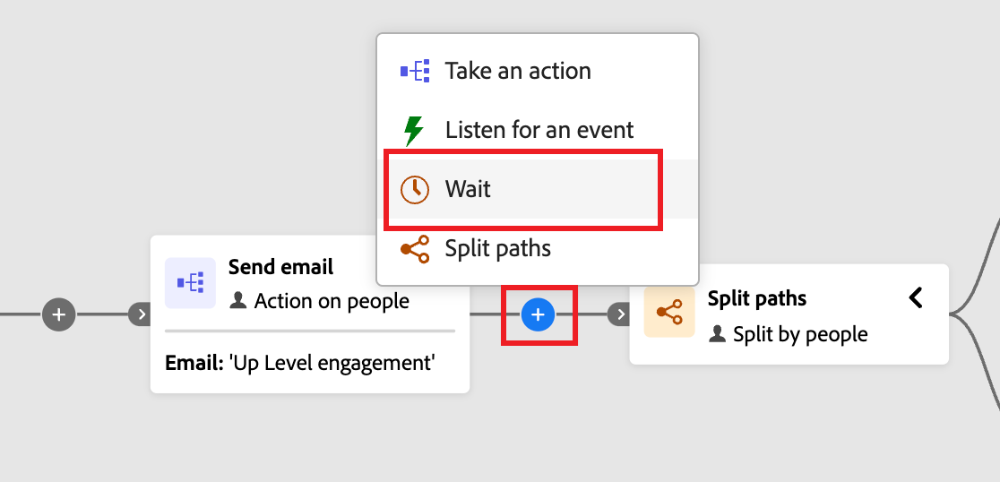

# 待機ノード

_待機_ ノードは、次のステップに進む前に、ジャーニーの進行を一定の期間一時停止する場合に使用します。

待機時間を定義する方法は 2 つあります。

* 相対的な期間（分、時間、日、週、月の数）
* ジャーニーの次のノードに進む特定の日付

アカウントジャーニーの待機ノードを定義するには（_T） :_

1. ジャーニーマップに移動します。

1. パスのプラス（**+**）アイコンをクリックし、「**[!UICONTROL 待機]**」を選択します。

   {width="400"}

1. 右側のノードプロパティで、パス内の次のノードにジャーニーが進むまでの待機時間 **[!UICONTROL タイプ]** を設定します。

   {width="700" zoomable="yes"}
