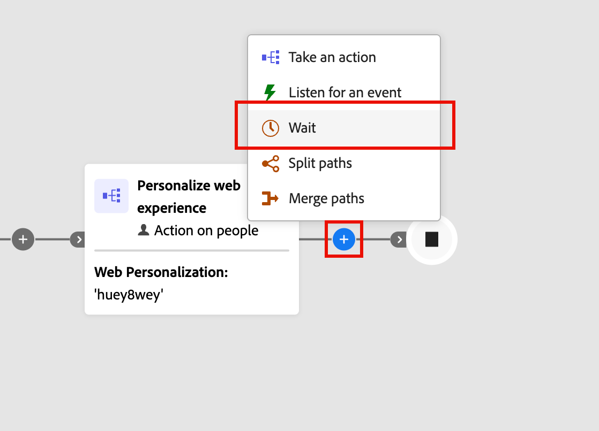
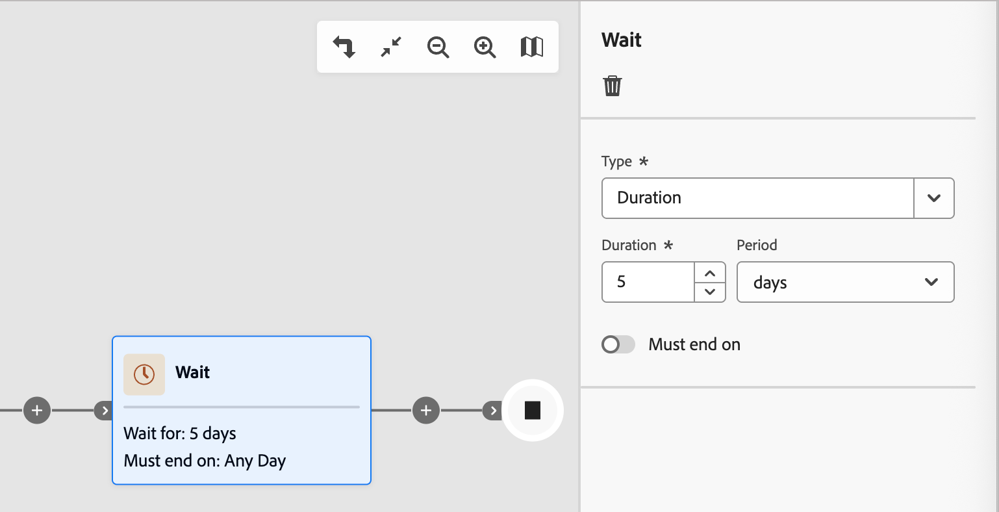

# 待機ノード

_待機_ ノードは、次のステップに進む前に、ジャーニーの進行を一定の期間一時停止する場合に使用します。

待機時間を定義する方法は 2 つあります。

* ジャーニーの次のノードに進む特定の日付
* 相対的な期間（分、時間、日、週、月の数）

## 待機ノードを追加

1. ジャーニーマップに移動します。

1. パスのプラス（**+**）アイコンをクリックし、「**[!UICONTROL 待機]**」を選択します。

   {width="440"}

1. 右側のノードプロパティで、パス内の次のノードにジャーニーが進むまでの待機時間 **[!UICONTROL タイプ]** を設定します。

   * **[!UICONTROL 期間]** – 待機ノードのエントリから終了までの日数、時間数、または分数を具体的に定義します。
   * **[!UICONTROL 日付]** – 終了の特定の日時を指定します。

   {width="500"}

## 詳細な待機設定

「**[!UICONTROL 終了日]**」オプションを有効にして _詳細な待機ステップ_ を設定し、最適なタイミングで人物とアカウントメンバーにメッセージが届くようにします。 この設定を使用すると、個人またはアカウントが待機ステップを終了し、ジャーニー内の次のノードに進むタイミングを正確に制御できます。 入口から出口までの時間または日数の固定数ではなく、特定の時間および曜日にアクションを実行するようにスケジュールできます。

_詳細な待機ステップ_ では、ユーザーまたはアカウントが待機する時間だけでなく **_終了するタイミング_** を定義できます。

{width="500"}

>[!AVAILABILITY]
>
>高度な待機設定は、[!DNL Journey Optimizer B2B Edition] アーキテクチャの簡素化 [ でプロビジョニングされた ](../simplified-architecture.md) 環境で使用できます。

### 待機タイプ

| 待機タイプ | 説明 | 設定 |
| --------- | ----------- | ------------- |
| **特定の時刻** | 特定の時間（午前 9:00 など）まで保持する | 時間（時間と分）を設定します。 その時間が次に発生した時点で（選択したタイムゾーンに対して）終了します。 |
| **特定の曜日** | 特定の日（火曜日など）まで保持する | 曜日を選択します。 時間を指定しない場合、は次に一致する日の午前 0 時（選択したタイムゾーン）に終了します。 |
| **日付範囲または組み合わせ** | 範囲内の任意の日（月曜日から金曜日など）まで、または指定した日のいずれかに保持します | 目標日数を選択します。 時間を指定しない場合、は次に一致する日の午前 0 時（選択したタイムゾーン）に終了します。 |
| **時間と日の組み合わせ** | 正確なスケジュール設定（火曜日の午前 10:00 など）のために両方を組み合わせる | 目標日数を選択し、目標時間を設定します。 次の日/時刻の発生で終了します（選択したタイムゾーン）。 |

### 一般的なシナリオ

次のシナリオは、待機ノードの設定に一般的なシナリオを適用する方法を示しています。

+++営業時間内の E メール到着

**シナリオ：** 職場でメールを読む B2B 顧客に対してマーケティングを行います。 すべてのメールを営業時間内に受信する必要がある。

**解決策：** 待機ステップを設定して、平日の午前 9:00 （月曜日から金曜日）にリードをリリースします。 リードが待機ノードに入っても、営業時間内にメールが届きます。

+++

+++動的オーディエンスに対して一貫性のある送信時間

**シナリオ：** 新しいアカウントまたはリードが選定されると、オーディエンスは毎日変更されます。 見込み客がいつ認定されるかに関係なく、すべてのリードが最初のメールを同時に受け取るようにしたい。

**解決策：** 特定の時刻（午前 10:00 など）に終了するように待機ステップを設定してください。 すべてのリードは、午前 0 時または正午に認定された場合でも、午前 10:00 に一緒に待機ステップを終了します。

+++

+++SLA準拠のフォローアップタスク

**シナリオ：** セールスチームは、マーケティング上適格なアカウントリードをフォローアップするために、2 営業日のSLAを用意しています。 週末は数えない。

**解決策：** 待機ステップを設定して、営業日にのみリードをリリースします。 金曜日に認定されたリードは、週末ではなく、月曜日または火曜日にフォローアップのためにルーティングされます。

+++

### 入口と出口の例

| 待機設定 | アカウント / リードエントリ | アカウント/リードの離脱 |
| ------------------ | ------------------- | ------------------ |
| 午前 9:00、いつでも | 月曜日の午前 11:00 | 火曜日の午前 9:00 |
| 午前 9:00、いつでも | 月曜日 :00 午前 7:00 | 月曜日 :00 午前 9:00 |
| 火曜日、時間設定なし | 金曜午後 3:00 （PT） | 火曜日の午前 12:00 |
| 月曜日～金曜 :00 午前 10 時 | 土曜 :00 午後 2:00 | 月曜午前 10:00 （PT） |
| 月曜日～金曜 :00 午前 10 時 | 水曜日午前 8:00 （PT） | 水曜日午前 10:00 （PT） |
