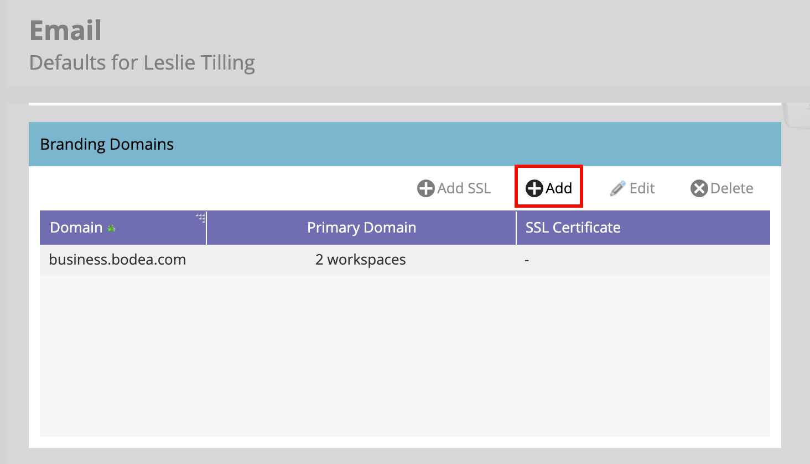

# ブランディングドメインの設定

Marketo Engageのブランディングドメインは、リンクの書き換えとメールのクリック数の追跡に使用されるカスタムサブドメイン（`links.yourcompany.com` など）で、汎用ドメインではなくブランドが反映されていることを確認します。 各ブランディングドメインは、クリック追跡ドメインとして機能し、メールおよびランディングページのリンクをドメインと照合して、配信品質と信頼を強化します。

* これは、一般的なリンクを、メールのハイパーリンクにおける独自のブランディングに置き換えます。
* アカウントのリードがリンクをクリックすると、このカスタムドメインを通じてリダイレクトされるので、パフォーマンスのトラッキングが可能になると同時に、メールフィルターでは妥当に見えます。
* 複数のブランドがある場合、異なるビジネスユニットやブランドをサポートするように追加のブランディングドメインを設定できます。

>[!BEGINSHADEBOX]

**トラッキングリンクの一意の CNAME**

メールトラッキングリンクは、接続されたMarketo Engage インスタンスに対して新しく、一意である必要があります。 既存の（実稼動）Marketo Engage インスタンスを指すトラッキングリンク用の既存のCNAMEがある場合、変更せずに再利用することはできません。

実稼動Marketo Engageのインスタンスと接続されたインスタンスの間でリターンパスドメインのブランディングを共有できますが、これはバックエンドの変更です。 サポートチケットを開き、Marketo Engage プレフィックス（Munchkin ID）と新しいJourney Optimizer B2B edition プレフィックス（Munchkin ID）を指定して、共通のリターンパスドメインのブランディングをリクエストします。

>[!ENDSHADEBOX]

>[!PREREQUISITES]
>
>UI でドメインを編集または追加する前に、[Adobeが提供するMarketo Engage ドメインに CNAME をマッピング ](https://experienceleague.adobe.com/ja/docs/marketo/using/getting-started/initial-setup/setup-steps#customize-your-landing-page-urls-with-a-cname){target="_blank"} する必要があります。
>
>ドメインを追加すると、システムは、以前に手動で作成された可能性のある既存の SSL をチェックします。 この検証が発生した場合は、SSL作成を選択せずにドメインを作成し、別の手順で接続します。

## Marketo Engageのブランディングドメインへのアクセス

1. Marketo Engage インスタンスの **[!UICONTROL 管理者]** エリアに移動して、「**[!UICONTROL メール]**」を選択します。

1. **[!UICONTROL ブランディングドメイン]** パネルまでスクロールします。

   {width="700" zoomable="yes"}

   このリストには、Marketo Engage インスタンスのデフォルトドメインが表示されます。

## デフォルトのブランディングドメインを編集

ブランディングドメインの操作の最初の手順は、Marketo Engage インスタンスで定義されたデフォルトのブランディングドメインを編集することです。

>[!NOTE]
>
>汎用のデフォルトドメインを編集するまで、追加のブランディングドメインを定義することはできません。

1. _[!UICONTROL ブランディングドメイン]_ パネルで、汎用ドメインを選択し、上部の **[!UICONTROL 編集]** をクリックします。

   {width="500"}

1. _[!UICONTROL ブランディングドメインを編集]_ ダイアログの **[!UICONTROL ドメイン]** フィールドに、デフォルトドメインの名前を入力します。

   {width="400"}

1. Marketo Engage インスタンスに複数のワークスペースを定義している場合は、「**[!UICONTROL 次へ]**」をクリックします。

   更新したプライマリドメインを適用する各ワークスペースを選択します。

   {width="400"}

1. 「**[!UICONTROL 保存]**」をクリックします。

## 追加ドメインの定義

デフォルトドメインを編集した後、別のブランドドメインを追加して、Journey Optimizer B2B Edition環境内の複数のブランドをサポートできます。各ブランドには、独自のトラッキングリンクがあります。 ドメインを追加する場合、次のオプションがあります。

>* _プライマリドメインを作成_：これをワークスペースのプライマリドメインにします。 このオプションを選択すると、既存の未送信メールはすべてデフォルトのプライマリドメインに設定され、新しく作成されたすべてのメールは自動的にこのプライマリドメインにデフォルト設定されます。 マーケターは、必要に応じて別のブランディングドメインを選択できます。
>
>* _SSL 証明書を生成_：ドメインの作成に Secure Sockets Layer （SSL）を作成します。 最初のトラッキングドメインは、数時間かかるインフラストラクチャの1回限りのセットアップを開始します。 完了時に通知が送信されます。

ドメインを追加するには（_T） :_

1. _[!UICONTROL ブランディングドメイン]_ パネルで、上部の **[!UICONTROL 追加]** をクリックします。

   {width="500"}

1. _[!UICONTROL 新しいブランディングドメイン]_ ダイアログで、「**[!UICONTROL ドメイン]**」フィールドにブランディングドメインの名前を入力します。

1. （オプション）「**[!UICONTROL SSL 証明書を生成]**」チェックボックスをオンにして、ドメインの SSL を自動的に生成します。

   {width="400"}

   必要に応じて使用可能な場合は、「_プライマリドメインを作成_」チェックボックスをオンにすることもできます。

   >[!NOTE]
   >
   >**_カスタム SSL_**：カスタム SSL が必要な場合は、[ サポートチケット ](https://experienceleague.adobe.com/en/support){target="_blank"} を送信できます。 SSL 作成にチェックボックスを使用しないでください。

1. Marketo Engage インスタンスに複数のワークスペースを定義している場合は、「**[!UICONTROL 次へ]**」をクリックします。

   必要に応じて、新しいドメインをプライマリドメインとして適用するワークスペースをそれぞれ選択します。

   {width="400"}

1. 「**[!UICONTROL 保存]**」をクリックします。

## 既存のブランディングドメインの SSL の編集

既存のドメインで SSL を有効にするには、次の手順に従います。

1. _[!UICONTROL 管理者]_ エリアから、「**[!UICONTROL メール]**」を選択します。

1. _[!UICONTROL ブランディングドメイン]_ パネルで、ドメイン行を選択し、「**[!UICONTROL SSL を追加]**」をクリックします。

   {width="500"}

1. ダイアログで、「**[!UICONTROL 確認]**」をクリックします。

   {width="400"}

## エラーメッセージ

| エラー | 詳細 |
| ----- | ------- |
| `Domain already exists.` | 同じ名前のドメインが既に存在します。 |
| `Domain is not mapped to the default domain.` | カスタムドメインがデフォルトのドメインに正しくマッピングされていません。 ドメインマッピング設定を確認し、DNS 設定が正しいデフォルトドメインを指していることを確認します。 |
| `SSL certificates could not be issued due to unsupported CAA records. Request your IT to update your CAA records.` | CAA レコードが最新ではありません。 Adobeの管理による SSL 証明書を使用している場合、CAA レコードを、ベンダーが推奨する証明書に更新する必要があります。 |
| `SSL certificate has already been issued.` | このカスタムドメインには、SSL 証明書が既に存在します。 証明書の有効期限が切れているか、証明書を再発行する必要がない限り、これ以上の操作は必要ありません。 |
| `The default domain was not found. Please contact Support for assistance.` | デフォルトのドメインを見つけようとした際に問題が発生しました。 トリガー調査については、Adobe サポートにお問い合わせください。 |
| `Unexpected error encountered while creating a domain. Please contact Support for assistance.` | 予期しないエラーが発生しました。 ログとエラーの詳細を収集し、問題をAdobe サポートにエスカレーションします。 |

## ブランディングドメインの削除

>[!NOTE]
>
>（1 つ以上のワークスペースの） プライマリブランディングドメインを削除する場合は、まず、各ワークスペースのプライマリとして異なるブランディングドメインを選択する必要があります。
>
>SSL 証明書を削除 **_しない_** ドメインを削除します。 このガードレールは、web サイトに SSL 証明書がない結果となるユーザーエラーを防ぎます。 SSL 証明書を削除する場合は、Adobe サポートにお問い合わせください。

_[!UICONTROL ブランディングドメイン]_ パネルで、ドメインを選択し、上部の **[!UICONTROL 削除]** をクリックします。
