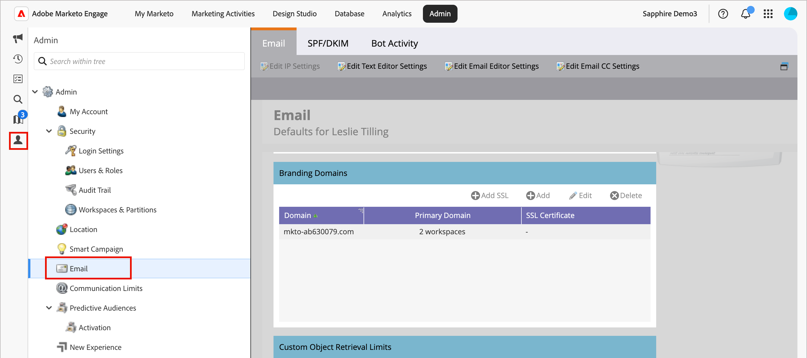
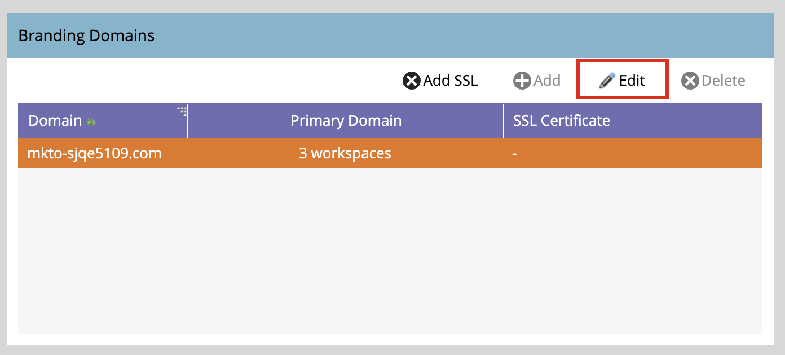
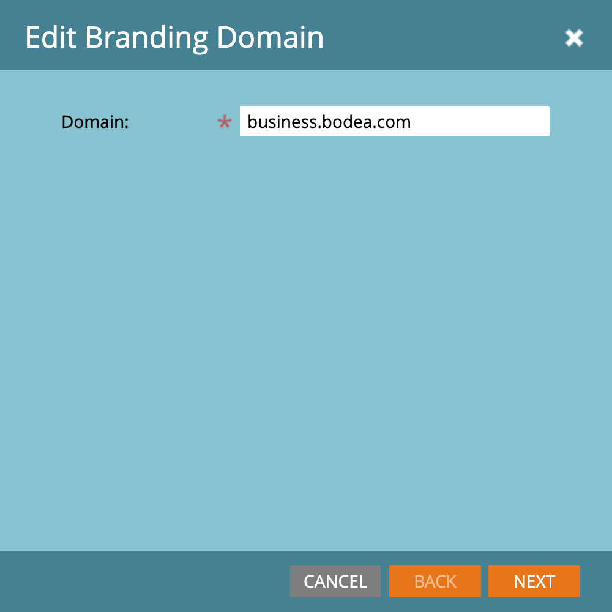

# ブランディングドメインの設定

Marketo Engageのブランディングドメインは、リンクの書き換えとメールのクリック数の追跡に使用されるカスタムサブドメイン（`links.yourcompany.com` など）で、汎用ドメインではなくブランドが反映されていることを確認します。 各ブランディングドメインは、クリック追跡ドメインとして機能し、メールおよびランディングページのリンクをドメインと照合して、配信品質と信頼を強化します。

* メール内のハイパーリンクにある汎用的なリンクを、自社ブランドのリンクに置き換えます。
* リードがリンクをクリックすると、このカスタムドメインを通じてリダイレクトされ、メールフィルターでは正当と思われながらパフォーマンスの追跡が可能になります。
* 複数のブランドがある場合、さまざまな事業部やブランドをサポートするために、追加のブランドドメインを設定できます。

>[!BEGINSHADEBOX]

**トラッキングリンクの一意の CNAME**

メールトラッキングリンクは、接続されたMarketo Engage インスタンスに対して新しく、一意である必要があります。 実稼動Marketo Engage インスタンスとアタッチされたインスタンスの間でreturn-path ドメインブランディングを共有できますが、この変更は内部システムの変更です。 サポートチケットを開き、Marketo Engage プレフィックス（Munchkin ID）と新しい Journey Optimizer B2B Edition プレフィックス（Munchkin ID）を指定して、共有のリターンパスドメインのブランディングをリクエストします。

>[!ENDSHADEBOX]

>[!PREREQUISITES]
>
>UI でドメインを編集または追加する前に、[Adobeが提供するMarketo Engage ドメインに CNAME をマッピング ](https://experienceleague.adobe.com/ja/docs/marketo/using/getting-started/initial-setup/setup-steps#customize-your-landing-page-urls-with-a-cname){target="_blank"} する必要があります。
>
>ドメインを追加する際に、システムは、以前に手動で作成した既存のSSLをチェックします。 この検証が発生した場合は、SSL作成を選択せずにドメインを作成し、別の手順で接続します。

## Marketo Engageのブランディングドメインへのアクセス

1. Marketo Engage インスタンスの **[!UICONTROL 管理者]** エリアに移動して、「**[!UICONTROL メール]**」を選択します。

1. **[!UICONTROL ブランディングドメイン]** パネルまでスクロールします。

   {width="700" zoomable="yes"}

   このリストには、Marketo Engage インスタンスのデフォルトドメインが表示されます。

## デフォルトのブランディングドメインを編集

ブランディングドメインの操作の最初の手順は、Marketo Engage インスタンスで定義されたデフォルトのブランディングドメインを編集することです。

>[!NOTE]
>
>汎用のデフォルトドメインを編集するまで、追加のブランディングドメインを定義することはできません。

1. _[!UICONTROL ブランディングドメイン]_ パネルで、汎用ドメインを選択し、上部の **[!UICONTROL 編集]** をクリックします。

   {width="500"}

1. _[!UICONTROL ブランディングドメインを編集]_ ダイアログの **[!UICONTROL ドメイン]** フィールドに、デフォルトドメインの名前を入力します。

   {width="400"}

<!--
1. If you have multiple workspaces defined for your Marketo Engage instance, click **[!UICONTROL Next]**.

   Select each of the workspaces where you want to apply the updated primary domain.

   {width="400"}

-->

1. **[!UICONTROL 次へ]** をクリックしてから **[!UICONTROL 保存]** をクリックします。

## 追加ドメインを定義する

Journey Optimizer B2B edition環境内で複数のブランドをサポートするために、それぞれのブランドのトラッキングリンクを使用するには、デフォルトドメインを編集した後に別のブランドドメインを追加します。 ドメインを追加する場合、次のオプションがあります。

>* _プライマリドメインを作成_：これをワークスペースのプライマリドメインにします。 このオプションを選択すると、既存の未送信メールはすべてデフォルトのプライマリドメインに設定され、新しく作成されたすべてのメールは自動的にこのプライマリドメインにデフォルト設定されます。 マーケターは、必要に応じて別のブランディングドメインを選択できます。
>
>* _SSL 証明書を生成_：ドメインの作成に Secure Sockets Layer （SSL）を作成します。 最初のトラッキングドメインは、数時間かかるインフラストラクチャの1回限りのセットアップを開始します。 完了時に通知が送信されます。

ドメインを追加するには（_T） :_

1. _[!UICONTROL ブランディングドメイン]_ パネルで、上部の **[!UICONTROL 追加]** をクリックします。

   {width="500"}

1. _[!UICONTROL 新しいブランディングドメイン]_ ダイアログで、「**[!UICONTROL ドメイン]**」フィールドにブランディングドメインの名前を入力します。

1. （オプション）「**[!UICONTROL SSL証明書を生成]**」チェックボックスを選択して、ドメインのSSLを自動的に生成します。

   {width="400"}

   必要に応じて使用可能な場合は、「_プライマリドメインを作成_」チェックボックスをオンにすることもできます。

   >[!NOTE]
   >
   >**_カスタム SSL_**：カスタム SSL が必要な場合は、[ サポートチケット ](https://experienceleague.adobe.com/en/support){target="_blank"} を送信できます。 SSL 作成にチェックボックスを使用しないでください。

<!-- 
1. If you have multiple workspaces defined for your Marketo Engage instance, click **[!UICONTROL Next]**.

   If needed, select each of the workspaces where you want to apply the new domain as the primary domain.

    {width="400"}
-->

1. **[!UICONTROL 次へ]** をクリックしてから **[!UICONTROL 保存]** をクリックします。

## 既存のブランディングドメインの SSL の編集

既存のドメインのSSLを有効にするには、次の手順に従います。

1. _[!UICONTROL 管理者]_ エリアから、「**[!UICONTROL メール]**」を選択します。

1. _[!UICONTROL ブランディングドメイン]_ パネルで、ドメイン行を選択し、「**[!UICONTROL SSL を追加]**」をクリックします。

   {width="500"}

1. ダイアログで、「**[!UICONTROL 確認]**」をクリックします。

   {width="400"}

## エラーメッセージ

| エラー | 詳細 |
| ----- | ------- |
| `Domain already exists.` | 同じ名前のドメインが既に存在します。&#x200B; |
| `Domain is not mapped to the default domain.` | カスタムドメインがデフォルトのドメインに正しくマッピングされていません。 ドメインマッピング設定を確認し、DNS 設定が正しいデフォルトドメインを指していることを確認します。 |
| `SSL certificates could not be issued due to unsupported CAA records. Request your IT to update your CAA records.` | CAA レコードが最新ではありません。 Adobe 管理の SSL 証明書を使用している場合、CAA レコードをベンダーが推奨する証明書に更新する必要があります。 |
| `SSL certificate has already been issued.` | このカスタムドメインには、SSL 証明書が既に存在します。 証明書の有効期限が切れているか、証明書を再発行する必要がない限り、これ以上の操作は必要ありません。 |
| `The default domain was not found. Please contact Support for assistance.` | デフォルトのドメインを見つけようとした際に問題が発生しました。 トリガー調査については、Adobe サポートにお問い合わせください。 |
| `Unexpected error encountered while creating a domain. Please contact Support for assistance.` | 予期しないエラーが発生しました。 ログとエラーの詳細を収集し、その問題を Adobe サポートにエスカレーションします。 |

## ブランディングドメインの削除

>[!NOTE]
>
>プライマリブランディングドメイン（1つ以上のワークスペース内）を削除する場合は、まず、各ワークスペースのプライマリとなる異なるブランディングドメインを選択します。
>
>SSL 証明書を削除 **_しない_** ドメインを削除します。 このガードレールは、web サイトに SSL 証明書がない結果となるユーザーエラーを防ぎます。 SSL 証明書を削除する場合は、Adobe サポートにお問い合わせください。

_[!UICONTROL ブランディングドメイン]_ パネルで、ドメインを選択し、上部の **[!UICONTROL 削除]** をクリックします。
