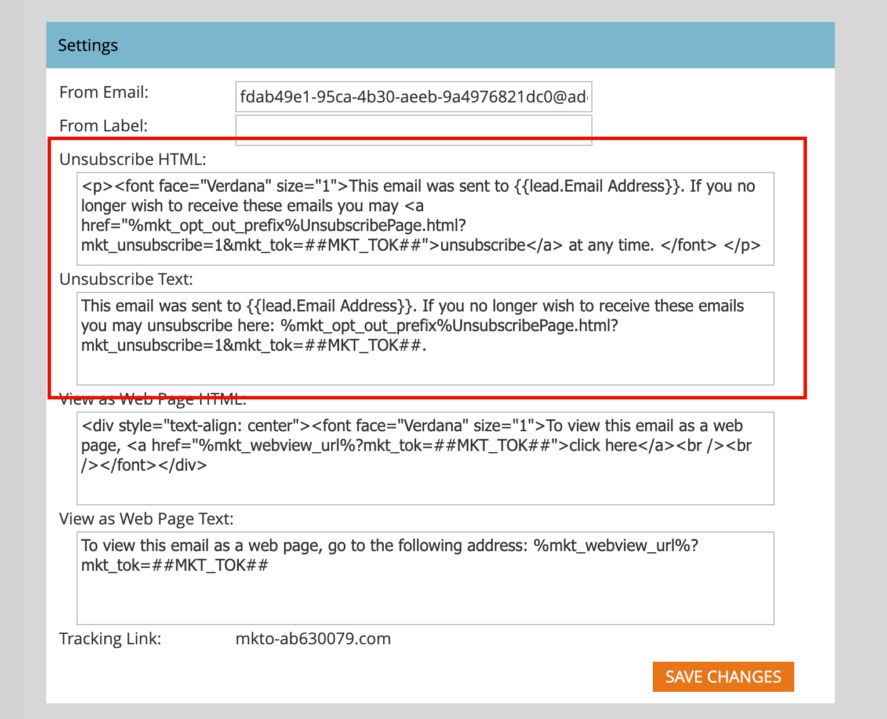

# E メール設定

添付されたMarketo Egage インスタンスで提供されるメール配信インフラストラクチャをサポートするには、次のメールオプションを設定します。 Marketo Engage製品管理者は、Marketo Engage インスタンスの **[!UICONTROL 管理者]** エリアに移動して **[!UICONTROL メール]** を選択することで、これらの設定を行うことができます。

## メールの設定

添付されたMarketo Engage インスタンスに対してメールのデフォルト値を設定するには、マーケティング組織の使用状況を反映するように設定値を変更します。

### 送信元のメールおよびラベル

新しいメールにこれらのデフォルト値が自動的に入力されるように、「送信元メール」と「ラベル」の値を変更します。

>[!NOTE]
>
>変更内容は、自分が作成したメールにのみ適用され、他のMarketo EngageまたはJourney Optimizer B2B edition ユーザーには適用されません。

1. 添付されたMarketo Engage インスタンスの **[!UICONTROL 管理者]** エリアに移動して、**[!UICONTROL メール]** を選択します。

1. _[!UICONTROL 設定]_ パネルで **[!UICONTROL 送信元メール]** および **[!UICONTROL 送信元ラベル]** のデフォルト値を入力します。

   {width="500"}

1. 「**[!UICONTROL 変更を保存]**」をクリックします。

### メッセージの登録解除

運用以外のマーケティングメールの場合は、登録解除テキストとリンクが下部に追加されます。 製品管理者は、マーケターがメールを運用可能としてマークしない場合に入力されるデフォルトのHTMLとテキストを設定する必要があります。

1. 添付されたMarketo Engage インスタンスの **[!UICONTROL 管理者]** エリアに移動して、**[!UICONTROL メール]** を選択します。

1. _[!UICONTROL 設定]_ パネルで **[!UICONTROL HTMLの登録解除]** および **[!UICONTROL テキストの登録解除]** のデフォルト値を入力します。

   >[!TIP]
   >
   >マーケターは、システムトークンを使用して、メール内の購読解除HTMLの位置を変更できます。

   {width="500"}

   >[!CAUTION]
   >
   >次の変数は重要です。**それらを削除** ないでください。
   >
   >* `%mkt_opt_out_prefix%`
   >* `mkt_unsubscribe=1&mkt_tok=##MKT_TOK##`

1. 「**[!UICONTROL 変更を保存]**」をクリックします。

デフォルトのシステムコンテンツに戻す必要がある場合は、次をコピーして貼り付けます。

+++ システムのデフォルトの購読解除テキスト

```
<p><font face="Verdana" size="1">If you no longer wish to receive these emails, click on the following link: <a href="%mkt_opt_out_prefix%UnsubscribePage.html?mkt_unsubscribe=1&mkt_tok=##MKT_TOK##">Unsubscribe</a><br/></font></p>` [!UICONTROL Unsubscribe Text]:
%mkt_opt_out_prefix%UnsubscribePage.html?mkt_unsubscribe=1&mkt_tok=##MKT_TOK##
```

+++

### Web ページとして表示

メールコンテンツの表示機能が制限されています（CSS に制限があり、JavaScriptやフォームはサポートされていません）。 マーケターは「web ページとして表示 _オプションを使用し、Marketo Munchkinを使用してメール受信者に cookie を適用できます_。 製品管理者は、マーケターがこのオプションを選択したときに入力されるデフォルトのHTMLとテキストを設定する必要があります。

1. 添付されたMarketo Engage インスタンスの **[!UICONTROL 管理者]** エリアに移動して、**[!UICONTROL メール]** を選択します。

1. _[!UICONTROL 設定]_ パネルの **[!UICONTROL Web ページとして表示HTML]** および **[!UICONTROL Web ページテキストとして表示]** フィールドのコンテンツを、トーンとメッセージを反映するように変更します。

   {width="500"}

   >[!CAUTION]
   >
   >次の変数は重要です。**それらを削除** ないでください。
   >
   >`%mkt_webview_url%?mkt_tok=##MKT_TOK##`
   >
   >`##MKT_TOK##` の第 2 部は、そのユーザーのMunchkin Cookie です。 これにより、メール受信者がリンクをクリックしたときに、Cookie が適切に適用されます。
   >
   >以下は避けるようにします。
   >
   >* いずれかの HTML ボックスに付加的な URL を追加する
   >* テキストバージョンに HTML コードを配置する

1. 「**[!UICONTROL 変更を保存]**」をクリックします。

デフォルトのシステムコンテンツに戻す必要がある場合は、次をコピーして貼り付けます。

+++ システムのデフォルト Web ページのHTML

```
<div style="text-align: center"><font face="Verdana" size="1">To view this email as a web page, <a href="%mkt_webview_url%?mkt_tok=##MKT_TOK##">click here</a></font></div>
```

+++

+++ システムの既定の Web ページ テキスト

```
To view this email as a web page, go to the following address:
`%mkt_webview_url%?mkt_tok=##MKT_TOK##`
```

+++

## カスタム オブジェクトの取得の制限

[!DNL Velocity Script] を使用してメールにカスタムオブジェクトデータを表示する場合は、親のカスタムオブジェクトの取得制限を調整します。 デフォルトでは、この制限により、Velocity スクリプトから 10 個の親カスタムオブジェクトへのアクセスが許可されます。 必要に応じて、この制限を増やすことができます。

[[!DNL Apache Velocity]](https://velocity.apache.org/) は [!DNL Java] に基づいて構築された言語で、HTML コンテンツのテンプレート化とスクリプト化を目的として設計されています。 Marketo Engageのメールインフラストラクチャでは、カスタムオブジェクトに保存されたデータにアクセスできるスクリプトトークンを使用して、メールのコンテキストでの使用をサポートしています。

リードまたは連絡先に直接接続されているが、第 3 レベルのカスタムオブジェクトに接続されていない親および子のカスタムオブジェクトを参照できます。 各カスタムオブジェクトでは、ユーザー/連絡先ごとに最近更新された 10 件のレコードが実行時に使用可能で、最近更新されたレコード（`0`）から最も古い更新レコード（`9`）へと並べられます。

制限を変更するには（_T） :_

1. 添付されたMarketo Engage インスタンスの **[!UICONTROL 管理者]** エリアに移動して、**[!UICONTROL メール]** を選択します。

1. _[!UICONTROL カスタム・オブジェクト取得制限]_ パネルまでスクロールし、**[!UICONTROL 親取得制限]** に新しい値を入力します
フィールド。

   {width="500"}

   10～100 の値がサポートされています。 _[!UICONTROL 子検索制限]_ は、1000 を親制限で割ることで自動的に設定されます。 例えば、親の制限を 50 に設定した場合、子の制限は 20 （1000 ÷ 50 = 20）と計算されます。

1. 「**[!UICONTROL 変更を保存]**」をクリックします。

## カスタムヘッダーオプション

メールトラッキングリンクヘッダーを設定するには、メールの _[!UICONTROL カスタムヘッダーオプション]_ を変更します。 これらのオプションを有効にすると、厳密なトランスポートを使用した HTTPS を使用して、セキュリティで保護されたトラッキングリンクが実装されます。

1. 添付されたMarketo Engage インスタンスの **[!UICONTROL 管理者]** エリアに移動して、**[!UICONTROL メール]** を選択します。

1. _[!UICONTROL カスタムヘッダーオプション]_ パネルまでスクロールし、トラッキングリンクポリシーに従って設定を変更します。

   {width="500"}

   * **[!UICONTROL 厳格なトランスポートセキュリティ]** – このオプションを有効に設定すると、トラッキングリンクは常に HTTPS で提供されます（SSL で保護されたトラッキングリンクを含むサブスクリプションでのみ設定する必要があります）。
   * **[!UICONTROL Max-age]** – このフィールドでは、ブラウザーが HTTPS 経由でドメインにのみアクセスする必要がある時間を秒単位で指定する必須ディレクティブをサポートしています。
   * **[!UICONTROL IncludeSubDomains]** – このオプションを使用すると、ホストのすべてのサブドメインに HSTS ポリシーを適用するディレクティブを含めることができます。

   >[!IMPORTANT]
   >
   >これらの設定を IT チームと確認し、組織のポリシーと一致していることを確認します。 設定が正しくない場合、一部の訪問者がメールリンクにアクセスできなくなることがあります。

1. 「**[!UICONTROL 変更を保存]**」をクリックします。

## メールボットアクティビティをフィルタリング {#filter-email-bots}

メール ボットアクティビティは、非ヒューマンインタラクション（NHI）とも呼ばれ、メール _開封数_ クリック数 _データを水増しし、エンゲージメント指標を歪め、イベントベースのジャーニー進行をトリガーする可能性が_ ります。 メールボットフィルタリングを使用して、クリックエンゲージメント指標とインサイトの整合性を維持します。 疑わしいボットアクティビティを識別する方法は 2 つあります。

* _**[!UICONTROL IAB ボットリストとの一致]**_ - [ インタラクティブ Advertising ビューロボットリスト ](https://www.iab.com/guidelines/iab-abc-international-spiders-bots-list/){target="_blank"} 内の任意のものと一致するアクティビティ（ユーザーエージェント/IP アドレス）はボットとしてマークされます。
* _**[!UICONTROL 近接パターンと一致]**_ – 同時に（1 秒未満で）発生する 2 つ以上のアクティビティがボットとして識別されます。 比較時に考慮される属性は以下のとおりです。
   * リード ID（同じであること）
   * メールアセット（同じであること）
   * リンククリックまたはメール開封

メールのリンククリックとメールの開封アクティビティの場合、属性には次の値が入力されています。

* ボットとして識別されるアクティビティ - _ボットアクティビティ_ = `true` および _ボットアクティビティパターン_ =識別されたパターン/メソッド
* ボットではないと識別されたアクティビティ - _ボットアクティビティ_ = `false` および _ボットアクティビティパターン_ = `n/a`

### フィルターの設定

1. 添付されたMarketo Engage インスタンスの **[!UICONTROL 管理者]** エリアに移動して、**[!UICONTROL メール]** を選択します。

1. **[!UICONTROL ボットアクティビティ]** タブを選択します。

   {width="700" zoomable="yes"}

   ボットアクティビティ識別パネルには、ボットアクティビティを識別するために使用できる 2 つのスライダーが表示されます。

1. スライダーを切り替えて、一方または両方を有効にします。

   有効にする各メソッドに対して、「ボットアクティビティをログに記録 _[!UICONTROL または]_ ボットアクティビティをフィルター _[!UICONTROL を選択]_ ます。

   >[!IMPORTANT]
   >
   >[!UICONTROL  ボットアクティビティをフィルター ] を選択すると、誤ったアクティビティが排除されるので、メールの開封数とクリック数が減少する場合があります。

   {width="500"}

   _[!UICONTROL 近接パターンと一致]_ の場合は、**[!UICONTROL アクティビティ間の期間]** の秒数を設定することもできます（デフォルトは `0`、最大値は `3`）。

   >[!NOTE]
   >
   >_アクティビティの間隔_ を `0` 秒に設定すると、Marketo Engageはまったく同じ秒数で発生するメールアクティビティを特定します。 指定した秒数以内に複数のメールアクティビティが発生した場合、そのアクティビティはボットアクティビティとして識別されます。

   どちらのフィルタリング方法も無効にするには、スライダーを左に切り替えます。 その場合も、データはリセットされません。

### IP のブロックリスト

Adobeは、数百万の偽のエンゲージメントを生成する原因となる IP アドレスのリストを特定しました。次の IP から受け取ったエンゲージメントは自動的に除外され、Marketo Engage インスタンスに追加されません。 このフィルタリングの結果、メールの開封数、クリック数およびその他の関連アクティビティが減少する場合があります。 このリストは定期的に更新される可能性があります。

+++ ブロックされている IP アドレス

* 40.94.34.52
* 40.94.34.86
* 52.34.76.65
* 54.70.53.60
* 54.71.187.124
* 60.28.2.248
* 64.235.150.252
* 64.235.153.10
* 64.235.153.2
* 64.235.154.105
* 64.235.154.109
* 64.235.154.140
* 64.74.215.1
* 64.74.215.100
* 64.74.215.138
* 64.74.215.139
* 64.74.215.142
* 64.74.215.146
* 64.74.215.150
* 64.74.215.154
* 64.74.215.158
* 64.74.215.162
* 64.74.215.164
* 64.74.215.166
* 64.74.215.170
* 64.74.215.174
* 64.74.215.176
* 64.74.215.178
* 64.74.215.51
* 64.74.215.56
* 64.74.215.58
* 64.74.215.59
* 64.74.215.86
* 64.74.215.98
* 65.154.226.101
* 66.249.91.149
* 70.42.131.106
* 74.125.217.116
* 74.217.90.250
* 104.129.41.4
* 104.47.55.126
* 104.47.58.126
* 104.47.70.126
* 104.47.73.126
* 104.47.73.254
* 104.47.74.126
* 128.220.160.1
* 155.70.39.101
* 162.129.251.14
* 162.129.251.42
* 208.52.157.204

>[!NOTE]
>
>すべての IP アドレスは、このリストに含まれる前に細心の注意を払って分析および調査され、最も重要で有害な IP のみがブロックされるようにします。

+++

